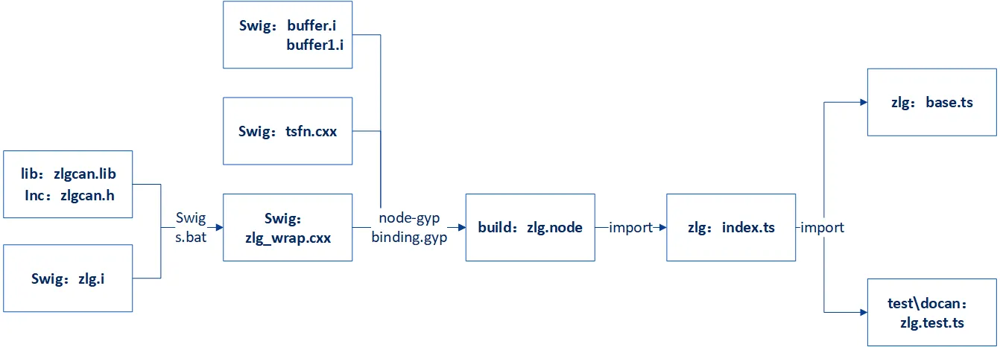
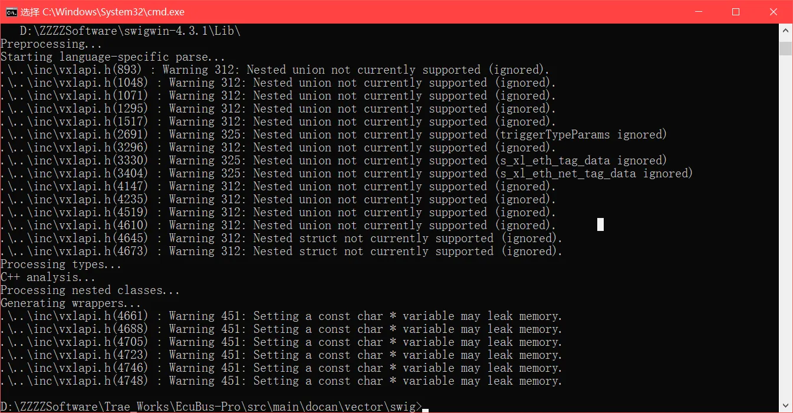
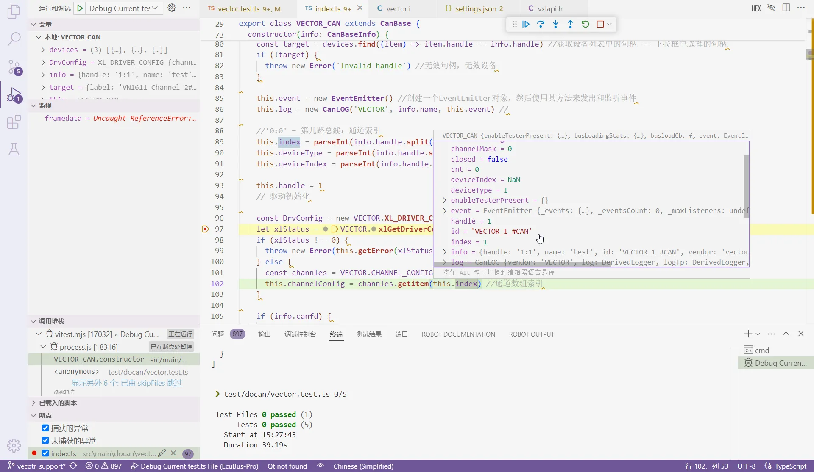

# How to Develop New Adapters

EcuBus-Pro currently supports many mainstream CAN communication boxes, but you may have other CAN boxes from various manufacturers with different models and interfaces. Following the development process from the official website [How to Develop New Adapters](../adapter), you can add underlying drivers to EcuBus-Pro for adaptation.  
For this purpose, I have added some Vector drivers based on the existing foundation. Since this is my first time working with these technologies, the steps are recorded below for reference only.

## 1. Essential Basic Knowledge

1. According to the manual steps, using ZLG CAN box as an example, the interaction principle between the CAN box driver and the Electron client is roughly as follows: CAN box lib library + .h header files + .i interface files use SWIG to generate zlg_wrap.cxx, the .cxx file is compiled into zlg.node through node-gyp, after importing .node, device initialization, CAN transmission/reception and other functions are implemented in index.ts, and finally used for Electron's base.ts interface implementation and zlg.test.ts testing.

The role of SWIG is to convert driver API C/C++ language to Javascript, enabling other languages to access these API declarations and call Lib interfaces.

Node-gyp builds the C/C++ APIs that have been converted to Javascript and Lib into node modules for cross-platform distribution.

The role of each file:  
zlg.i: SWIG interface file, defines how C/C++ is converted to Javascript standards  
s.bat: Script to convert C/C++ code to Javascript code, used to generate zlg_wrap.cxx  
zlg_wrap.cxx: Generated Javascript code  
buffer.i, buffer1.i: Buffer interfaces, generally unchanged  
tsfn.cxx: Thread-safe file, entry point for CAN transmission/reception threads  
zlg.node: Compiled node module, can be used in .ts files  
   
2. Following this process requires mastering basic JavaScript/Typescript syntax knowledge. For users who only know C/C++, a quick way to learn Typescript is through the [TypeScript Tutorial](../jslearn) on the rookie tutorial website. Spending 1-2 days following each example in the tutorial will help you master basic syntax and language features. For more advanced applications and implementation methods, you can look up materials when writing actual related code.
3. For SWIG, we only need to know that it is a cross-language compiler that can create wrappers for driver API C/C++ declarations, allowing Typescript and other languages to access these declarations. SWIG is very powerful and complex, but we can temporarily ignore other functions and only understand SWIG's working principle through a simple example, such as referring to this [SWIG Introduction and Getting Started Guide](https://www.cnblogs.com/xiaoqi/p/17973315/SWIG)

## 2. Replacement and Building

With the above basic knowledge, adding new CAN box drivers based on existing driver programs becomes much simpler. The best method is to imitate and gradually replace existing programs. If you already have a developed new CAN box driver implemented in other languages, you only need to convert device initialization, CAN transmission/reception and other functions to Typescript language. The conversion work can be done by AI.  
If you haven't implemented a CAN box driver before, you can refer to the official examples provided by CAN box manufacturers, which also have API processes implemented in various languages, and similarly convert them to Typescript.  
The process of implementing vector driver following zlg is as follows:

1. Copy the folder under .\docan\zlg directory and create a vector folder

   ```text
   <\zlg>  
   ├index.ts  
   ├<\inc>  
   │  ├canframe.h  
   │  ├config.h  
   │  ├typedef.h  
   │  └zlgcan.h  
   ├<\lib>  
   │  └zlgcan.lib  
   ├<\swig>  
   │  ├buffer.i  
   │  ├buffer1.i  
   │  ├s.bat  
   │  ├tsfn.cxx  
   │  ├zlg.i  
   │  └zlg_wrap.cxx

   <\vector>  
   ├index.ts  
   ├<\inc>  
   │  └vxlapi.h  
   ├<\lib>  
   │  └vxlapi64.lib  
   ├<\swig>  
   │  ├buffer.i  
   │  ├buffer1.i  
   │  ├s.bat  
   │  ├tsfn.cxx  
   │  ├vector.i  
   │  └vector_wrap.cxx
   ```

    Replace the .h files and .lib with vector files, keep other files unchanged for now, and rename all files to vector.

2. Modify the SWIG interface file vector.i, replace the module name and included header files with vector's, temporarily disable all various pointer_class, array_class, etc., because these definitions and mappings come from .h files, and the new vxlapi.h may not contain them. Add them later if needed, ensuring that .i does not contain original zlgcan.h content.  
Keep other thread-safe functions like CreateTSFN unchanged.

   ```plain
   %module vector
   ...
   %header %{
   ...
   #include "vxlapi.h"
   ...
   // %array_class(uint32_t, U32Array);
   // %array_class(BYTE, ByteArray);
   // %array_class(ZCAN_Receive_Data, ReceiveDataArray);
   // %array_class(ZCAN_ReceiveFD_Data, ReceiveFDDataArray);
   ...
   %}
   ```

3. Change vector's s.bat to:

    ```bat
    swig -I"./../inc" -c++ -javascript -napi -v ./vector.i 
    ```

    Execute the above command in cmd under the .\docan\vector\swig directory, which will generate vector_wrap.cxx from the vxlapi.h header file in the inc directory.  
      
    If cmd reports an error, it means some code in vxlapi.h cannot be converted to .cxx and needs to be disabled or modified according to the prompts until .cxx is successfully generated. At this point, ts files can actually use vector_wrap.cxx to access Lib APIs, but for cross-platform compatibility, further generation of .node modules is needed.

4. Modify the safe thread tsfn.cxx file, replace include zlgcan.h, which also has implementation functions about ZLG API, temporarily disable them, replace them later, ensuring that .cxx does not contain original zlgcan.h content.

   ```plain
   #include "vxlapi.h"
   ...
      // numCan=ZCAN_GetReceiveNum(context->channel,TYPE_CAN);
      // numCanFd=ZCAN_GetReceiveNum(context->channel,TYPE_CANFD);
      // ZCAN_CHANNEL_ERR_INFO err;
      // ZCAN_ReadChannelErrInfo(context->channel,&err);
      // ZCAN_ResetCAN(context->channel);
   ...

   ```

5. At this step, the programs in the swig directory no longer contain the original ZLG code content, so you can build vector.node. Modify .\docan\binding.gyp, following 'target_name': 'zlg', add 'target_name': 'vector' content, and disable build instructions for other devices, so that npx node-gyp rebuild won't repeatedly build peak, kvaser and other drivers every time.  
'target_name': 'vector' needs to specify the correct paths for vxlapi64.lib and vector_wrap.cxx, tsfn.cxx.

```json
# 'target_name': 'peak',
# 'target_name': 'kvaser',
# 'target_name': 'zlg',
# 'target_name': 'toomoss',
{
   'target_name': 'vector',
   'conditions': [
      ['OS=="win"', {
         'include_dirs': [
             './vector/inc',
             "<!@(node -p \"require('node-addon-api').include\")"
         ],
         'configurations': { },
         'defines': [
             '__EXCEPTIONS'
         ],
         'sources': [
             './vector/swig/vector_wrap.cxx',
             './vector/swig/tsfn.cxx'
         ],
         'cflags': [ ],
         'cflags_cc': [ ],
         'libraries': ['<(module_root_dir)/vector/lib/vxlapi64.lib'],
         'defines': [ 'DELAYLOAD_HOOK' ],
         'msvs_settings': {
             'VCCLCompilerTool': {
                 'AdditionalOptions': [ '/DELAYLOAD:vxlapi64.dll' ],
                 'ExceptionHandling':1
             }
         },
         'link_settings': {
             'libraries': [ '-DELAYLOAD:vxlapi64.dll' ]
         }
      },
      ...
      ]
}
```

Execute npx node-gyp rebuild in the terminal, which will generate vector.node under \docan\build\Release. At this point, C/C++ and Lib have been compiled and built into Node modules that can be used by ts files. If the build fails, modify according to error prompts.

```plain
cd src/main/docan
npx node-gyp rebuild
```


---

## 3. Porting and Testing

1. CAN device initialization and transmission/reception functions are all implemented in the index.ts file. Change the original import ZLG to import VECTOR, change all ZLG implementation methods to VECTOR implementation methods. Simple replacement is sufficient for now, and all methods that don't exist in VECTOR can be temporarily disabled. After importing the previously generated vector.node, you can use all vector APIs.

    ```plain
    import VECTOR from './../build/Release/vector.node'
    ...
    export class VECTOR_CAN extends CanBase 
    ...
    const devices = VECTOR_CAN.getValidDevices()
    ...
    ```

    The constructor method in index.ts inherits from CanBaseInfo, which includes information for device selection in the Electron UI, and by overriding the getValidDevices method, the list of available devices is also added to the UI dropdown.

    ```ts
      //New constructor method
      constructor(info: CanBaseInfo) {
        super()
        this.id = info.id //Current subclass uses = property in parent class
        this.info = info

        const devices = VECTOR_CAN.getValidDevices() //Method to get device list

        const target = devices.find((item) => item.handle == info.handle) //Get handle in device list == handle selected in dropdown
        if (!target) {
          throw new Error('Invalid handle') //Invalid handle, invalid device
        }

        this.event = new EventEmitter() //Create an EventEmitter object, then use its methods to emit and listen to events
        this.log = new CanLOG('VECTOR', info.name, this.event) //

        //'0:0' = Which bus: channel index
        this.index = parseInt(info.handle.split(':')[1]) //Channel index: :0
        this.deviceType = parseInt(info.handle.split('_')[0]) //Device type in parent class: XL_HWTYPE_VN1611
        this.deviceIndex = parseInt(info.handle.split('_')[2]) //Channel index: _0
    ```

    After adding device initialization code in index.ts, you can directly debug index.ts, but since the parameters ultimately used are passed from the UI selection, ensuring correct parameter passing of info is also crucial.  
    Create vector.test.ts under .\test\docan following zlg.test.ts. By debugging .test.ts files to debug index.ts files, you can simulate different parameter settings in the UI. As long as .test.ts testing passes, Electron's UI parameter passing will also be ensured to be correct.  
    Add the following configuration in vscode's launch.json to debug .test.ts:

    ```json
    {
        "type": "node",
        "request": "launch",
        "name": "Debug Current test.ts File",
        "autoAttachChildProcesses": true,
        "skipFiles": ["<node_internals>/**", "**/node_modules/**"],
        "program": "${workspaceRoot}/node_modules/vitest/vitest.mjs",
        "args": ["run", "${relativeFile}"],
        "smartStep": true,
        "console": "integratedTerminal"
    },
    ```

2. Below is an example of how to debug index.ts. If the Lib has an API for querying device information, you can first implement the getValidDevices function. Create a new test in vector.test.ts to implement the getValidDevices method, and temporarily disable other tests about CAN transmission/reception.

    ```ts
    import { VECTOR_CAN } from '../../src/main/docan/vector'
    ...
    const dllPath = path.join(__dirname, '../../resources/lib')
    VECTOR_CAN.loadDllPath(dllPath)
    ...
    test('vector devices', () => {
    const devices = VECTOR_CAN.getValidDevices()
    console.log(devices)
    })
    ```

    Go to index.ts to implement this method. For example, vector's API for getting device information is xlGetDriverConfig. For the data types required by API parameters, you can directly use those in vxlapi.h.

    ```ts
      static override getValidDevices(): CanDevice[] {
        //Override getValidDevices method, return value is CanDevice, returns list of available devices
        const devices: CanDevice[] = []
        if (process.platform === 'win32') {
          const deviceHandle = new VECTOR.XL_DRIVER_CONFIG()
          const ret = VECTOR.xlGetDriverConfig(deviceHandle) //Get/print hardware configuration g_xlDrvConfig
          if (ret === 0) {
            ...
              devices.push({
                label: `${channelName}${busType}`, //'VN1640A Channel 1#LIN' = channel name#bus type
                id: `VECTOR_${num}_${busType}`, //'VECTOR_0_#LIN' = channel index_#bus type
                handle: `${channel.hwChannel}:${num}`, //'0:0' = which bus: channel index
                serialNumber: channel.serialNumber
              })
            }
          }
        }
        return devices
      }
    ```

    If console.log(devices) prints correct device information in the terminal, it means .ts can correctly access .Lib API, and all previous conversion steps are correct.  
    

    If .Lib doesn't have an API for getting device information, you can use other APIs for simple testing to test whether .Lib is correctly used by .ts. If you can't access APIs or APIs error during debugging, you need to go back to previous steps and check if there were errors when generating .cxx and .node. For getValidDevices, you can follow .\zlg\index.ts and return a fixed identifier and handle based on device characteristics.

    ```ts
      static override getValidDevices(): CanDevice[] {
        if (process.platform == 'win32') {
          const zcanArray: CanDevice[] = [
            {
              label: 'ZCAN_USBCANFD_200U_INDEX_0_CHANNEL_0',
              id: 'ZCAN_USBCANFD_200U_INDEX_0_CHANNEL_0',
              handle: `${ZLG.ZCAN_USBCANFD_200U}_0_0`
            },
    ```

3. After .Lib API can be correctly used in .ts, create a test for vector device initialization in vector.test.ts. The parameters set here will be passed to the constructor method along with info.

    ```ts
    describe('vector test', () => {
      let client!: VECTOR_CAN
      beforeAll(() => {
        client = new VECTOR_CAN({
          handle: '3:3',
          name: 'test',
          id: 'VECTOR_3_#CAN',
          vendor: 'vector',
          canfd: true,
          bitrate: {
            sjw: 1,
            timeSeg1: 13,
            timeSeg2: 2,
            preScaler: 10,
            freq: 500000,
            clock: '80'
          },
          bitratefd: {
            sjw: 1,
            timeSeg1: 7,
            timeSeg2: 2,
            preScaler: 4,
            freq: 2000000,
            clock: '80'
          }
        })
      })
    ```

    In index.ts, the passed parameter info index will determine which device channel returned by getValidDevices to use. After channel matching, other initialization functions will be further executed.

    ```ts
      constructor(info: CanBaseInfo) {
        const devices = VECTOR_CAN.getValidDevices() //Method to get device list
        this.index = parseInt(info.handle.split(':')[1]) //Channel index: :0

        const DrvConfig = new VECTOR.XL_DRIVER_CONFIG()
        let xlStatus = VECTOR.xlGetDriverConfig(DrvConfig) //Get/print hardware configuration g_xlDrvConfig

        const channles = VECTOR.CHANNEL_CONFIG.frompointer(DrvConfig.channel) //Channel configuration
        this.channelConfig = channles.getitem(this.index) //Channel number

        // Channel mask calculation
        this.channelMask = VECTOR.xlGetChannelMask(
          this.channelConfig.hwType,
          this.channelConfig.hwIndex,
          this.channelConfig.hwChannel
        )
        ....
        xlStatus = VECTOR.xlOpenPort(
            this.PortHandle.cast(),
            'EcuBus-Pro',
            this.channelMask,
            this.PermissionMask.cast(),
            16384,
            4,
            1
        )
    ```

    

    Different devices have vastly different initialization processes, which won't be described here. Add them to the constructor method according to actual situations. For CAN transmission/reception functions, you can first implement them in the constructor, ensure that transmission/reception are normal, then port the sending function to _writeBase, receiving function to callback, callbackFd, and implement other methods like close, getError, etc. in the same way. Also test transmission/reception in vector.test.ts.

    ```ts
      test.skip('write multi frame', async () => {

      test('read frame', async () => {

      test('write frame can-fd', async () => {
    ```

      

    Finally, tsfn.cxx also has some API implementations, just replace the original corresponding functionality implementations.

4. Many .Lib API parameters must use specific data types, otherwise errors occur. TypeScript doesn't have such rich basic types, so you need to re-encapsulate vxlapi.h types in vector.i for .ts use. The following are common situations:

Parameters are pointer types, need to define pointer classes:

```plain
vxlapi.h
    typedef XLlong XLportHandle;
vector.i
    %pointer_class(XLportHandle, XLPORTHANDLE)
    %pointer_class(unsigned int, UINT32)
    %pointer_class(unsigned short, UINT16)
index.ts
    private PortHandle = new VECTOR.XLPORTHANDLE()
    this.PortHandle.cast(),
    const cntSent = new VECTOR.UINT32()
    cntSent.assign(1)
    cntSent.cast()
```

Parameters are array structure pointer types, need to define array classes:

```plain
vxlapi.h
    typedef struct {
    ...
    XL_CAN_RX_EVENT_UNION tagData;
    } XLcanRxEvent;
vector.i
    %array_class(XLcanRxEvent, XLCANRXEVENT);
index.ts
    const frames = new VECTOR.XLCANRXEVENT(1)
    xlStatus = VECTOR.xlCanReceive(this.PortHandle.value(), frames.cast())
```

CAN transmission/reception interface parameters have multiple structure types, need to define array classes to access:

```plain
vxlapi.h
    struct s_xl_can_msg {
    ...
    unsigned char  data[MAX_MSG_LEN];
    };

    union s_xl_tag_data {
    struct s_xl_can_msg                  msg;
    ...
    };

    struct s_xl_event {
    XLeventTag     tag;
    ...
    union s_xl_tag_data tagData;
    };

vector.i
    %array_class(unsigned char, UINT8ARRAY)

index.ts
    const framedata = new VECTOR.s_xl_event()
    framedata.tag = 10
    const dataPtr = VECTOR.UINT8ARRAY.frompointer(framedata.tagData.msg.data)
    for (let i = 0; i < data.length; i++) {
        dataPtr.setitem(i, data[i])
    }
```

Some structures in vxlapi.h have unions that need to be extracted:

```plain
typedef struct {
    ...
} XL_CAN_TX_MSG;

typedef struct {
  unsigned short     tag;              //  2 - type of the event
  unsigned short     transId;          //  2
  unsigned char      channelIndex;     //  1 - internal has to be 0
  unsigned char      reserved[3];      //  3 - has to be zero 

  union {
    XL_CAN_TX_MSG   canMsg;
  } tagData;
} XLcanTxEvent;
```

For example, member canMsg needs to be redefined as XL_CAN_TX_MSG_UNION, otherwise .ts cannot access it:

```plain
typedef union {
  XL_CAN_TX_MSG   canMsg;
} XL_CAN_TX_MSG_UNION;


typedef struct {
  unsigned short     tag;              //  2 - type of the event
  unsigned short     transId;          //  2
  unsigned char      channelIndex;     //  1 - internal has to be 0
  unsigned char      reserved[3];      //  3 - has to be zero 

  XL_CAN_TX_MSG_UNION tagData;
} XLcanTxEvent;
```

Every time you modify vxlapi.h and vector.i, you need to re-run s.bat and npx node-gyp rebuild to regenerate .node to ensure it takes effect in .ts.

After vector.test.ts testing passes, add to UI referring to [Add In UI](../adapter#add-in-ui), which won't be described here.
