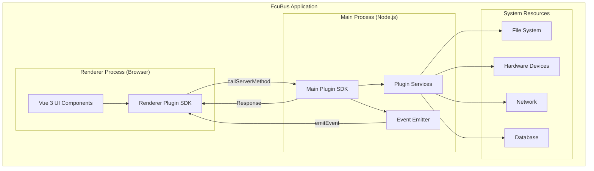
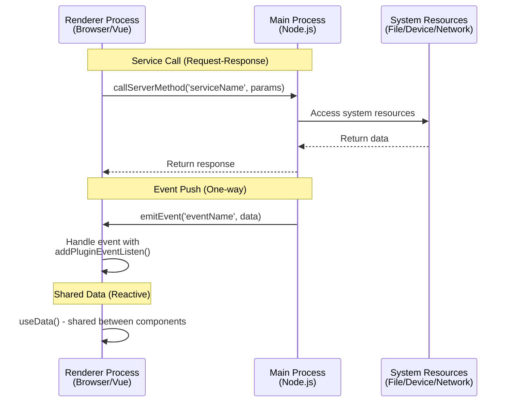

# EcuBus Plugin Development Guide

## Introduction

EcuBus provides a powerful plugin system that allows developers to extend the application's functionality with custom features. Plugins are built using modern web technologies including Vue 3, TypeScript, and Vite, following a two-process architecture similar to Electron.

This guide will walk you through everything you need to know to develop, test, and publish your own EcuBus plugins.

## Prerequisites

Before you start developing EcuBus plugins, make sure you have:

- **Node.js**: Version 20.19.0+ or 22.12.0+
- **npm/pnpm/yarn**: Any modern package manager
- **Basic knowledge of**:
  - TypeScript
  - Vue 3 (Composition API)
  - Node.js basics

## Quick Start

### Creating a New Plugin

The fastest way to create a new plugin is using the official template:

```bash
# Using npm
npm create ecubus-plugin@latest my-plugin

# Using pnpm
pnpm create ecubus-plugin my-plugin

# Using yarn
yarn create ecubus-plugin my-plugin

# Using bun
bun create ecubus-plugin my-plugin
```

Then navigate to your plugin directory and install dependencies:

```bash
cd my-plugin
npm install
```

### Start Development Server

```bash
npm run dev
```

This command will:
- Start the renderer process development server at `http://localhost:5173/` with Hot Module Replacement (HMR)
- Watch and automatically rebuild main process code when files change

> [!NOTE]
> you need change the `manifest.json` file to point to the correct renderer process URL.
> ```json
> {
>   "extensions": [{
>     "items": [{
>       "entry": "http://localhost:5173/"
>     }]
>   }]
> }

### Load Your Plugin in EcuBus-Pro

1. Open EcuBus application
2. Navigate to the `Plugin`
3. Click `Load Local Plugin`
4. Select your plugin directory
5. Your plugin will displayed in the `Plugin Marketplace` list
6. Enter project and and check your plugin extensions

## Project Structure

A typical EcuBus plugin has the following structure:

```
my-plugin/
├── src/
│   ├── main/              # Main process code (Node.js environment)
│   │   └── index.ts       # Register services, emit events, business logic
│   └── renderer/          # Renderer process code (Browser environment)
│       ├── App.vue        # Vue main component, UI interface
│       └── index.ts       # Renderer process entry
├── dist/                  # Build output directory
│   ├── main/             # Main process build output
│   └── renderer/         # Renderer process build output
├── public/               # Static assets
├── manifest.json         # Plugin configuration file (IMPORTANT!)
├── icon.png             # Plugin icon
├── package.json         # Project dependencies
├── vite.main.config.ts  # Vite config for main process
├── vite.renderer.config.ts  # Vite config for renderer process
├── DEVELOPMENT.md       # Detailed development guide
└── README.md
```

## Core Concepts

### 1. Two-Process Architecture

EcuBus plugins follow a two-process architecture:



#### Main Process
- **Environment**: Node.js
- **Location**: `src/main/index.ts`
- **Capabilities**:
  - Full system access
  - File system operations
  - Database access
  - Hardware device communication
  - Heavy computation tasks
  - Network requests

#### Renderer Process
- **Environment**: Browser (Chromium)
- **Location**: `src/renderer/`
- **Capabilities**:
  - UI rendering with Vue 3
  - User interaction handling
  - Calling main process services
  - Listening to main process events
  - Data visualization

> [!NOTE]
> Vue 3 and Element Plus are built-in to EcuBus-Pro and externalized by default. Using these libraries directly will keep your plugin bundle size small.

### 2. Communication Between Processes

The main process and renderer process communicate through a secure API:

**Main → Renderer**: 
- Services (renderer calls, main responds)
- Events (main emits, renderer listens)

**Renderer → Main**:
- Service calls (async RPC-style)

#### Communication Architecture



#### Example: Complete Communication Flow

**Main Process** (`src/main/index.ts`):
```typescript
import { registerService, emitEvent, getPluginPath } from '@ecubus-pro/main-plugin-sdk'

// Register a service that can be called from renderer
registerService('getUserInfo', async (userId: string) => {
  const user = await fetchUserFromDatabase(userId)
  return { success: true, user }
})

// Emit events to notify renderer process
setInterval(() => {
  const status = checkSystemStatus()
  emitEvent('statusUpdate', {
    timestamp: Date.now(),
    status: status
  })
}, 5000)

// Get plugin path for accessing local resources
const pluginPath = getPluginPath()
console.log('Plugin installed at:', pluginPath)
```

**Renderer Process** (`src/renderer/App.vue`):
```vue
<script setup lang="ts">
import { ref, onMounted, onUnmounted } from 'vue'
import { 
  callServerMethod, 
  addPluginEventListen, 
  removePluginEventListen,
  useData 
} from '@ecubus-pro/renderer-plugin-sdk'

const userInfo = ref(null)
const systemStatus = ref('unknown')

// Call main process service
async function loadUser(userId: string) {
  const result = await callServerMethod('getUserInfo', userId)
  if (result.success) {
    userInfo.value = result.user
  }
}

// Listen to main process events
function handleStatusUpdate(data) {
  systemStatus.value = data.status
  console.log('Status updated at:', data.timestamp)
}

onMounted(() => {
  // Subscribe to events
  addPluginEventListen('statusUpdate', handleStatusUpdate)
})

onUnmounted(() => {
  // Clean up event listeners
  removePluginEventListen('statusUpdate', handleStatusUpdate)
})
</script>
```


### 3. Plugin Manifest

The `manifest.json` file is the plugin's configuration file that defines metadata and extension points.

## Plugin Manifest Configuration

### Basic Structure

```json
{
  "id": "my-plugin",
  "name": "My Plugin",
  "version": "1.0.0",
  "description": "A description of what your plugin does",
  "author": "Your Name",
  "mainEntry": "dist/main/index.cjs",
  "icon": "icon.png",
  "readme": "README.md",
  "extensions": [
    {
      "targetTab": "test",
      "items": [
        {
          "type": "button",
          "id": "my-button",
          "label": "My Button",
          "icon": "mdi:hand-wave",
          "onClick": "handleClick",
          "entry": "http://localhost:5173/"
        }
      ]
    }
  ]
}
```

### Manifest Fields

| Field | Type | Required | Description |
|-------|------|----------|-------------|
| `id` | string | Yes | Unique identifier for your plugin (lowercase, no spaces) |
| `name` | string | Yes | Display name shown in EcuBus |
| `version` | string | Yes | Semantic version number (e.g., "1.0.0") |
| `description` | string | No | Short description of plugin functionality |
| `author` | string | No | Plugin author name |
| `mainEntry` | string | Yes | Path to main process entry file (relative to plugin root) |
| `icon` | string | No | Path to plugin icon (PNG recommended) |
| `readme` | string | No | Path to README file |
| `extensions` | array | Yes | Array of extension points |

### Extension Configuration

Each extension defines where and how your plugin appears in EcuBus:

```json
{
  "targetTab": "test",        // Which tab to add the button
  "items": [
    {
      "type": "button",       // Extension type (currently only "button")
      "id": "unique-btn-id",  // Unique button identifier
      "label": "Click Me",    // Button label text
      "icon": "mdi:rocket",   // Icon (Iconify format)
      "onClick": "handler",   // Handler name (optional)
      "entry": "http://localhost:5173/"  // Renderer process URL
    }
  ]
}
```

**Available Target Tabs**:
- `test` - Test & Diagnostics tab
- `can` - CAN Bus tab
- `lin` - LIN Bus tab
- `data` - Data Analysis tab
- (Check EcuBus documentation for full list)

**Icon Format**:
Use Iconify icons in the format `collection:icon-name`. Browse available icons at [iconify.design](https://iconify.design/)

Examples:
- `mdi:rocket` - Material Design Icons
- `lucide:settings` - Lucide icons
- `carbon:settings` - Carbon icons


## Getting Help

If you encounter issues:

1. Check this guide thoroughly
2. Review the DEVELOPMENT.md in the plugin template
3. Check EcuBus official documentation
4. Search existing issues on GitHub
5. Ask in community forums
6. Submit a bug report if needed

## Contributing

We welcome contributions to improve the plugin system!

- Submit bug reports
- Suggest new features
- Share example plugins
- Improve documentation


