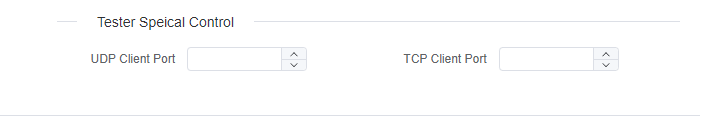

# DOIP

> TODO

## Tester Speical Control

### TCP/UDP Source Port Control

By default, the client will use a random available port for TCP/UDP communication. However, you can configure it to use a specific fixed port if needed.

