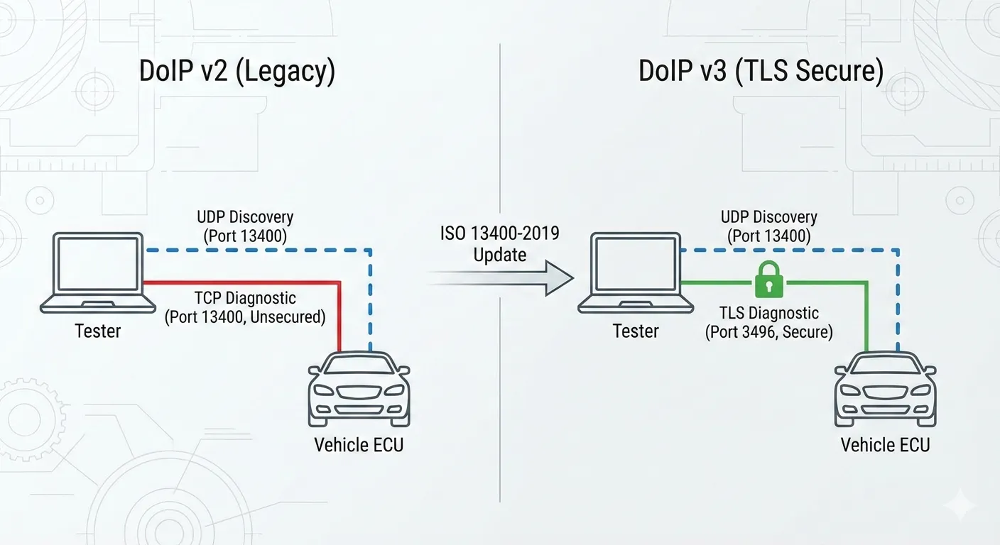
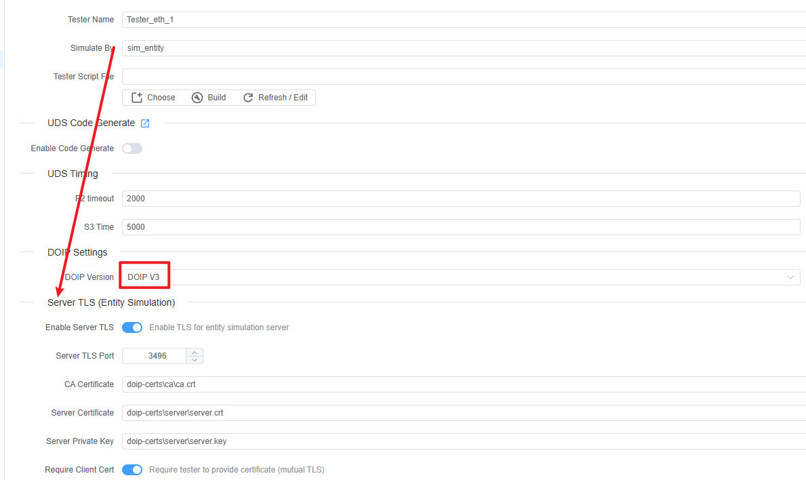
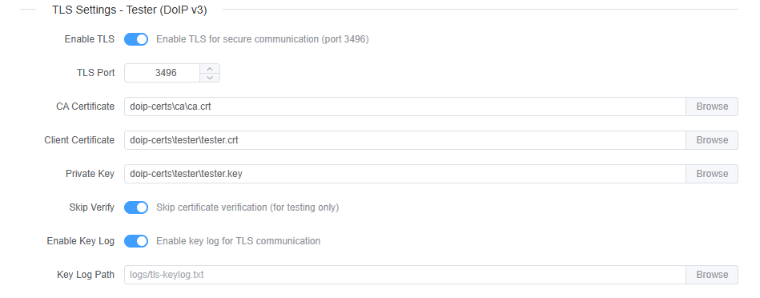

# DoIP v3 (TLS Secure DoIP)

DoIP v3 defined in new ISO13400-2 2019, major differenet is add TLS support.

- **UDP discovery stays the same**: UDP port **13400** is still used for Vehicle Identification and announcements.
- **Diagnostic TCP becomes TLS** (when enabled): default secure port **3496**.
- **DoIP v3 protocol header** is used when you set **DOIP Version = 3**.

## Usage

1. **Select Ethernet tester**
   - In your tester configuration, set **DOIP Version** to **DOIP V3**.
   - Also setup **Entity Simulation** certificates if you want to simulate an entity/gateway.
   
2. **Enable TLS on the address**
   - Open the Ethernet address (`EthAddr`) you will use.
   - Enable **TLS Settings - Tester (DoIP v3)** → **Enable TLS**.
   - Keep **TLS Port = 3496** unless your ECU uses a different port.
   
3. **Provide certificates (recommended)**
   - Set **CA Certificate** to trust the ECU/server certificate.
   - If the server requires client authentication, also set **Client Certificate** and **Private Key**.
   - Test Certificate generation steps: [DoIP v3 TLS Certificates Generation Guide](doip-tls-certificates.md).
4. Start the test and send UDS requests as usual.

## Ports and Traffic Model

- **UDP 13400**: vehicle identification requests/responses and announcements.
- **TCP 13400**: DoIP v2 (non-TLS) diagnostic channel.
- **TLS 3496**: DoIP v3 secure diagnostic channel (this project’s default).

> [!NOTE]
> Enabling TLS only changes the **TCP diagnostic connection**. UDP discovery still uses port **13400**.

## Configuration Reference

### DOIP Version

Under **DOIP Settings**:

- **DOIP V2**: TCP diagnostic connection to port **13400** (no TLS).
- **DOIP V3**: uses DoIP v3 headers; you can optionally enable TLS for the TCP connection (recommended).

### Entity Simulation TLS (DoIP v3 server)

If your tester is configured to **simulate an entity/gateway** (Entity Simulation), you can enable TLS for the built-in DoIP server:

- **Enable Server TLS**
  - Starts a TLS server instead of a plain TCP server.
- **Server TLS Port**
  - Defaults to **3496**.
- **CA Certificate**
  - Trust anchor used to verify a tester certificate (when mutual TLS is used).
- **Server Certificate / Server Private Key**
  - The server identity presented during TLS handshake.
- **Require Client Cert**
  - Intended to enforce mutual TLS (tester must present a certificate).

### Tester Address TLS Settings (DoIP v3)

Under the Ethernet address (`EthAddr`) when **DOIP Version = 3**:

- **Enable TLS**
  - When enabled, the tester creates a **TLS** connection instead of plain TCP.
  - Default target port is **3496**.
- **TLS Port**
  - Overrides the default secure port (3496).
- **CA Certificate**
  - CA file used to verify the ECU/server certificate.
- **Client Certificate / Private Key**
  - Used when the server requests client authentication (mutual TLS).
- **Skip Verify**
  - For testing only.
  - When enabled, ECUBus-Pro will skip certificate verification and hostname/IP checks.
- **Enable Key Log / Key Log Path**
  - Writes TLS session keys to a file (default: `logs/tls-keylog.txt`) for decrypting TLS in Wireshark.

> [!TIP]
> Certificate file paths can be **project-relative**. ECUBus-Pro resolves relative paths against the current project directory.

## Wireshark: Decrypt DoIP v3 TLS Using Key Log

1. Enable **Enable Key Log** and set **Key Log Path** (or keep the default `logs/tls-keylog.txt`).
2. Re-run the session so the key log file is generated.
3. In Wireshark, set **(Pre)-Master-Secret log filename** to that keylog file.

More details see wireshark official documentation: [Wireshark-TLS](https://wiki.wireshark.org/TLS#using-the-pre-master-secret)

> [!WARNING]
> TLS key logs allow decrypting captured traffic. Treat the keylog file as sensitive and do not share it publicly.

## Troubleshooting

### TLS connect fails immediately

- **Wrong port**: confirm the ECU listens on **3496** (or your configured TLS port).
- **CA mismatch**: ensure the tester’s **CA Certificate** matches the CA that signed the server certificate.
- **Missing client cert**: if the server requires client authentication, configure **Client Certificate** and **Private Key** on the tester side.

### “Skip Verify” works but normal verify fails

This almost always means your certificate chain is not trusted (wrong CA) or the server certificate is not valid for your environment. Fix the certificates rather than leaving “Skip Verify” enabled.

### Vehicle discovery works but diagnostics do not

Discovery is UDP 13400; diagnostics uses TCP/TLS. Check firewall rules and confirm:

- UDP 13400 is open (discovery)
- TLS 3496 (or configured TLS port) is open (diagnostics)

