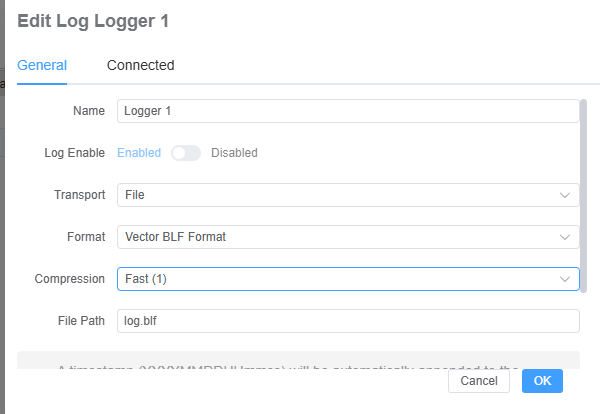
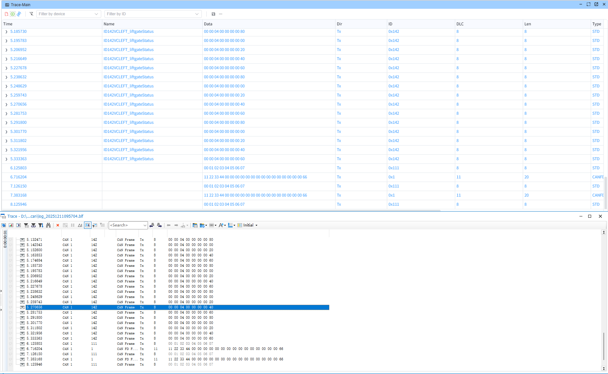

# Logger

By configuring a logger, you can export all related trace data elsewhere, addressing the limited storage capacity of the Trace window in the UI.

## How to add a logger

Open the network configuration via `Hardware -> Network`, then add a logger under `Loggers`.

## Configure the logger

Hover over the target logger and click the `✏️` button to edit it.

* Transport
  * File: write frames to a file; select the destination path
  * Socket: write frames to a socket (not supported yet)
* Format
  * ASC: Vector ASC format
  * CSV: comma-separated text format (not supported yet)
  * BLF: Vector BLF format 
* Record Types: choose the types of frames to record

  * CAN: record CAN frames
  * LIN: record LIN frames
  * ETH: record Ethernet frames
  * UDS: record PW

## BLF format

BLF format is a binary format for logging CAN frames. It is supported by Vector tools and can be used to analyze CAN frames.

### Test with CANoe

## Demo: write to file

