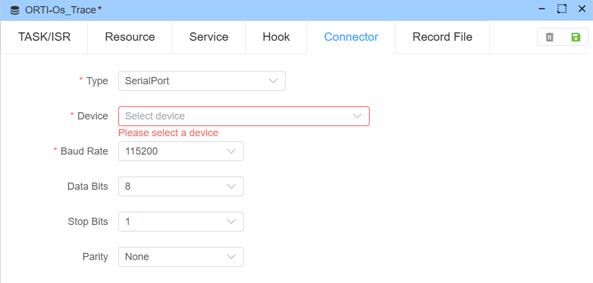
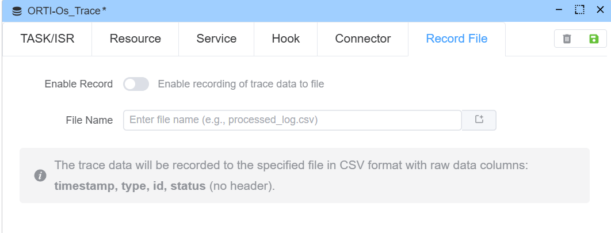
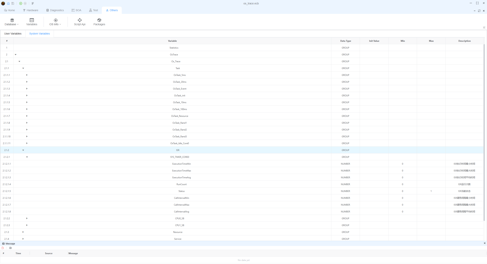
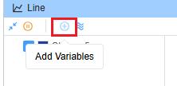
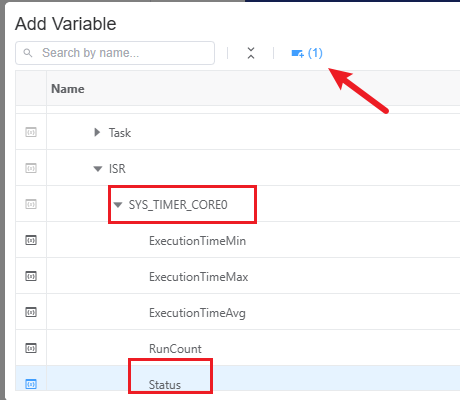

# OSEK OS Trace

OSEK OS Trace is a powerful feature that allows you to retrieve the runtime status of OSEK OS through external interfaces in real-time and convert it into a visual graphical interface.

> [!NOTE]
> This feature requires the OS to provide the corresponding ORTI file, insert relevant code in the corresponding HOOK to record related information, and then transmit the data to EcuBus-Pro through the data interface.

## Import ORTI File

Import ORTI files by clicking `Others->Database->Add OS(ORTI)`. You can also view already imported ORTI files.


## Configure ORTI

> [!NOTE]
> After importing the ORTI file, users are still allowed to manually modify the configuration information.

After successfully importing the ORTI file, you can see the configuration information parsed from the ORTI file.

### TASK/ISR

1. Set Name
2. Set the actual CPU operating frequency (depends on your timestamp format. If your timestamp is already in microseconds, the CPU frequency can be 1)
3. Set object color
4. Set the theoretical activation interval for periodic tasks (Active Interval, in microseconds, only applicable to Tasks)

> [!NOTE]
> Active Interval (us) can only be configured for Task types. ISR does not support this configuration item.


### Resource


### Service


### Hook


### Connector Configuration

Connector determines where you obtain TRACE data. The following methods are currently supported:

#### Serial Port (SerialPort)

Receive OS Trace data in real-time through a serial port.

**Configuration Items:**

- **Device**: Select serial port device (e.g., COM1, /dev/ttyUSB0, etc.)
- **Baud Rate**: Baud rate (e.g., 115200, 921600, etc.)
- **Data Bits**: Data bits (5, 6, 7, 8)
- **Stop Bits**: Stop bits (1, 1.5, 2)
- **Parity**: Parity bit (None, Even, Odd, Mark, Space)

**Data Format:** 16-byte binary data (little-endian)

| Field | Length | Description |
|------|------|------|
| frame header | 4 bytes | Frame header (05D5C5B5A) |
| timestamp | 4 bytes | Timestamp (LSB) |
| type id | 2 bytes | Object ID (LSB) |
| type status | 2 bytes | Status/Parameter (LSB) |
| index | 1 byte | Event index (0-255 cyclic) |
| type | 1 byte | Event type |
| coreID | 1 byte | Core ID |
| CRC8/Reserved | 1 byte | CRC8 checksum or reserved byte |

> [!NOTE]
>
> - The total frame length is fixed at 16 bytes
> - The CRC8 checksum is calculated from the 11 bytes of the data portion (excluding the frame header and CRC byte itself, including: index, timestamp, type, type id, type status, coreID)
> - When CRC verification is enabled, the last byte is used as the CRC8 checksum
> - When CRC verification is disabled, the last byte is used as a reserved byte (Reserved), and the system validates the frame validity by checking the type field (valid values: 0-5)



#### Binary File (BinaryFile)

Read OS Trace data from a binary file. The data format is the same as the serial port (16-byte binary data).

**Configuration Items:**

- **File**: Select binary file path (relative paths are supported)

**Data Format:** Same as serial port, 16-byte binary data

#### CSV File (CSVFile)

Read OS Trace data from a CSV file.

**Configuration Items:**

- **File**: Select CSV file path (relative paths are supported)

**Data Format:** CSV format, one event per line

> [!NOTE]
> The CSV file format is: timestamp,type,id,status. Headers are not allowed, and the timestamp unit is tick.

```csv

1000,1,0,0
1500,1,0,1
2000,2,1,0
```

**Field Descriptions:**

- **timestamp**: Timestamp (tick)
- **type**: Event type
- **id**: Object ID
- **status**: Status value

#### CAN/ETH

> [!NOTE]
> CAN and ETH interfaces are not yet implemented. Please stay tuned.

### Record File

Record File determines where TRACE data is written to local files. The written data format is CSV format.

> [!NOTE]
> One event per line, format: timestamp,type,id,status. The timestamp unit is tick.



### Save

After configuring the ORTI-related information, click the save button in the upper right corner to save the ORTI configuration information.

## View OS Trace Data and Auto-Generated System Variables

The data sent by the OS can be viewed through the `Trace` window.


After configuring the ORTI, the ORTI data will be automatically generated as built-in system variables, which can be viewed through `Others->Variables->System Variables`.



## View OS Statistics

OS statistics can be viewed through `Others->Os Info->Corresponding ORTI File Name`.


## Custom View of Specific Variable Information

Users can select components such as **LINE, Gauge, Data** to display these variables according to their needs.

For example: If users want to view the real-time runtime status of 5msTask and SystemTick ISR, click `Home->Graph->Line`, then click `Add Variables` at the top.


Select `5msTask->Status` and `SystemTick ISR->Status`, then click `Add` to see the real-time runtime status of 5msTask and SystemTick ISR.


Result Preview:

