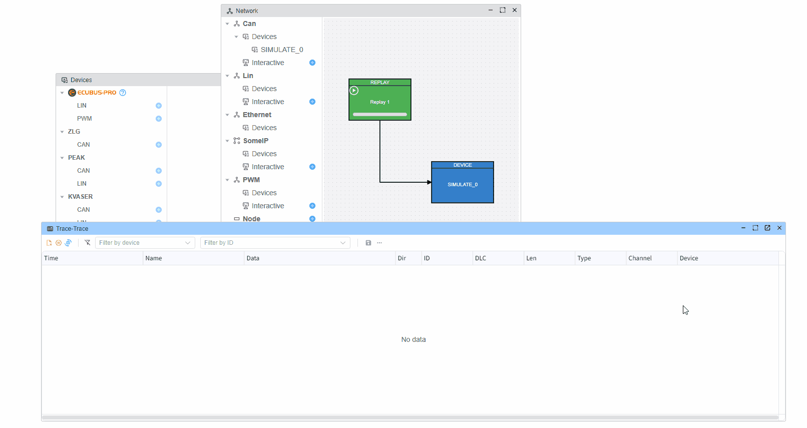
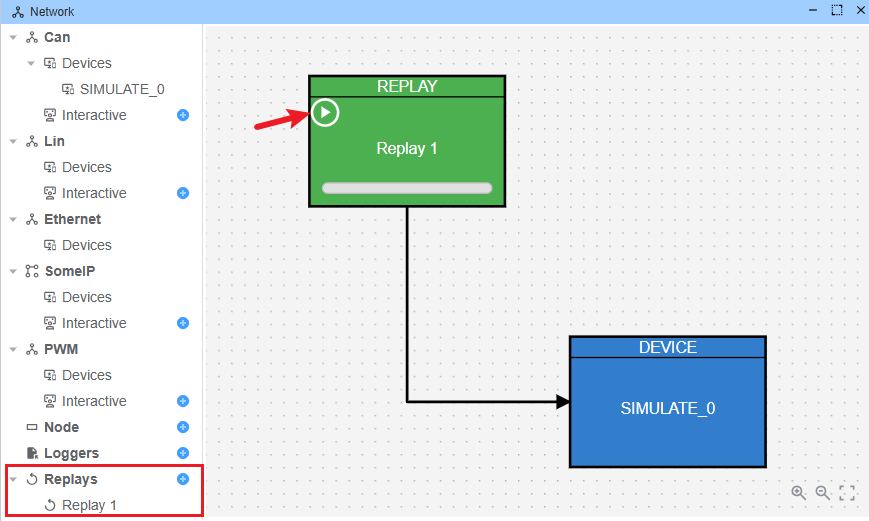
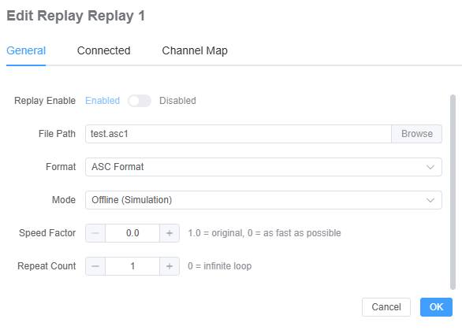
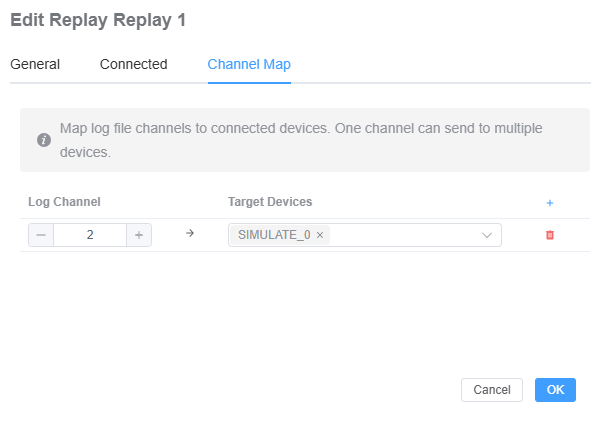

# Replay

## Overview

The **Replay** feature allows you to load previously recorded CAN traffic and play it back as if it were happening in real time.  
This is useful for:

- **Debugging** complex issues that are hard to reproduce live.
- **Analysis** of diagnostic sessions and network behavior.
- **Demonstrations** and training without needing a real vehicle or bench.

> **Note**: Currently, replay only supports **ASC** and **CAN** log formats.

## Online vs Offline Replay

- **Offline replay**: You load a previously recorded log file (ASC / CAN) from disk and play it back inside the tool. No real CAN hardware or live vehicle connection is required. The messages are injected into the internal bus of the application for analysis and visualization.
- **Online replay (live streaming)**: Messages would be captured from a **live** CAN interface or vehicle in real time and immediately displayed/forwarded as they arrive. This type of live streaming / online replay is **not** supported yet.

> Currently, EcuBus-Pro supports **offline replay only**.

## Supported File Formats

- **`.asc`**: Vector ASCII log files (CAN).

If you try to open any other format, the application will reject the file or may not show any replay data.

## Opening a Replay

1. Open the **Network** view.
2. Add **Replay** node.
3. Select an log file from your filesystem.

## Replay Configuration

The **Replay Configuration** panel lets you fine‑tune how the replay behaves:

- **File selection**: Choose the ASC file to replay.
- **Speed factor (`speedFactor`)**: Controls how fast frames are played relative to the original timestamps.  
  - `1.0`: normal speed (default).  
  - `> 1.0`: faster than real time (e.g. `2.0` = 2×).  
  - `< 1.0`: slower than real time (e.g. `0.5` = half speed).  
  - `0`: play as fast as possible, ignoring real-time delays.
- **Repeat count (`repeatCount`)**: Number of times the log is replayed.  
  - `1`: play once (default).  
  - `N > 1`: play the entire file N times.  
  - `0`: loop continuously until you manually stop the replay.

### Channel Map

In the context of replay, the **map** refers to the mapping between **ASC log channels** and **Ecubus devices**.

- Each **log channel** (e.g. channel `1`, `2`, …) in the ASC file can be mapped to one or more EcuBus-Pro devices.
- During replay, frames from a given ASC channel are injected into the corresponding mapped devices.
- This allows you to control exactly which hardware interface (or virtual device) should receive which part of the recorded traffic.

Typical use cases include:

- Mapping different ASC channels to different CAN interfaces in your project.
- Replaying a multi-channel log into a subset of devices for focused analysis or testing.

