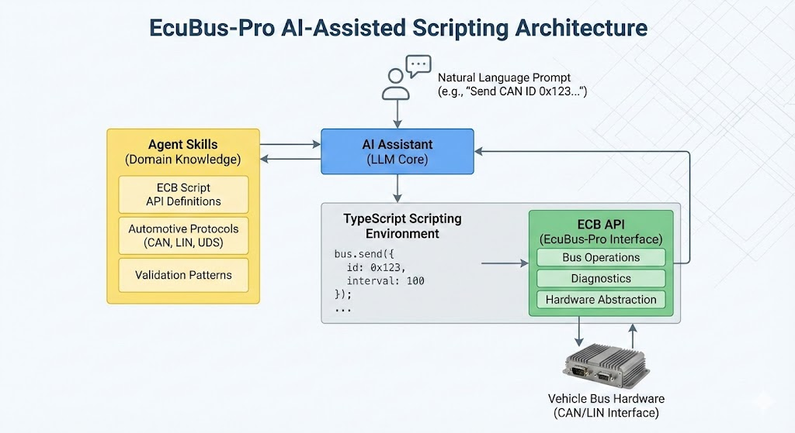

# AI-Assisted Scripting in EcuBus-Pro

EcuBus-Pro integrates AI assistance directly into its TypeScript-based scripting environment. By combining strong typing, structured APIs, and domain-specific agent-skills for the ECB Script API, the AI assistant can understand, generate, and optimize scripts with high accuracy.

Because the scripting layer is built on TypeScript, AI can reliably interpret types, interfaces, and function signatures. This enables precise code generation and context-aware suggestions. Embedded automotive engineers who are not familiar with TypeScript can quickly get started by describing intended behavior in natural language, without needing to learn the language syntax first.

## Overview

The AI assistant supports:

* Natural-language-to-code generation
* Context-aware API suggestions
* Script explanation and annotation
* Refactoring and optimization
* Test script scaffolding

The assistant is enhanced with agent-skills that provide structured knowledge of the ECB Script API, including bus operations, diagnostics, and common validation patterns. This ensures generated code aligns with actual platform capabilities.

## Natural Language to Script

Engineers can describe functionality directly:

> “Send CAN ID 0x123 every 100 ms and log responses.”

The AI generates a valid TypeScript script using the ECB API:

<video controls width="640" height="480" src="./../../../media/um/script/ai1.mp4" poster="./../../../media/um/script/ai-arch.jpg">
  Your browser does not support the video tag.
</video>

## Summary

AI-assisted scripting in EcuBus-Pro transforms script development into an interactive workflow. Leveraging TypeScript’s structure and domain-aware agent-skills, the assistant provides accurate, API-compliant code generation and guidance.

Automotive embedded engineers can focus on communication logic and validation goals, while AI handles syntax, structure, and API details—enabling rapid onboarding and improved productivity.
