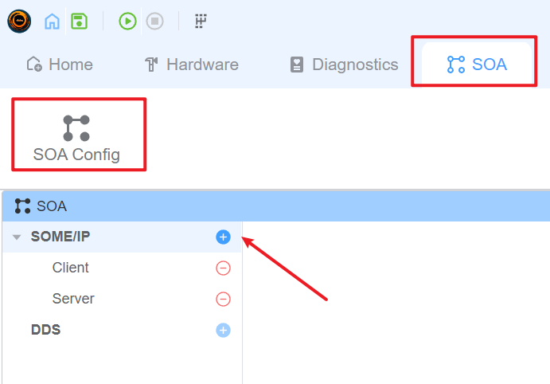
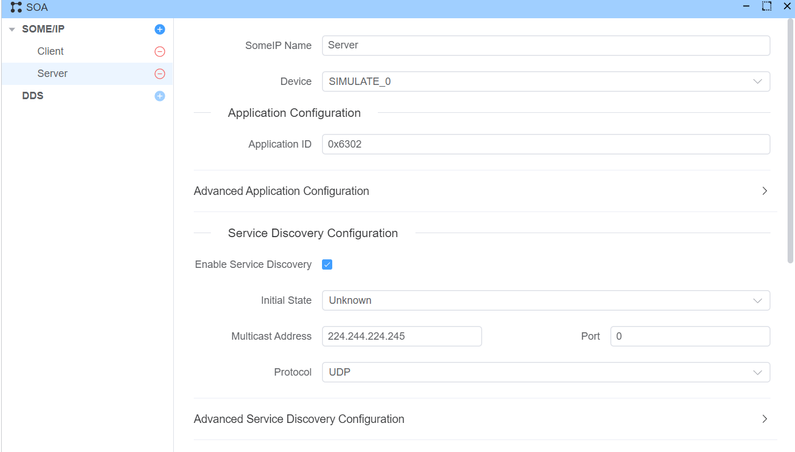
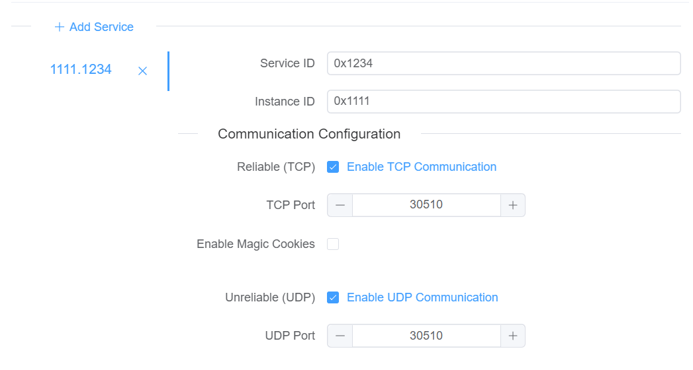
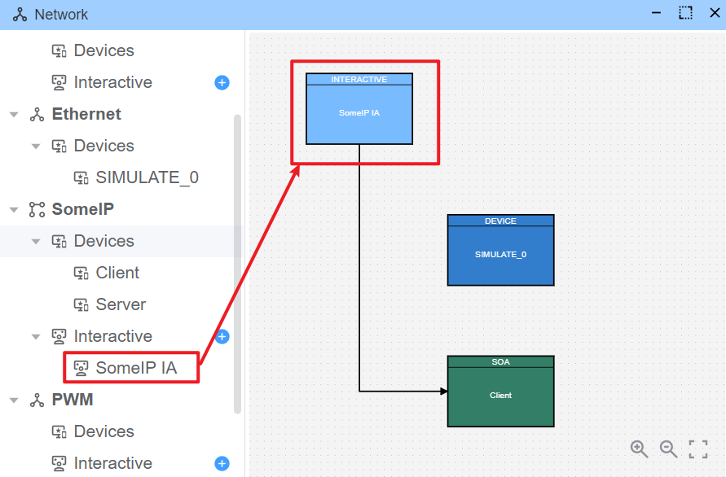
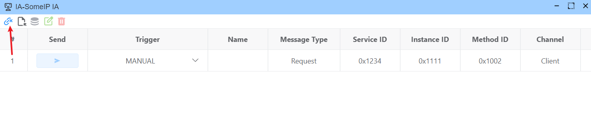
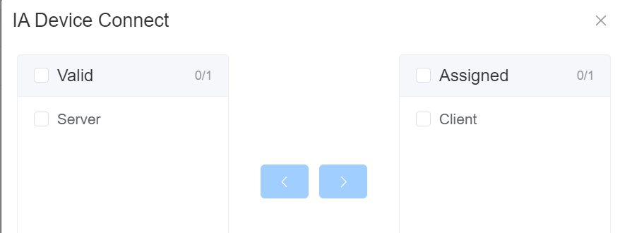
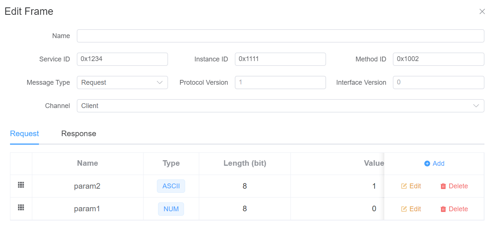
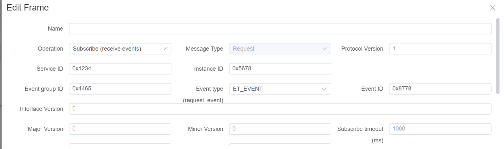
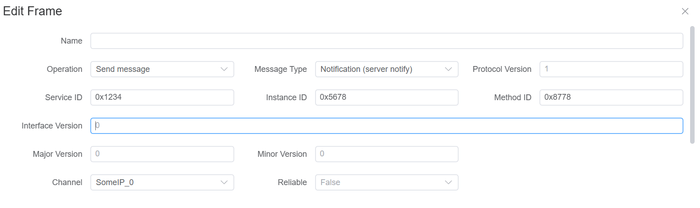

# SOME/IP

EcuBus-Pro supports the SOME/IP protocol and can be used for developing and testing SOME/IP-enabled devices.

## Configuration

> EcuBus-Pro's SOME/IP functionality is based on [vSomeIP](https://github.com/GENIVI/vsomeip). For configuration details that are unclear, please refer to the [vSomeIP Configuration Documentation](https://github.com/COVESA/vsomeip/blob/master/documentation/vsomeipConfiguration.md).

### Add SOME/IP Configuration

Add a SOME/IP configuration by clicking `SOA -> SOA Config -> Add SOME/IP Configuration`.



### Configure SOME/IP

Click a SOME/IP configuration item to open its settings.



#### Device Configuration

Each SOME/IP configuration must bind to one Ethernet device.

- Select the NIC used for SOME/IP communication.
- Verify local IP and subnet are reachable from the target ECU/service.
- In multi-NIC environments, explicitly bind to the NIC used for test traffic.


#### Application Configuration

Each SOME/IP configuration corresponds to one application and requires an Application ID.

- Application ID range: `1` to `65535`
- The value must be unique in the same runtime context.
- It should match your vSomeIP runtime expectation when integrating with external services.


#### Service Discovery Configuration

This section controls whether SOME/IP Service Discovery (SD) is enabled.

If SD is enabled, configure multicast and timing settings (for example multicast address, SD port, offer/request timing, and TTL).

> [!TIP]
> If service discovery is enabled, you may need multicast routing/firewall configuration on your computer.


#### Service Configuration



For each service, configure:

1. Service ID - The unique identifier for the service, ranging from 1-65535
2. Service Instance ID - The unique identifier for the service instance, ranging from 1-65535
3. Whether to enable TCP reliable transmission and the corresponding port number
4. Whether to enable UDP unreliable transmission and the corresponding port number

## SOME/IP Interactor

Use SOME/IP Interactor to quickly send SOME/IP actions and inspect responses/messages.



### Interactor Configuration

Hover over the interactor block and click **Edit**.

#### Connection Configuration




#### Edit Request

> [!TIP]
> Selecting requests from the database is not currently supported.



### Common Action Flow (Subscribe Before Notify)

For event-based communication, use this sequence:

1. Configure a `subscribe` action (`someipOp=subscribe`) for the target Service/Instance/Event Group.
2. Execute the subscribe action first and confirm subscription succeeds.
3. Trigger or wait for remote notify messages.
4. Observe messages in Trace or in the Interactor response area.

> [!IMPORTANT]
> If you do not subscribe first, notify messages are typically not delivered to the client.






### Recommended Validation Checklist

- Service/Instance/Method/Event Group IDs match on both sides.
- Local NIC/IP binding is correct.
- UDP/TCP ports are consistent with remote service.
- Service Discovery multicast settings are reachable.
- Firewall allows SOME/IP and SD traffic.

## SOME/IP Script

### [Util.OnSomeipMessage](https://app.whyengineer.com/scriptApi/classes/UtilClass.html#onsomeipmessage) Listen to SOME/IP Messages

Listen to SOME/IP messages. When a SOME/IP message is received, the callback function will be called.

```typescript
// Listen to all SOME/IP messages
Util.OnSomeipMessage(true, (msg) => {
  console.log('Received SOMEIP message:', msg);
});

// Listen to SOME/IP messages for a specific service/instance/method
Util.OnSomeipMessage('0034.5678.90ab', (msg) => {
  console.log('Received specific SOMEIP message:', msg);
});

// Listen to SOME/IP messages for a specific service with wildcards
Util.OnSomeipMessage('0034.*.*', (msg) => {
  console.log('Received specific SOMEIP message:', msg);
});
```

### [output](https://app.whyengineer.com/scriptApi/functions/output.html) Output SOME/IP Messages

Output SOME/IP messages. You can output SOME/IP requests and SOME/IP responses.

```typescript
import { SomeipMessageRequest, SomeipMessageResponse, output } from 'ECB'

Util.OnSomeipMessage('1234.*.*', async (msg) => {
  if (msg instanceof SomeipMessageRequest) {
    const response = SomeipMessageResponse.fromSomeipRequest(msg)
    await output(response)
  }
})
```
