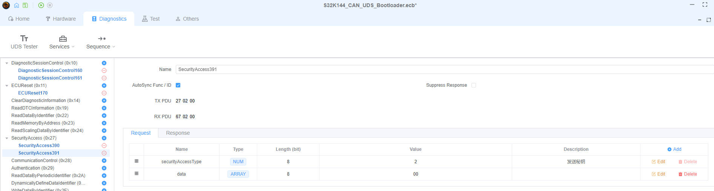
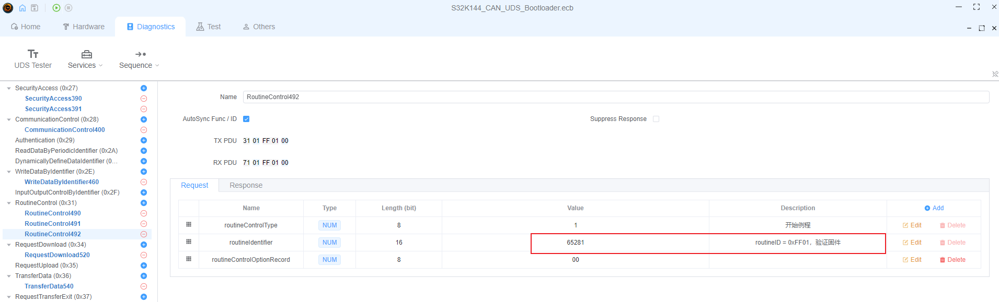

# UDS Bootloader Implementation Guide

## Overview

This guide demonstrates how to implement a complete UDS (Unified Diagnostic Services) bootloader using EcuBus-Pro with the S32K144 microcontroller. The example covers the entire firmware update process, from initial configuration to script implementation.


## Project Configuration
### Hardware and Communication Setup
+ Configure the Hardware>Device interface as follows, select Leaf V3. Other CAN card configurations are similar, just ensure the baud rate is at 500K.
  
> [!NOTE]
> All Supported CAN Devices: [CAN Devices](./../../can/can.md)


+ You can select the corresponding sampling point according to actual conditions.


+ Set the addressing mode. The S32K144 official CAN UDS Bootloader example uses Normal fixed addressing, configured as follows.


### Diagnostic Services Configuration
#### DiagnosticSessionControl (Diagnostic Session Control) ($10) Service
+ Configuration for entering extended session:


+ Configuration for entering programming session:


#### ECUReset (ECU Reset) ($11) Service
+ Hardware reset configuration is as follows, using hardware reset here.


#### SecurityAccess (Security Access) ($27) Service
+ Seed request configuration is as follows. You need to enter the Response interface and change the securitySeed length to 128bit, otherwise you cannot receive the complete seed data replied by the MCU.


+ Key response configuration is as follows. The data segment will have its size changed to 128bit in the script and filled with the calculated key.



#### CommunicationControl (Communication Control) ($28) Service
+ Disable network management messages and normal message transceivers, configured as follows.


#### WriteDataByIdentifier (Write Data By Identifier) ($2E) Service
+ Write to specified DID. The S32K144 official CAN UDS Bootloader example uses 0xF15A, configured as follows.


#### RoutineControl (Routine Control) ($31) Service
+ Routine with routineID 0x0202 is used to notify the MCU to perform CRC verification, configured as follows.


+ Routine with routineID 0xFF00 is used to notify the MCU to perform Flash erase, configured as follows.


+ Routine with routineID 0xFF01 is used to notify the MCU to perform firmware verification, configured as follows.



#### RequestDownload (Request Download) ($34) Service
+ Request download configuration is as follows. The storage address and storage space will be assigned in the script during actual use.


#### TransferData (Transfer Data) ($36) Service
+ Transfer data configuration is as follows. During actual use, it will be repeatedly called and assigned values in the script.


#### RequestTransferExit (Request Transfer Exit) ($37) Service
+ Stop transfer configuration is as follows.


#### JobFunction
> What is a Job? A Job is an abstract service in EcuBus-Pro. When using a Job, there must be a corresponding script. Through the script, the Job's return is implemented. The Job's return requirement is an array, which can be 0-N normal UDS services or Jobs. Jobs are typically used for firmware download, upload, and other scenarios that require multiple unknown quantities of 0x36 services, but can also be used for any other situations you want.

Add empty JobFunction0 and JobFunction1 to facilitate combining download-related services through scripts.


### Sequence Configuration
The entire UDS upgrade process is configured as shown in the following diagram:


It is mainly divided into three phases:

`Pre-programming phase:`

1. Enter extended session through $10 service;
2. Disable network management messages and normal message transceivers through $28 service;

`Programming phase:`

1. Enter programming session through $10 service;
2. Request seed and return calculated key through $27 service, successfully pass verification;
3. Write specified DID (0xF15A) through $2E service;
4. Initiate flash driver download request through $34 service;
5. Transfer flash driver through $36 service;
6. End transfer through $37 service;
7. Notify MCU to perform CRC verification and Flash erase through $31 service;
8. Initiate APP download request through $34 service;
9. Transfer APP through $36 service;
10. End transfer through $37 service;
11. Notify to perform CRC verification and firmware check through $31 service;

`Post-programming phase:`

1. Perform hardware reset through $11 service

## Implementation
### Development Environment Setup
+ Create a new ts file in the project directory;


+ Place the files needed for upgrade in the project directory;


+ Load the script file in UDS Tester and open VS Code for script writing;


### Script Development
#### Import Necessary Modules
```typescript
// Import necessary modules
import crypto from 'crypto'
import { CRC, DiagRequest, DiagResponse } from 'ECB'
import path from 'path'
import fs from 'fs/promises'
```

#### Prepare Required CRC Algorithm and Related Variables
```typescript
// Create CRC instance, configure parameters: type 'self', 16 bits, polynomial 0x3d65, initial value 0, XOR value 0xffff, input/output reflection
const crc = new CRC('self', 16, 0x3d65, 0, 0xffff, true, true)
// Initialize maximum chunk size, initial value undefined
let maxChunkSize: number | undefined = undefined
// Initialize file content buffer, initial value undefined
let content: undefined | Buffer = undefined
```

#### Firmware File Configuration
```typescript
// Define file list, containing start address and file path for each file
const fileList: {
  addr: number
  file: string
}[] = [
  {
    // Start address of the first file
    addr:0x1FFF8010,
    // Path of the first file, joined from project root directory, bin folder and filename
    file: path.join(process.env.PROJECT_ROOT, 'bin', 'flash_api.bin')
  },
  {
    // Start address of the second file
    addr:0x00014200,
    // Path of the second file, joined from project root directory, bin folder and filename
    file: path.join(process.env.PROJECT_ROOT, 'bin', 'S32k144_UDS_Bootloader_App_Test.bin')
  }
]
```

#### Security Access Implementation
```typescript
/**
 * Listen to security access response event, encrypt received security seed and send response request
 * @param v - Security access response object
 */
Util.On('S32K144_CAN_UDS_Bootloader.SecurityAccess390.recv', async (v) => { 
  // Get security seed data from response
  const data = v.diagGetParameterRaw('securitySeed')
  // Create AES-128-CBC cipher with fixed key and zero initialization vector
  const cipher = crypto.createCipheriv(
    'aes-128-cbc',
    Buffer.from([0, 1, 2, 3, 4, 5, 6, 7, 8, 9, 10, 11, 12, 13, 14, 15]),
    Buffer.alloc(16, 0)
  )
  // Encrypt security seed data
  const encrypted = cipher.update(data)
  // Complete encryption operation
  cipher.final()
  // Create security access response request object
  const req = DiagRequest.from('S32K144_CAN_UDS_Bootloader.SecurityAccess391')
  // Set request parameter 'data' raw value to encrypted data
  req.diagSetParameterRaw('data', encrypted)
  // Initiate service change request
  await req.changeService()
})
```

#### JobFunction0 Implementation - Download Request and CRC Verification
```typescript
/**
 * Register job function 0, handle file download requests and CRC verification requests
 */
Util.Register('S32K144_CAN_UDS_Bootloader.JobFunction0', async () => {
  // Take the first file item from the file list
  const item = fileList.shift()
  if (item) {
    // Create request download diagnostic request object
    const r34 = DiagRequest.from('S32K144_CAN_UDS_Bootloader.RequestDownload520')
    // Create 4-byte buffer to store memory address
    const memoryAddress = Buffer.alloc(4)
    // Write file start address to buffer in big-endian byte order
    memoryAddress.writeUInt32BE(item.addr)
    // Set request parameter 'memoryAddress' raw value to memory address buffer
    r34.diagSetParameterRaw('memoryAddress', memoryAddress)
    // Asynchronously read file content to buffer
    content = await fs.readFile(item.file)
    // Calculate CRC value of file content
    const crcResult = crc.compute(content)
    // Create routine control diagnostic request object for CRC verification
    const crcReq = DiagRequest.from('S32K144_CAN_UDS_Bootloader.RoutineControl490')
    // Create 4-byte buffer to store CRC result
    const crcBuffer = Buffer.alloc(4)
    // Write CRC result to the last 2 bytes of buffer in big-endian byte order
    crcBuffer.writeUInt16BE(crcResult, 2)
    // Set routine control option record parameter size to 4 bytes (32 bits)
    crcReq.diagSetParameterSize('routineControlOptionRecord', 4 * 8)
    // Set routine control option record parameter raw value to CRC result buffer
    crcReq.diagSetParameterRaw('routineControlOptionRecord', crcBuffer)
    // Initiate routine control service request
    await crcReq.changeService()

    // Set request download diagnostic request object 'memorySize' parameter to file content length
    r34.diagSetParameter('memorySize', content.length)
    // Listen to request download diagnostic request response event
    r34.On('recv', (resp) => {
      // Get maximum block length parameter from response and read its first byte as maximum chunk size
      maxChunkSize = resp.diagGetParameterRaw('maxNumberOfBlockLength').readUint8(0)
    })
    // Return array containing request download diagnostic request object
    return [r34]
  } else {
    // If file list is empty, return empty array
    return []
  }
})
```

#### JobFunction1 Implementation - Data Transfer and Completion
```typescript
/**
 * Register job function 1, handle file chunk transfer requests and transfer exit requests
 */
Util.Register('S32K144_CAN_UDS_Bootloader.JobFunction1', () => {
  // Check if maximum chunk size is undefined or too small
  if (maxChunkSize == undefined || maxChunkSize <= 2) {
    // If condition not met, throw error
    throw new Error('maxNumberOfBlockLength is undefined or too small')
  }
  if (content) {
    // Subtract 2 from maximum chunk size
    maxChunkSize -= 2
    // Ensure maximum chunk size is multiple of 8
    if (maxChunkSize & 0x07) {
      maxChunkSize -= maxChunkSize & 0x07
    }
    // Calculate number of chunks needed for file content
    const numChunks = Math.ceil(content.length / maxChunkSize)
    // Initialize array to store transfer request objects
    const list = []
    // Loop to generate transfer request for each chunk
    for (let i = 0; i < numChunks; i++) {
      // Calculate start position of current chunk
      const start = i * maxChunkSize
      // Calculate end position of current chunk, not exceeding file content length
      const end = Math.min(start + maxChunkSize, content.length)
      // Extract current chunk from file content
      const chunk = content.subarray(start, end)

      // Create transfer data diagnostic request object
      const transferRequest = DiagRequest.from('S32K144_CAN_UDS_Bootloader.TransferData540')
      // Set transfer request parameter record size to current chunk byte count
      transferRequest.diagSetParameterSize('transferRequestParameterRecord', chunk.length * 8)
      // Set transfer request parameter record raw value to current chunk
      transferRequest.diagSetParameterRaw('transferRequestParameterRecord', chunk)

      // Calculate block sequence number (starting from 1)
      const blockSequenceCounter = Buffer.alloc(1)
      // Use cyclic count 1-255, write block sequence number to buffer
      blockSequenceCounter.writeUInt8((i + 1) & 0xff) 
      // Set block sequence counter parameter raw value to block sequence number buffer
      transferRequest.diagSetParameterRaw('blockSequenceCounter', blockSequenceCounter)

      // Add transfer request object to array
      list.push(transferRequest)
    }
    // Create request transfer exit diagnostic request object
    const r37 = DiagRequest.from('S32K144_CAN_UDS_Bootloader.RequestTransferExit550')
    // Set transfer request parameter record size to 0
    r37.diagSetParameterSize('transferRequestParameterRecord', 0)
    // Add request transfer exit diagnostic request object to array
    list.push(r37)
    // Clear file content buffer
    content = undefined
    // Reset maximum chunk size to undefined
    maxChunkSize = undefined
    // Return array containing all transfer requests and transfer exit request
    return list
  } else {
    // If file content buffer is empty, return empty array
    return []
  }
})
```

---

*This example serves as a foundation for implementing UDS bootloaders in automotive applications. Customize the configuration and scripts according to your specific project requirements.*


