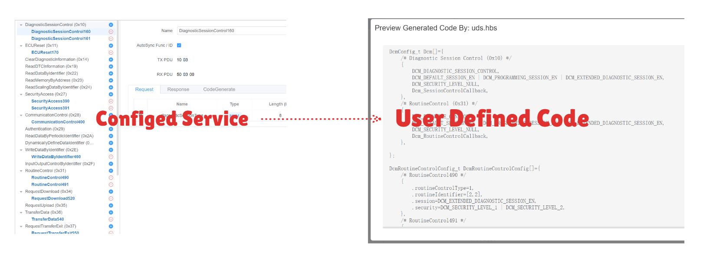
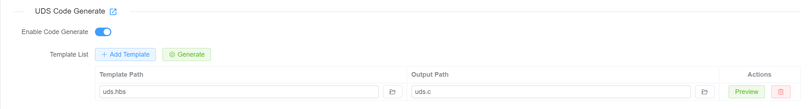
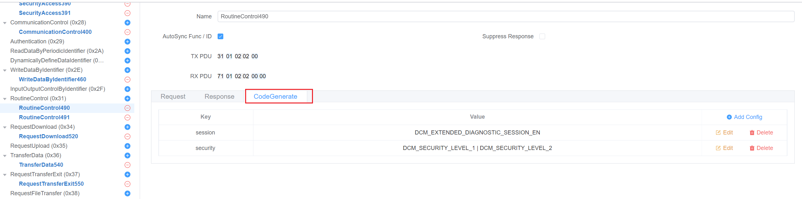

# UDS -> C Code

Users can generate C code based on their configured UDS services. The code format depends on user-defined templates.


## UDS Code Generation

First, users need to enable UDS code generation in the UDS Tester.



Then users can add Template Configurations. Each template configuration contains two fields:

* **Template Path**: Users can select a template file from the local file system.
* **Generate Path**: Users can specify the path where the generated code will be saved.

Multiple template configurations are supported. Users can add or remove template configurations as needed, and each template supports runtime preview functionality.

## Special Properties

When enabling UDS code generation, each service supports adding user-defined special properties for `code generation`.


Properties are defined in Key-Value format.

**Requirements:**

* Keys cannot be duplicated
* Values must be strings

## Template

The UDS code generation system is based on [**Handlebars.js**](https://handlebarsjs.com) templating engine, enhanced with extensive custom helper methods to provide powerful code generation capabilities.

### Template System Overview

Templates use Handlebars syntax with double curly braces `{{ }}` for expressions and `{{# }}{{/ }}` for block helpers. The system provides access to UDS service data, configuration properties, and a rich set of helper functions.

### Available Data Context

When generating code, templates have access to:

* **tester:[TesterInfo](https://app.whyengineer.com/scriptApi/interfaces/TesterInfo.html)**: All configured UDS services and their properties
* **project:ProjectInfo**: Project information, type is:

```ts
export interface ProjectInfo {
  name: string
  path: string
}
```

### Custom Helper Methods

#### **Mathematical Operations**

* `{{add a b}}` - Addition
* `{{subtract a b}}` - Subtraction  
* `{{multiply a b}}` - Multiplication
* `{{divide a b}}` - Division
* `{{abs num}}` - Absolute value
* `{{ceil num}}` - Round up
* `{{floor num}}` - Round down
* `{{modulo a b}}` - Remainder
* `{{avg array}}` - Average of array
* `{{sum array}}` - Sum of array

#### **String Manipulation**

* `{{camelcase str}}` - Convert to camelCase
* `{{capitalize str}}` - Capitalize first letter
* `{{uppercase str}}` - Convert to UPPERCASE
* `{{lowercase str}}` - Convert to lowercase
* `{{dashcase str}}` - Convert to dash-case
* `{{snakecase str}}` - Convert to snake_case
* `{{dotcase str}}` - Convert to dot.case
* `{{append str suffix}}` - Append suffix
* `{{prepend str prefix}}` - Prepend prefix
* `{{trim str}}` - Remove whitespace
* `{{replace str old new}}` - Replace text

#### **Array Operations**

* `{{first array n}}` - Get first n items
* `{{last array n}}` - Get last n items
* `{{after array n}}` - Get items after index n
* `{{before array n}}` - Get items before index n
* `{{join array separator}}` - Join array elements
* `{{arrayify value}}` - Convert to array
* `{{#forEach array}}...{{/forEach}}` - Iterate array
* `{{#eachIndex array}}...{{/eachIndex}}` - Iterate with index

#### **Comparison & Logic**

* `{{eq a b}}` - Equal to
* `{{ne a b}}` - Not equal to
* `{{gt a b}}` - Greater than
* `{{lt a b}}` - Less than
* `{{gte a b}}` - Greater than or equal
* `{{lte a b}}` - Less than or equal
* `{{isString val}}` - Check if string
* `{{isNumber val}}` - Check if number
* `{{isArray val}}` - Check if array
* `{{isDefined val}}` - Check if defined
* `{{isUndefined val}}` - Check if undefined

#### **Utility Functions**

* `{{setVar name value}}` - Set variable
* `{{jsonParse str}}` - Parse JSON string
* `{{jsonStringify obj}}` - Convert to JSON
* `{{times n}}...{{/times}}` - Repeat n times
* `{{range start end}}...{{/range}}` - Loop from start to end
* `{{logFile message}}` - Debug output
* `{{error message}}` - Throw error

### Template Example

```handlebars
/* Generated UDS Code */
#include <stdint.h>

{{#forEach services}}
// Service: {{name}}
{{#if (isDefined description)}}
/* {{description}} */
{{/if}}

#define {{uppercase (snakecase name)}}_ID 0x{{serviceId}}

{{#if specialProperties}}
/* Special Properties */
{{#each specialProperties}}
#define {{uppercase (snakecase @key)}} "{{this}}"
{{/each}}
{{/if}}

{{/forEach}}
```

### More Complex Example

See the [uds_generate_code](https://app.whyengineer.com/examples/uds_generate_code/readme) example.
