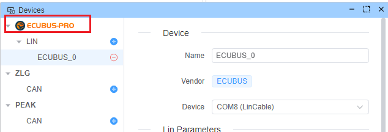

# EcuBus Hardware

At **EcuBus**, we've worked with a wide range of hardware devices from various vendors, integrating and adapting them to deliver seamless experiences for our users. However, through years of hands-on development, we’ve found that many existing solutions fall short — whether in flexibility, performance, or advanced feature support.

That’s why we’re excited to announce **EcuBus Hardware** — our own line of purpose-built devices, designed from the ground up to deliver the **exceptional capabilities** we’ve always envisioned.

## Why EcuBus Hardware?
- **Optimized for EcuBus-Pro**: Seamless compatibility with our software, ensuring stable and powerful performance out of the box.

- **Next-Level Features**: We’re building hardware that unlocks features simply not possible with off-the-shelf devices.

- **Developer-First Design**: Tuned for customization, extensibility, and precise control, giving engineers exactly what they need.

- **Reliable & Future-Proof**: Engineered to keep up with evolving protocols and demanding environments.

## Our Vision
We’re not just creating another hardware product. We’re building tools that empower developers, testers, and engineers to go beyond the limits of traditional solutions — delivering an **amazing** experience that truly makes a difference.

## Hardware List

Choose from our specialized EcuBus hardware options:

---

### LinCable

LinCable is our most affordable LIN hardware device, providing USB to LIN connectivity. It supports powerful fault injection capabilities for LIN conformance testing. For more details, see [LinCable](./lincable.md)

