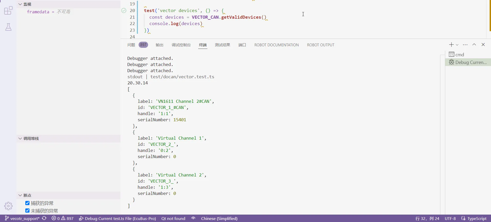

# 如何开发新的适配器

EcuBus-Pro 目前已支持许多主流的 CAN 通信盒，但您可能拥有其他厂商生产的、型号和接口各异的 CAN 设备。通过遵循官方文档中的 [如何开发新适配器](../adapter) 开发流程，您可以为 EcuBus-Pro 添加底层驱动程序以实现适配。

为此，我基于现有基础添加了一些 Vector 驱动。由于这是我首次接触这些技术，以下记录了具体步骤，仅供参考。

---

## 1. 必备基础知识

根据手册中的步骤，以 ZLG CAN 盒为例，CAN 盒驱动与 Electron 客户端的交互原理大致如下：

- **CAN 盒的 lib 库 + .h 头文件 + .i 接口文件**
- 使用 **SWIG** 生成 `zlg_wrap.cxx`
- `.cxx` 文件通过 **node-gyp** 编译为 `zlg.node`
- 导入 `.node` 后，在 `index.ts` 中实现设备初始化、CAN 收发等功能
- 最终用于 Electron 的 `base.ts` 接口实现和 `zlg.test.ts` 测试

### 各文件的作用

| 文件                    | 说明                                                               |
| ----------------------- | ------------------------------------------------------------------ |
| `zlg.i`                 | SWIG 接口文件，定义 C/C++ 到 JavaScript 的转换规则                 |
| `s.bat`                 | 脚本，用于将 C/C++ 代码转换为 JavaScript 代码，生成 `zlg_wrap.cxx` |
| `zlg_wrap.cxx`          | 生成的 JavaScript 代码（C++ 形式）                                 |
| `buffer.i`, `buffer1.i` | 缓冲区接口，通常无需修改                                           |
| `tsfn.cxx`              | 线程安全文件，CAN 收发线程的入口                                   |
| `zlg.node`              | 编译后的 node 模块，可在 `.ts` 文件中使用                          |


### SWIG 的作用

SWIG 是一个跨语言编译器，用于将驱动 API 的 C/C++ 语言封装为 JavaScript，使其他语言能够访问这些 API 声明并调用 Lib 接口。

### node-gyp 的作用

将已转换为 JavaScript 的 C/C++ API 和 Lib 编译为 node 模块，实现跨平台分发。

---

### 学习建议

要完成上述流程，需要掌握基本的 JavaScript/TypeScript 语法。对于只会 C/C++ 的用户，推荐通过 [TypeScript 教程](../jslearn)（菜鸟教程网站）快速学习。花 1-2 天时间跟随教程中的每个示例，即可掌握基本语法和语言特性。更高级的应用可在实际编码时查阅资料。

对于 SWIG，我们只需了解它是一个跨语言编译器，能为驱动 API 的 C/C++ 声明创建封装，使 TypeScript 等语言能够访问这些声明。SWIG 功能强大且复杂，但我们可以暂时忽略其他功能，仅通过一个简单示例理解其工作原理，例如参考这篇 [SWIG 入门与快速上手指南](https://www.cnblogs.com/xiaoqi/p/17973315/SWIG)。

---

## 2. 替换与构建

掌握上述基础知识后，基于现有驱动程序添加新的 CAN 盒驱动就变得简单多了。最佳方法是模仿并逐步替换现有程序。

- 如果您已有其他语言实现的 CAN 盒驱动，只需将设备初始化、CAN 收发等功能转换为 TypeScript 语言。转换工作可借助 AI 完成。
- 如果您从未实现过 CAN 盒驱动，可参考厂商提供的官方示例，这些示例通常包含多种语言的 API 实现，同样可转换为 TypeScript。

### 以 Vector 驱动为例，基于 ZLG 实现的流程如下

1. 复制 `.\\docan\\zlg` 目录下的文件夹，创建 `vector` 文件夹：

   ```text
   <\zlg>  
   ├index.ts  
   ├<\inc>  
   │  ├canframe.h  
   │  ├config.h  
   │  ├typedef.h  
   │  └zlgcan.h  
   ├<\lib>  
   │  └zlgcan.lib  
   ├<\swig>  
   │  ├buffer.i  
   │  ├buffer1.i  
   │  ├s.bat  
   │  ├tsfn.cxx  
   │  ├zlg.i  
   │  └zlg_wrap.cxx

   <\vector>  
   ├index.ts  
   ├<\inc>  
   │  └vxlapi.h  
   ├<\lib>  
   │  └vxlapi64.lib  
   ├<\swig>  
   │  ├buffer.i  
   │  ├buffer1.i  
   │  ├s.bat  
   │  ├tsfn.cxx  
   │  ├vector.i  
   │  └vector_wrap.cxx
   ```

    将 `.h` 和 `.lib` 文件替换为 Vector 的文件，其他文件暂时保持不变，并将所有文件重命名为 `vector`。

2. 修改 SWIG 接口文件 `vector.i`：
    - 更改模块名和包含的头文件为 Vector 的
    - 暂时禁用所有 `pointer_class`、`array_class` 等定义，因为这些定义来自 `.h` 文件，而新的 `vxlapi.h` 可能不包含它们
    - 后续按需添加，确保 `.i` 文件不包含原始 `zlgcan.h` 的内容

    ```plain
    %module vector
    ...
    %header %{
    ...
    #include "vxlapi.h"
    ...
    // %array_class(uint32_t, U32Array);
    // %array_class(BYTE, ByteArray);
    // %array_class(ZCAN_Receive_Data, ReceiveDataArray);
    // %array_class(ZCAN_ReceiveFD_Data, ReceiveFDDataArray);
    ...
    %}
    ```

3. 修改 `vector` 的 `s.bat`：

    ```bat
    swig -I"./../inc" -c++ -javascript -napi -v ./vector.i
    ```

    在 `.\docan\vector\swig` 目录下执行该命令，将从 `inc` 目录的 `vxlapi.h` 头文件生成 `vector_wrap.cxx`。
    
    如果命令行报错，说明 `vxlapi.h` 中某些代码无法转换为 `.cxx`，需根据提示禁用或修改，直到成功生成 `.cxx`。
    此时，`.ts` 文件实际上已可使用 `vector_wrap.cxx` 访问 Lib API，但为了跨平台兼容性，仍需进一步生成 `.node` 模块。

4. 修改线程安全文件 `tsfn.cxx`：
    - 替换 `#include "zlgcan.h"`
    - 暂时禁用其中关于 ZLG API 的实现函数
    - 替换为 Vector 的实现
    - 确保 `.cxx` 文件不再包含原始 `zlgcan.h` 的内容

    ```plain
    #include "vxlapi.h"
    ...
        // numCan = ZCAN_GetReceiveNum(context->channel, TYPE_CAN);
        // numCanFd = ZCAN_GetReceiveNum(context->channel, TYPE_CANFD);
        // ZCAN_CHANNEL_ERR_INFO err;
        // ZCAN_ReadChannelErrInfo(context->channel, &err);
        // ZCAN_ResetCAN(context->channel);
    ...
    ```

5. 此时，`swig` 目录中的程序已不再包含原始 ZLG 代码，可以开始构建 `vector.node`。然后修改 `.\docan\binding.gyp`，在 `'target_name': 'zlg'` 之后添加 `'target_name': 'vector'` 的内容，并禁用其他设备的构建指令，避免 `npx node-gyp rebuild` 每次都重复构建 peak、kvaser 等驱动。

```json
# 'target_name': 'peak',
# 'target_name': 'kvaser',
# 'target_name': 'zlg',
# 'target_name': 'toomoss',
{
   'target_name': 'vector',
   'conditions': [
      ['OS=="win"', {
         'include_dirs': [
             './vector/inc',
             "<!@(node -p \"require('node-addon-api').include\")"
         ],
         'configurations': { },
         'defines': [
             '__EXCEPTIONS'
         ],
         'sources': [
             './vector/swig/vector_wrap.cxx',
             './vector/swig/tsfn.cxx'
         ],
         'cflags': [ ],
         'cflags_cc': [ ],
         'libraries': ['<(module_root_dir)/vector/lib/vxlapi64.lib'],
         'defines': [ 'DELAYLOAD_HOOK' ],
         'msvs_settings': {
             'VCCLCompilerTool': {
                 'AdditionalOptions': [ '/DELAYLOAD:vxlapi64.dll' ],
                 'ExceptionHandling':1
             }
         },
         'link_settings': {
             'libraries': [ '-DELAYLOAD:vxlapi64.dll' ]
         }
      },
      ...
      ]
}
```

在终端执行如下指令，这将在 `\docan\build\Release` 目录下生成 `vector.node`。此时，C/C++ 和 Lib 已被编译为可供 `.ts` 文件使用的 Node 模块。如果构建失败，请根据错误提示进行修改。

```bash
cd src/main/docan
npx node-gyp rebuild
```


---

## 3. 移植与测试

1. CAN 设备的初始化和收发功能均在 `index.ts` 文件中实现。
    1. 将原始的 `import ZLG` 改为 `import VECTOR`
    2. 将所有 ZLG 实现方法改为 VECTOR 实现方法
    3. 暂时禁用 VECTOR 中不存在的方法
    4. 导入之前生成的 `vector.node` 后，即可使用所有 Vector API：

        ```ts
        import VECTOR from './../build/Release/vector.node'
        ...
        export class VECTOR_CAN extends CanBase ...
        const devices = VECTOR_CAN.getValidDevices()
        ...
        ```

        `index.ts` 中的构造函数继承自 `CanBaseInfo`，包含 Electron UI 中设备选择的信息。通过重写 `getValidDevices` 方法，可用设备列表也会添加到 UI 下拉框中。

        ```ts
        // 新的构造函数
        constructor(info: CanBaseInfo) {
          super()
          this.id = info.id // 当前子类使用 = 父类属性
          this.info = info
          const devices = VECTOR_CAN.getValidDevices() // 获取设备列表的方法
          const target = devices.find((item) => item.handle == info.handle) // 在设备列表中查找与下拉框选中项匹配的 handle
          if (!target) {
            throw new Error('无效的 handle') // 无效 handle，设备无效
          }
          this.event = new EventEmitter() // 创建 EventEmitter 对象，用于 emit 和 listen 事件
          this.log = new CanLOG('VECTOR', info.name, this.event) //
          //'0:0' = 哪个总线: 通道索引
          this.index = parseInt(info.handle.split(':')[1]) // 通道索引: :0
          this.deviceType = parseInt(info.handle.split('_')[0]) // 父类中的设备类型: XL_HWTYPE_VN1611
          this.deviceIndex = parseInt(info.handle.split('_')[2]) // 通道索引: _0
        ```

        在 `index.ts` 中添加设备初始化代码后，可直接调试 `index.ts`。但由于最终使用的参数来自 UI 选择，确保 `info` 参数正确传递也至关重要。

    5. 在 `.\test\docan` 目录下创建 `vector.test.ts`（参考 `zlg.test.ts`）
    6. 通过调试 `.test.ts` 文件来调试 `index.ts`
    7. 在 `.test.ts` 中模拟不同的 UI 参数设置
    8. 只要 `.test.ts` 测试通过，Electron 的 UI 参数传递也应正确

    9. 在 VSCode 的 `launch.json` 中添加以下配置以调试 `.test.ts`：

    ```json
    {
      "type": "node",
      "request": "launch",
      "name": "Debug Current test.ts File",
      "autoAttachChildProcesses": true,
      "skipFiles": [
        "<node_internals>/**",
        "**/node_modules/**"
      ],
      "program": "${workspaceRoot}/node_modules/vitest/vitest.mjs",
      "args": [
        "run",
        "${relativeFile}"
      ],
      "smartStep": true,
      "console": "integratedTerminal"
    }
    ```

2. 以下是一个示例：如果 Lib 提供了查询设备信息的 API，可先实现 `getValidDevices` 函数。在 `vector.test.ts` 中创建新测试，实现 `getValidDevices` 方法，并暂时禁用其他关于CAN收发的测试

    ```ts
    import { VECTOR_CAN } from '../../src/main/docan/vector'
    ...
    const dllPath = path.join(__dirname, '../../resources/lib')
    VECTOR_CAN.loadDllPath(dllPath)
    ...
    test('vector devices', () => {
    const devices = VECTOR_CAN.getValidDevices()
    console.log(devices)
    })
    ```

    前往 `index.ts` 实现该方法。例如，Vector 的获取设备信息 API 是 `xlGetDriverConfig`。对于 API 参数所需的数据类型，可直接使用 `vxlapi.h` 中的定义：

    ```ts
    static override getValidDevices(): CanDevice[] {
    // 重写 getValidDevices 方法，返回值为 CanDevice，返回可用设备列表
    const devices: CanDevice[] = []
    if (process.platform === 'win32') {
      const deviceHandle = new VECTOR.XL_DRIVER_CONFIG()
      const ret = VECTOR.xlGetDriverConfig(deviceHandle) // 获取/打印硬件配置 g_xlDrvConfig
      if (ret === 0) {
        ...
        devices.push({
          label: `${channelName}${busType}`, //'VN1640A Channel 1#LIN' = 通道名称#总线类型
          id: `VECTOR_${num}_${busType}`, //'VECTOR_0_#LIN' = 通道索引_#总线类型
          handle: `${channel.hwChannel}:${num}`, //'0:0' = 哪个总线: 通道索引
          serialNumber: channel.serialNumber
        })
      }
    }
    return devices
    }
    ```

    如果 `console.log(devices)` 在终端中打印出正确的设备信息，说明 `.ts` 可以正确访问 `.Lib` API，此前所有转换步骤均正确。
     

    若 .Lib 无设备查询 API，你也可以使用其他 API 进行简单测试，验证 `.Lib` 是否被 `.ts` 正确使用。如果无法访问 API 或调试时 API 报错，需返回前序步骤检查 `.cxx` 和 `.node` 生成过程是否有误。对于 `getValidDevices`，可参考 `.\zlg\index.ts`，根据设备特征返回固定的标识符和 handle

    ```ts
    static override getValidDevices(): CanDevice[] {
    if (process.platform == 'win32') {
    const zcanArray: CanDevice[] = [
     {
       label: 'ZCAN_USBCANFD_200U_INDEX_0_CHANNEL_0',
       id: 'ZCAN_USBCANFD_200U_INDEX_0_CHANNEL_0',
       handle: `${ZLG.ZCAN_USBCANFD_200U}_0_0`
     },
    ```

3. 当 `.Lib` API 可在 `.ts` 中正确使用后，在 `vector.test.ts` 中创建 Vector 设备初始化测试。此处设置的参数将与 `info` 一起传递给构造函数：

    ```ts
    describe('vector test', () => {
      let client!: VECTOR_CAN
     beforeAll(() => {
       client = new VECTOR_CAN({
         handle: '3:3',
         name: 'test',
         id: 'VECTOR_3_#CAN',
         vendor: 'vector',
         canfd: true,
         bitrate: {
           sjw: 1,
           timeSeg1: 13,
           timeSeg2: 2,
           preScaler: 10,
           freq: 500000,
           clock: '80'
         },
         bitratefd: {
           sjw: 1,
           timeSeg1: 7,
           timeSeg2: 2,
           preScaler: 4,
           freq: 2000000,
           clock: '80'
         }
       })
     })
    ```

    在 `index.ts` 中，传入的 `info.index` 将决定使用 `getValidDevices` 返回的哪个设备通道。通道匹配后，将执行进一步的初始化函数：

    ```ts
    constructor(info: CanBaseInfo) {
      const devices = VECTOR_CAN.getValidDevices() // 获取设备列表的方法
      this.index = parseInt(info.handle.split(':')[1]) // 通道索引: :0
      const DrvConfig = new VECTOR.XL_DRIVER_CONFIG()
      let xlStatus = VECTOR.xlGetDriverConfig(DrvConfig) // 获取/打印硬件配置 g_xlDrvConfig
      const channles = VECTOR.CHANNEL_CONFIG.frompointer(DrvConfig.channel) // 通道配置
      this.channelConfig = channles.getitem(this.index) // 通道号
      // 通道掩码计算
      this.channelMask = VECTOR.xlGetChannelMask(
        this.channelConfig.hwType,
        this.channelConfig.hwIndex,
        this.channelConfig.hwChannel
      )
      ....
      xlStatus = VECTOR.xlOpenPort(
          this.PortHandle.cast(),
          'EcuBus-Pro',
          this.channelMask,
          this.PermissionMask.cast(),
          16384,
          4,
          1
      )
    ```

    

    不同的设备初始化流程差别很大，这里不做详细说明。请根据实际情况在构造函数中添加初始化内容。对于 CAN 收发功能，可以先在构造函数中实现，确保收发正常，然后将发送功能移植到 `_writeBase`，接收功能移植到 `callback` 和 `callbackFd`，其他方法如 `close`、`getError` 等也按同样方式实现。同时，在 `vector.test.ts` 中测试收发功能:

    ```ts
    test.skip('write multi frame', async () => {

    test('read frame', async () => {

    test('write frame can-fd', async () => {
    ```

      

    此外，`tsfn.cxx` 中也有一些 API 实现，只需替换为对应功能的实现即可。

4. 许多 `.Lib` API 的参数必须使用特定的数据类型，否则会报错。TypeScript 并没有这么丰富的基础类型，因此需要在 `vector.i` 中重新封装 `vxlapi.h` 的类型，以供 `.ts` 使用。以下是一些常见情况：

    1. 指针类型参数,需定义指针类：

        ```plain
        vxlapi.h
            typedef XLlong XLportHandle;
        vector.i
            %pointer_class(XLportHandle, XLPORTHANDLE)
            %pointer_class(unsigned int, UINT32)
            %pointer_class(unsigned short, UINT16)
        index.ts
            private PortHandle = new VECTOR.XLPORTHANDLE()
            this.PortHandle.cast(),
            const cntSent = new VECTOR.UINT32()
            cntSent.assign(1)
            cntSent.cast()
        ```

    2. 数组结构指针类型,需定义数组类：
    
        ```plain
        vxlapi.h
            typedef struct {
            ...
            XL_CAN_RX_EVENT_UNION tagData;
            } XLcanRxEvent;
        vector.i
            %array_class(XLcanRxEvent, XLCANRXEVENT);
        index.ts
            const frames = new VECTOR.XLCANRXEVENT(1)
            xlStatus = VECTOR.xlCanReceive(this.PortHandle.value(), frames.cast())
        ```

    3. CAN 收发接口的参数有多种结构体类型，需要定义数组类来进行访问：

        ```plain
        vxlapi.h
            struct s_xl_can_msg {
            ...
            unsigned char  data[MAX_MSG_LEN];
            };

            union s_xl_tag_data {
            struct s_xl_can_msg                  msg;
            ...
            };

            struct s_xl_event {
            XLeventTag     tag;
            ...
            union s_xl_tag_data tagData;
            };

        vector.i
            %array_class(unsigned char, UINT8ARRAY)

        index.ts
            const framedata = new VECTOR.s_xl_event()
            framedata.tag = 10
            const dataPtr = VECTOR.UINT8ARRAY.frompointer(framedata.tagData.msg.data)
            for (let i = 0; i < data.length; i++) {
                dataPtr.setitem(i, data[i])
            }
        ```

    4. `vxlapi.h` 中的某些结构体包含联合体，需要将其拆分提取：

        ```plain
        typedef struct {
            ...
        } XL_CAN_TX_MSG;

        typedef struct {
          unsigned short     tag;              //  2 - type of the event
          unsigned short     transId;          //  2
          unsigned char      channelIndex;     //  1 - internal has to be 0
          unsigned char      reserved[3];      //  3 - has to be zero 

          union {
            XL_CAN_TX_MSG   canMsg;
          } tagData;
        } XLcanTxEvent;
        ```

    5. 例如，成员 `canMsg` 需要重新定义为 `XL_CAN_TX_MSG_UNION`，否则 `.ts` 无法访问它：

        ```plain
        typedef union {
          XL_CAN_TX_MSG   canMsg;
        } XL_CAN_TX_MSG_UNION;


        typedef struct {
          unsigned short     tag;              //  2 - type of the event
          unsigned short     transId;          //  2
          unsigned char      channelIndex;     //  1 - internal has to be 0
          unsigned char      reserved[3];      //  3 - has to be zero 

          XL_CAN_TX_MSG_UNION tagData;
        } XLcanTxEvent;
        ```

### 重要提醒

每次修改 `vxlapi.h` 和 `vector.i` 后，都需要重新运行 `s.bat` 和 `npx node-gyp rebuild` 以重新生成 `.node`，确保更改在 `.ts` 中生效。

---

### 最终步骤

当 `vector.test.ts` 测试通过后，参考 [添加到 UI](../adapter#add-in-ui) 将设备添加到 UI，此处不再赘述。
