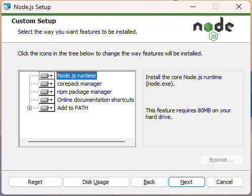
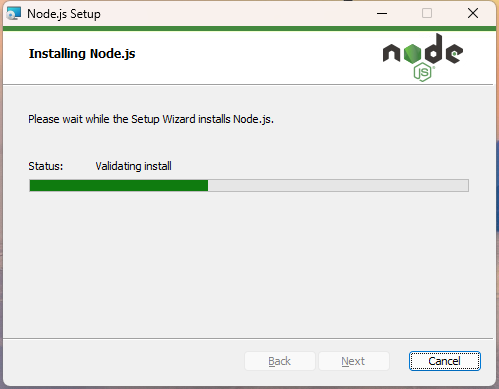
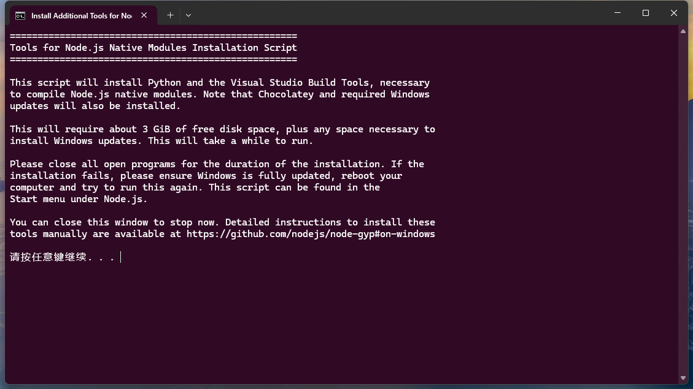
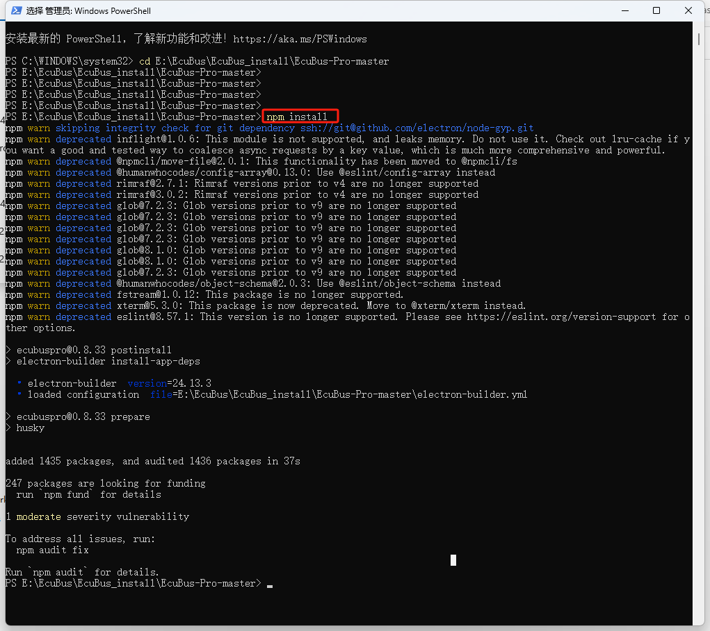
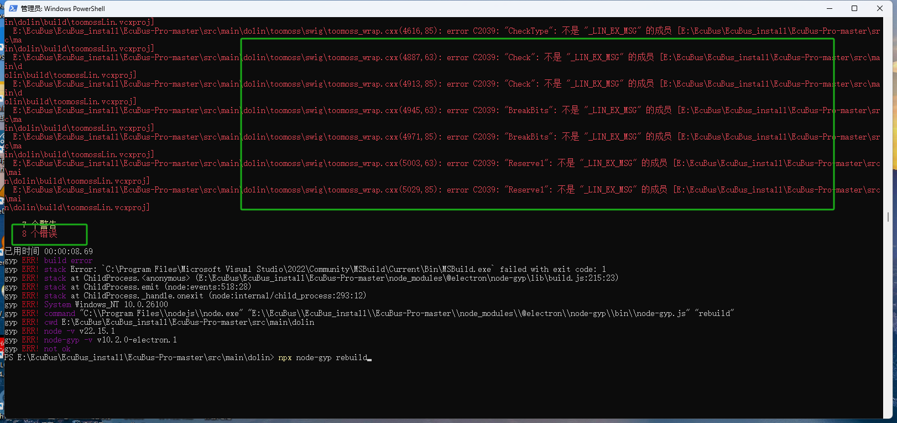
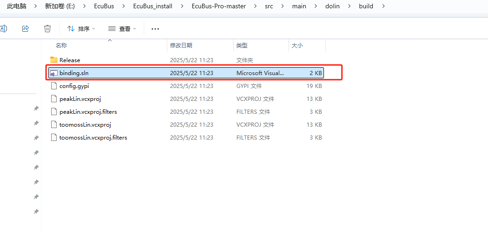

# EcuBus-Pro 开发环境详细设置指南

本指南提供了设置 EcuBus 开发环境的详细说明。 在开始之前，请准备以下内容：

1. Node.js - 从官方网站下载最新版本
2. EcuBus 源代码 - 从 GitHub 下载最新版本

准备好这些先决条件后，我们可以继续进行安装。

## 步骤 1：安装 Node.js

按照以下步骤安装 Node.js：

点击“下一步”：

点击“下一步”：

点击“下一步”：

点击“下一步”：

确保选中上图中突出显示的复选框。 这将自动安装 Node.js 所需的 Python 和 VS2019。 即使您已经安装了这些程序，我们也建议选中此复选框。

点击“安装”：

安装进行中...

点击“完成”。 将出现以下屏幕；按任意键继续：

按任意键继续：

下一个屏幕将检查您的计算机是否已安装 Python 和 VS。 如果没有，它将安装它们。 首次安装可能需要一些时间：

由于我的计算机已经安装了 Python 3.13.3 和 VS2019，因此跳过了这些步骤：

Python 3.13.3 和 VS2019 开发环境现已安装。 您可以退出此屏幕。

## 步骤 2：安装 NPM 包

我们已经完成了 Node.js 的安装。 现在让我们安装 NPM 包。

导航到 EcuBus 项目目录（在此示例中为 E:\EcuBus\EcuBus_install\EcuBus-Pro-master）：

运行 `npm install` 命令：

## 步骤 3：编译原生模块

安装完成后，导航到 src/main/docan 目录：

运行以下命令进行编译：`npx node-gyp rebuild`

如图所示，有 104 个错误。 这个问题困扰了我很长时间。 起初，我认为是环境问题，但**实际上是由于 .h 文件的编码格式**。

用记事本打开 toomoss 文件夹，我们发现 offline_type.h 采用 UTF-8 编码：

将格式更改为带 BOM 的 UTF-8 并重新编译：

现在错误减少到 75 个，tsfn.cxx 文件存在问题：

将 tsfn.cxx 文件编码更改为 BOM 格式：

进行此更改后，再次运行编译命令：

编译现在成功：

问题已解决！

## 步骤 4：编译 Dolin 模块

接下来，导航到 dolin 文件夹并运行编译命令：

我们再次遇到错误，可能是由于文件编码问题：

首先，我们修改 tsfn.cxx 文件编码格式：

编译仍然失败，出现相同的错误。 为了确定哪个文件有格式问题，请在 VS2019 或 VS2022 中打开项目：

在 VS2019 中编译时，我们得到以下错误：

我们发现 usb2lin_ex.h 文件存在编码问题。 修改后重新编译：

错误已解决！

## 步骤 5：启动应用程序

返回主目录并运行 `npm run dev`：

片刻之后，EcuBus 软件界面将出现，表明环境设置已完成。

## 总结

文件编码格式对编译过程产生了显著影响。 这是我第一次遇到这样的问题，可能是由于跨平台编译对特定文件编码格式的要求。

如果您遇到类似问题，希望本指南能有所帮助。 谢谢！
