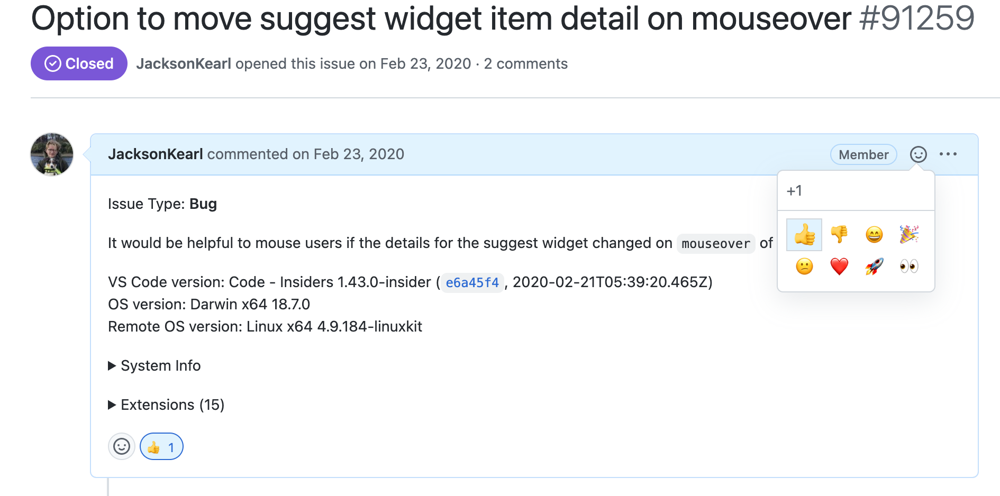

# 功能请求流程

## 步骤

1. 在 GitHub 仓库中创建一个功能 [issue](https://github.com/ecubus/EcuBus-Pro/issues/new/choose)。
2. 清楚地描述您要添加的功能，包括其目的以及它将如何为用户带来好处。
3. 使用 `enhancement` 标签标记该 issue，以适当分类。

为确保我们优先考虑有益于社区的功能，新的功能请求需要至少 5 个 GitHub 点赞（👍）才能被考虑加入我们的待办事项。

## 如何投票

在功能请求 issue 上添加 👍 反馈。

## 流程

1. 创建一个功能请求 Issue
2. 社区成员使用 👍 投票支持
3. 获得 5个以上的点赞后，该功能将被纳入待办审查
4. 点赞不足的功能请求可能会被关闭
