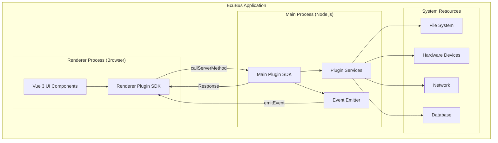
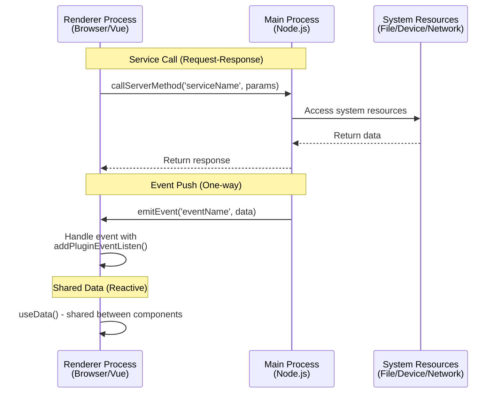

# EcuBus 插件开发指南

## 简介

EcuBus 提供了一个强大的插件系统，允许开发者通过自定义功能扩展应用程序的功能。 插件使用现代 Web 技术构建，包括 Vue 3、TypeScript 和 Vite，遵循类似于 Electron 的双进程架构。 插件使用现代 Web 技术构建，包括 Vue 3、TypeScript 和 Vite，遵循类似于 Electron 的双进程架构。

本指南将引导您了解开发、测试和发布自己的 EcuBus 插件所需的一切知识。

## 先决条件

在开始开发 EcuBus 插件之前，请确保您具备：

- **Node.js**：版本 20.19.0+ 或 22.12.0+
- **npm/pnpm/yarn**：任何现代包管理器
- **基础知识**：
  - TypeScript
  - Vue 3（组合式 API）
  - Node.js 基础知识

## 快速开始

### 创建新插件

创建新插件的最快方法是使用官方模板：

```bash
# Using npm
npm create ecubus-plugin@latest my-plugin

# Using pnpm
pnpm create ecubus-plugin my-plugin

# Using yarn
yarn create ecubus-plugin my-plugin

# Using bun
bun create ecubus-plugin my-plugin
```

然后导航到您的插件目录并安装依赖项：

```bash
cd my-plugin
npm install
```

### 启动开发服务器

```bash
npm run dev
```

此命令将：

- 在 `http://localhost:5173/` 启动渲染器进程开发服务器，支持热模块替换（HMR）
- 监视文件变化并自动重建主进程代码

> [!注意]
> 您需要更改 `manifest.json` 文件以指向正确的渲染器进程 URL。
>
> ```json
> {
>   "extensions": [{
>     "items": [{
>       "entry": "http://localhost:5173/"
>     }]
>   }]
> }
> ```

### 在 EcuBus-Pro 中加载您的插件

1. 打开 EcuBus 应用程序
2. 导航到 `插件`
3. 点击 `加载本地插件`
4. 选择您的插件目录
5. 您的插件将显示在 `插件市场` 列表中
6. 进入项目并检查您的插件扩展

## 项目结构

典型的 EcuBus 插件具有以下结构：

```
my-plugin/
├── src/
│   ├── main/              # Main process code (Node.js environment)
│   │   └── index.ts       # Register services, emit events, business logic
│   └── renderer/          # Renderer process code (Browser environment)
│       ├── App.vue        # Vue main component, UI interface
│       └── index.ts       # Renderer process entry
├── dist/                  # Build output directory
│   ├── main/             # Main process build output
│   └── renderer/         # Renderer process build output
├── public/               # Static assets
├── manifest.json         # Plugin configuration file (IMPORTANT!)
├── icon.png             # Plugin icon
├── package.json         # Project dependencies
├── vite.main.config.ts  # Vite config for main process
├── vite.renderer.config.ts  # Vite config for renderer process
├── DEVELOPMENT.md       # Detailed development guide
└── README.md
```

## 核心概念

### 1. 双进程架构

EcuBus 插件遵循双进程架构：



#### 主进程

- **环境**：Node.js
- **位置**：`src/main/index.ts`
- **能力**：
  - 完整的系统访问权限
  - 文件系统操作
  - 数据库访问
  - 硬件设备通信
  - 繁重的计算任务
  - 网络请求

#### 渲染器进程

- **环境**：浏览器（Chromium）
- **位置**：`src/renderer/`
- **能力**：
  - 使用 Vue 3 进行 UI 渲染
  - 用户交互处理
  - 调用主进程服务
  - 监听主进程事件
  - 数据可视化

> [!注意]
> Vue 3 和 Element Plus 已内置到 EcuBus-Pro 中，默认已外部化。 直接使用这些库将保持您的插件包体积较小。 直接使用这些库将保持您的插件包体积较小。

### 2. 进程间通信

主进程和渲染器进程通过安全 API 进行通信：

**主进程 → 渲染器**：

- 服务（渲染器调用，主进程响应）
- 事件（主进程发出，渲染器监听）

**渲染器 → 主进程**：

- 服务调用（异步 RPC 风格）

#### 通信架构



#### 示例：完整通信流程

**主进程**（`src/main/index.ts`）：

```typescript
import { registerService, emitEvent, getPluginPath } from '@ecubus-pro/main-plugin-sdk'

// Register a service that can be called from renderer
registerService('getUserInfo', async (userId: string) => {
  const user = await fetchUserFromDatabase(userId)
  return { success: true, user }
})

// Emit events to notify renderer process
setInterval(() => {
  const status = checkSystemStatus()
  emitEvent('statusUpdate', {
    timestamp: Date.now(),
    status: status
  })
}, 5000)

// Get plugin path for accessing local resources
const pluginPath = getPluginPath()
console.log('Plugin installed at:', pluginPath)
```

**渲染器进程** (`src/renderer/App.vue`)：

```vue
<script setup lang="ts">
import { ref, onMounted, onUnmounted } from 'vue'
import { 
  callServerMethod, 
  addPluginEventListen, 
  removePluginEventListen,
  useData 
} from '@ecubus-pro/renderer-plugin-sdk'

const userInfo = ref(null)
const systemStatus = ref('unknown')

// Call main process service
async function loadUser(userId: string) {
  const result = await callServerMethod('getUserInfo', userId)
  if (result.success) {
    userInfo.value = result.user
  }
}

// Listen to main process events
function handleStatusUpdate(data) {
  systemStatus.value = data.status
  console.log('Status updated at:', data.timestamp)
}

onMounted(() => {
  // Subscribe to events
  addPluginEventListen('statusUpdate', handleStatusUpdate)
})

onUnmounted(() => {
  // Clean up event listeners
  removePluginEventListen('statusUpdate', handleStatusUpdate)
})
</script>
```

### 3. 插件清单

`manifest.json` 文件是插件的配置文件，用于定义元数据和扩展点。

## 插件清单配置

### 基本结构

```json
{
  "id": "my-plugin",
  "name": "My Plugin",
  "version": "1.0.0",
  "description": "A description of what your plugin does",
  "author": "Your Name",
  "mainEntry": "dist/main/index.cjs",
  "icon": "icon.png",
  "readme": "README.md",
  "extensions": [
    {
      "targetTab": "test",
      "items": [
        {
          "type": "button",
          "id": "my-button",
          "label": "My Button",
          "icon": "mdi:hand-wave",
          "onClick": "handleClick",
          "entry": "http://localhost:5173/"
        }
      ]
    }
  ]
}
```

### 清单字段

| 字段            | 类型     | 必需 | 描述                                                |
| ------------- | ------ | -- | ------------------------------------------------- |
| `id`          | string | 是  | 插件的唯一标识符（小写，无空格）                                  |
| `name`        | string | 是  | 在 EcuBus 中显示的显示名称                                 |
| `version`     | string | 是  | 语义版本号（例如 "1.0.0"） |
| `description` | string | 否  | 插件功能的简短描述                                         |
| `author`      | string | 否  | 插件作者名称                                            |
| `mainEntry`   | string | 是  | 主进程入口文件的路径（相对于插件根目录）                              |
| `icon`        | string | 否  | 插件图标路径（推荐 PNG）                                    |
| `readme`      | string | 否  | README 文件路径                                       |
| `extensions`  | array  | 是  | 扩展点数组                                             |

### 扩展配置

每个扩展定义了您的插件在 EcuBus 中出现的位置和方式：

```json
{
  "targetTab": "test",        // Which tab to add the button
  "items": [
    {
      "type": "button",       // Extension type (currently only "button")
      "id": "unique-btn-id",  // Unique button identifier
      "label": "Click Me",    // Button label text
      "icon": "mdi:rocket",   // Icon (Iconify format)
      "onClick": "handler",   // Handler name (optional)
      "entry": "http://localhost:5173/"  // Renderer process URL
    }
  ]
}
```

**可用目标标签页**：

- `test` - 测试与诊断标签页
- `can` - CAN 总线标签页
- `lin` - LIN 总线标签页
- `data` - 数据分析标签页
- （查看 EcuBus 文档获取完整列表）

**图标格式**：
使用 Iconify 图标，格式为 `collection:icon-name`。 在 [iconify.design](https://iconify.design/) 浏览可用图标 在 [iconify.design](https://iconify.design/) 浏览可用图标

示例：

- `mdi:rocket` - Material Design Icons
- `lucide:settings` - Lucide 图标
- `carbon:settings` - Carbon 图标

## 获取帮助

如果您遇到问题：

1. 仔细检查本指南
2. 查看插件模板中的 DEVELOPMENT.md
3. 查看 EcuBus 官方文档
4. 在 GitHub 上搜索现有问题
5. 在社区论坛中提问
6. 如有需要，提交错误报告

## 贡献

我们欢迎贡献以改进插件系统！

- 提交错误报告
- 建议新功能
- 分享示例插件
- 改进文档

## 结论

您现在拥有创建强大 EcuBus 插件所需的所有知识！ 从模板开始，尝试示例，并构建一些令人惊叹的东西。 从模板开始，尝试示例，并构建一些令人惊叹的东西。

**插件开发愉快！** 🚀

---

_最后更新：2025 年 10 月_
_插件 SDK 版本：0.0.4+_

