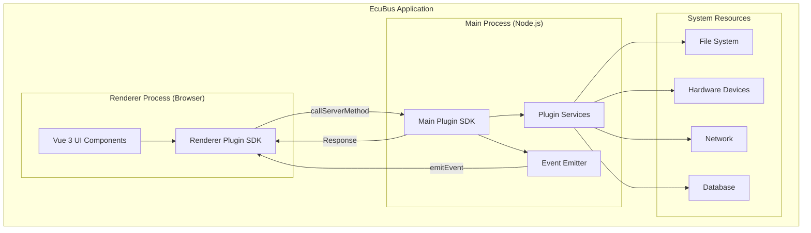
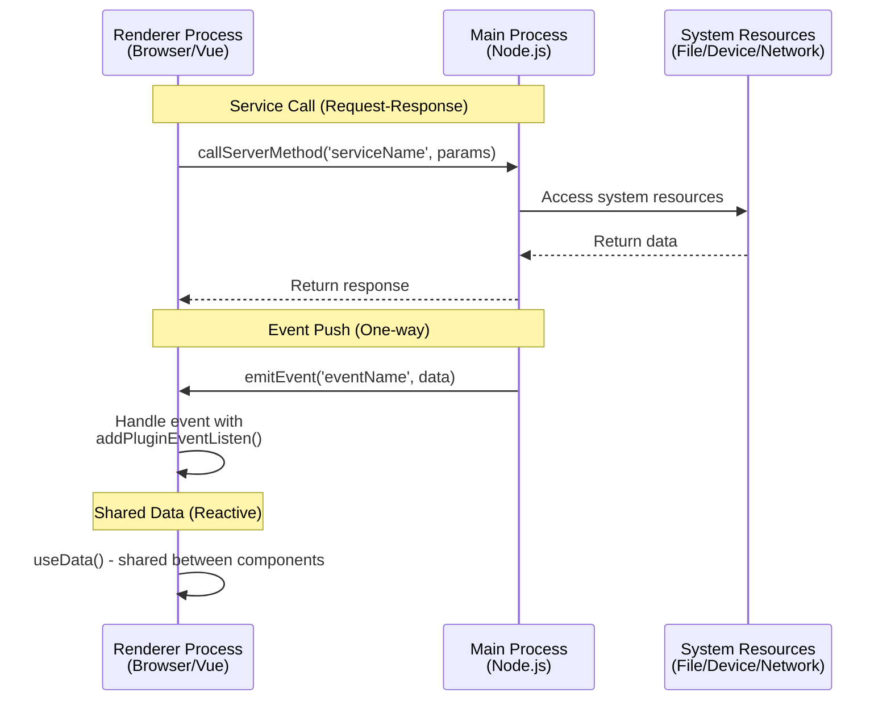

# EcuadBus 插件开发指南

## 一. 导言

EcuadBus 提供了一个强大的插件系统，允许开发者使用自定义功能扩展应用程序的功能。 插件是使用现代网络技术构造的，包括Vue 3, TypeScript和Vite, 采用类似于Electron的两进程构造。

本指南将使您走过您需要知道的开发、测试和发布您自己的 EcuadBus 插件的一切。

## 必备条件

在你开始开发EcuBus 插件之前，请确保你：

- **Node.js**: 版本 20.19.0+ 或 22.12.0+
- **npm/pnpm/yarn**: 任何现代软件包管理器
- **基本知识**：
  - 类型脚本
  - Vue 3 (Composition API)
  - Node.js 基础

## 快速开始

### 创建一个新插件

创建新插件的最快方式是使用官方模板：

```bash
# 使用 npm
npm 创建 ecubus-plugin@latest my-plugin

# 使用 pnpm
pnpm 创建 ecubus-plugin my-plugin

# 使用 yarn
yarn 创建 ecubus-plugin my-plugin

# 使用 bun
bun 创建 ecubus-plugin my-plugin
```

然后导航到你的插件目录并安装依赖：

```bash
cd 我的插件
npm 安装
```

### 启动开发服务器

```bash
npm 运行dev
```

此命令将：

- 在`http://localhost:5173/`上启动渲染器处理开发服务器，替换热模块(HMR)
- 当文件改变时观看并自动重建主进程代码

> [!注意]
> 你需要更改 `manifest.json` 文件来指向正确的渲染器进程 URL。
>
> ```json
> {
>   "extensions": [{
>     "items": [{
>       "entry": "http://localhost:5173/"
>     }]
>   }]
> }
> ```

### 加载您在EcuBus-Pro 中的插件

1. 打开 EcuBus 应用程序
2. 浏览到 `Plugin`
3. 点击 "加载本地插件"
4. 选择您的插件目录
5. 你的插件将显示在“插件市场”列表
6. 输入项目并检查插件扩展

## 项目结构

一个典型的 EcuBus 插件具有以下结构：

```
my-plugin/
/ id---src/
candid- - main/ # 主要进程代码 (节点) s environment)
s # 注册服务，发送事件 业务逻辑
cent---render/ # Renderer process code (Browser environment)
codium - --App ue # Vue main component, UI interface
climate - - index. s # 渲染器进程条目
- --dista/# 编译输出目录
textension - - main/ # 主要进程构建输出输出
tech - --renderer/# Renderer进程构建输出
- --public/# 静态资源
- --manifest. son # 插件配置文件 (IMPORTANT!)
--- 图标. ng # 插件图标
--- 软件包。 son # 项目依赖关系
--- vite.main.config. s # 主进程的
的 ---vite.render.config。 s # 渲染过程的Vite config
| - DevelopMENT.md # 详细开发指南
--- README.md
```

## 核心概念

### 1. 双进程结构

EcuadBus 插件遵循一个双进程架构：



#### 主进程

- **环境**：Node.js
- **定位**: `src/main/index.ts`
- **能力**：
  - 全系统访问
  - 文件系统操作
  - 数据库访问权限
  - 硬件设备通信
  - 重型计算任务
  - 网络请求

#### 渲染流程

- **环境**：浏览器 (Chromium)
- **位置**: `src/render/`
- **能力**：
  - 使用 Vue 3 渲染界面
  - 用户交互处理
  - 调用主流程服务
  - 正在聆听主要的进程事件
  - 数据可视化

> [!Note]
> Vue 3 和 Element Plus 是内置于EcuBus-Pro 并默认外部化的。 使用这些库将直接保持您的插件捆绑大小.

### 2. 各进程之间的联系

主要流程和渲染流程通过安全API通信：

**Main → 渲染器**：

- 服务 (渲染器通话，主要响应)
- 事件 (主要输出、渲染监听)

**Renderer → Main**：

- 服务调用 (async RPC-style)

#### 通信结构



#### 示例：完整通信流

**主进程** (`src/main/index.ts`):

```typescript
import { registerService, emitEvent, getPluginPath } from '@ecubus-pro/main-plugin-sdk'

// Register a service that can be called from renderer
registerService('getUserInfo', async (userId: string) => {
  const user = await fetchUserFromDatabase(userId)
  return { success: true, user }
})

// Emit events to notify renderer process
setInterval(() => {
  const status = checkSystemStatus()
  emitEvent('statusUpdate', {
    timestamp: Date.now(),
    status: status
  })
}, 5000)

// Get plugin path for accessing local resources
const pluginPath = getPluginPath()
console.log('Plugin installed at:', pluginPath)
```

**渲染过程** (`src/render/App.vue`):

```vue
<script setup lang="ts">
import { ref, onMounted, onUnmounted } from 'vue'
import { 
  callServerMethod, 
  addPluginEventListen, 
  removePluginEventListen,
  useData 
} from '@ecubus-pro/renderer-plugin-sdk'

const userInfo = ref(null)
const systemStatus = ref('unknown')

// Call main process service
async function loadUser(userId: string) {
  const result = await callServerMethod('getUserInfo', userId)
  if (result.success) {
    userInfo.value = result.user
  }
}

// Listen to main process events
function handleStatusUpdate(data) {
  systemStatus.value = data.status
  console.log('Status updated at:', data.timestamp)
}

onMounted(() => {
  // Subscribe to events
  addPluginEventListen('statusUpdate', handleStatusUpdate)
})

onUnmounted(() => {
  // Clean up event listeners
  removePluginEventListen('statusUpdate', handleStatusUpdate)
})
</script>
```

### 3. 插件清单

`manifest.json`文件是插件的配置文件，它定义了元数据和扩展点。

## 插件清单配置

### 基本结构

```json
{
  "id": "my-plugin",
  "name": "My Plugin",
  "version": "1.0.0",
  "description": "A description of what your plugin does",
  "author": "Your Name",
  "mainEntry": "dist/main/index.cjs",
  "icon": "icon.png",
  "readme": "README.md",
  "extensions": [
    {
      "targetTab": "test",
      "items": [
        {
          "type": "button",
          "id": "my-button",
          "label": "My Button",
          "icon": "mdi:hand-wave",
          "onClick": "handleClick",
          "entry": "http://localhost:5173/"
        }
      ]
    }
  ]
}
```

### 清单字段

| 字段          | 类型  | 必填 | 描述                                                                   |
| ----------- | --- | -- | -------------------------------------------------------------------- |
| `id`        | 字符串 | 否  | 插件唯一标识符 (小写，无空格)                                  |
| `name`      | 字符串 | 否  | 在EcuadBus 中显示名称                                                      |
| `version`   | 字符串 | 否  | 语义版本号(例如，"1.0.0") |
| `描述`        | 字符串 | 否  | 插件功能的简短描述                                                            |
| `author`    | 字符串 | 否  | 插件作者名称                                                               |
| `mainEntry` | 字符串 | 否  | 主进程条目的路径 (相对于插件root)                              |
| `icon`      | 字符串 | 否  | 插件图标路径 (PNG 推荐)                                   |
| `readme`    | 字符串 | 否  | README 文件路径                                                          |
| 扩展` 扩展`     | 数组  | 否  | 扩展点数组                                                                |

### 扩展配置

每个扩展定义你的插件在EcuadBus中的位置和显示方式：

```json
{
  "targetTab": "test",        // Which tab to add the button
  "items": [
    {
      "type": "button",       // Extension type (currently only "button")
      "id": "unique-btn-id",  // Unique button identifier
      "label": "Click Me",    // Button label text
      "icon": "mdi:rocket",   // Icon (Iconify format)
      "onClick": "handler",   // Handler name (optional)
      "entry": "http://localhost:5173/"  // Renderer process URL
    }
  ]
}
```

**可用目标Tabs**：

- `test` - 测试和诊断标签
- `can` - CAN Bus 选项卡
- `lin` - LIN Bus tab
- `data` - 数据分析选项卡
- (检查EcuBus 文档以获取完整列表)

**图标格式** :
使用 `collection:icon-name` 格式的图标。 在 [iconify.design](https://iconify.design/) 上浏览可用图标

示例：

- `mdi:rocket` - 材料设计图标
- `lucide:settings` - Lucide 图标
- `carbon:settings` - 碳图标

## 获取帮助

如果您遇到问题：

1. 彻底检查本指南
2. 查看插件模板中的发展情况
3. 检查EcuBus 官方文档
4. 在 GitHub 上搜索现有问题
5. 在社区论坛中询问
6. 如果需要提交错误报告

## 贡献中

我们欢迎为改进插件系统做出贡献！

- 提交错误报告
- 建议新功能
- 分享示例插件
- 改进文档

## 五. 结论

您现在拥有创建强大的 EcuBus 插件所需的全部知识！ 从模板开始，尝试示例，并建立一些令人惊奇的东西。

**快乐插件开发！** ：火箭：

---

_最后更新：2025年10月_
_插件SDK 版本：0.0.4+_

