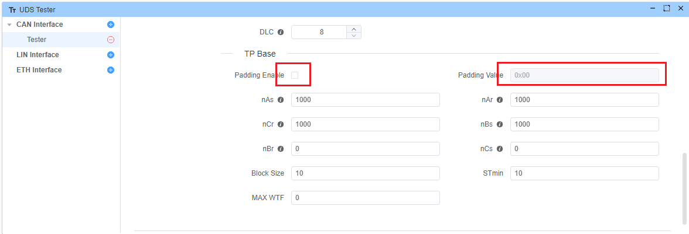
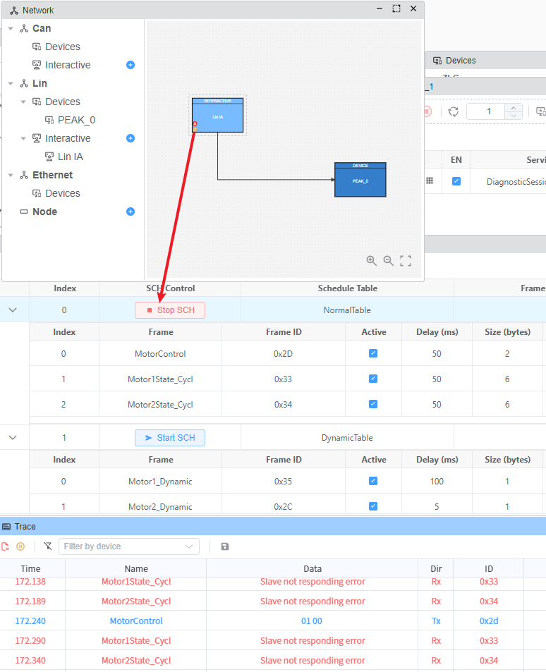
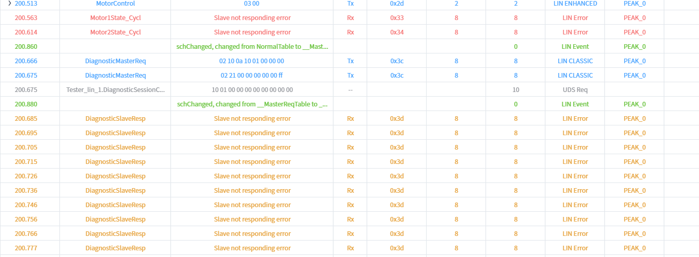
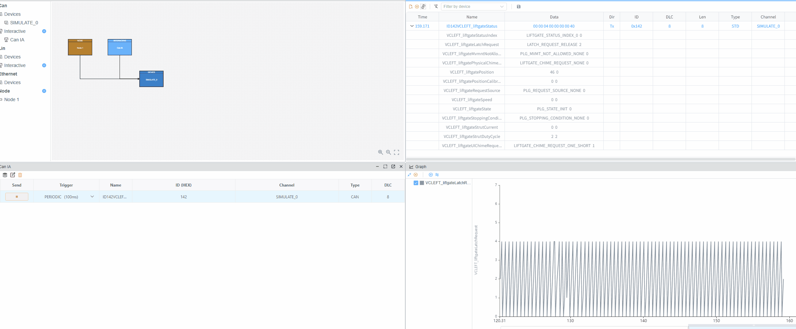

# 常见问题（FAQ）

## 如何将 UDS 消息长度配置为 8 字节？

:::: details 答复
在 UDS Tester -> Tp Base -> Padding Enable 中启用填充（Padding）。你也可以设置自定义的 Padding Value，默认值为 0x00。

::::

## ZLG 打开设备提示 Set baud rate failed？

:::: details 答复
这是一个已知问题，请将EcuBus-Pro安装在非C盘的其他磁盘分区上即可解决。
::::

## 使用 Sequencer 通过 LIN（ID 0x3C，NAD 0x55）发送 UDS 服务后，为什么不再发送 ID 0x3D 的 LIN 报文让从站响应？

:::: details 答复
这是由于 LIN 调度表（schedule table）的实现方式所致。你需要先启动任意一个调度表。

然后再发送 ID 0x3D 的 LIN 报文。

::::

## 如何计算报文的 CRC 值？

:::: details 答复
可在脚本中使用内置的 [CRC](https://app.whyengineer.com/scriptApi/classes/CRC.html) API 计算 CRC。该 API 支持多种 CRC 算法（CRC8、CRC16、CRC32），并可配置参数。

::::

## 如何为周期性报文实现循环计数？

:::: details 答复

**如果有数据库，且希望周期性更新信号数值：**

1. 先将该报文配置为周期性发送。
2. 使用 [OnCan](https://app.whyengineer.com/scriptApi/classes/UtilClass.html#oncan) API 监听该报文的收发。
3. 使用 [setSignal](https://app.whyengineer.com/scriptApi/functions/setSignal.html) API 更新信号数值。

```ts
import { setSignal } from 'ECB'
let val = 0

Util.OnCan(0x142, (data) => {
   setSignal('Model3CAN.VCLEFT_liftgateLatchRequest', val++ % 5)
})
```



**无数据库：**

1. 直接使用 [output](https://app.whyengineer.com/scriptApi/functions/output.html) API 输出你需要的任意报文数据。

```ts
import { output,CanMessage,CAN_ID_TYPE} from 'ECB'
setInterval(() => {
  const canMsg:CanMessage = {
      id: 0x111,
      data: Buffer.from([0,1,2,3,4,5,6,7]),
      dir: 'OUT',
      msgType:{
        idType: CAN_ID_TYPE.STANDARD,
        remote: false,
        brs: false,
        canfd: false,
      }
    }
   output(canMsg)
}, 1000)
```

:::
