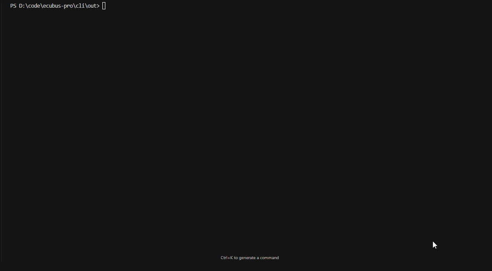

# EcuBus-Pro CLI

EcuaduBus-Pro 提供一个命令行接口(CLI)，允许您在没有GUI的情况下运行您的
代码。 它对自动化、测试和调试很有用。
CLI 建立在EcuBus-Pro 核心之上， 这样您可以使用相同的脚本和
插件。

## CLI 已安装路径

`${InstallPath}/resources/app.asar.unpacked/resources/lib` you can add this
path to your system environment variable `PATH` to use the `ecb_cli` command in
any directory.

Note: Arch Linux comes with `/usr/bin/ecb_cli` pre-installed, allowing you to
use `ecb_cli` directly.

## 用法

```bash
ecb_cli -h
```

### Seq 命令

通过 CLI 运行 UDS 序列。

```bash
ecb_cli seq -h
```

#### 示例 (seq)

```bash
ecb_cli seq xx.ecb Tester_1 --log-level=debug
```


### PNPM命令

`pnpm` is a package manager for JavaScript, which is fast, disk-space
efficient, and optimized for monorepos. 更多详细信息可以在
[pnpm 文档](https://pnpm.io/)中找到。 我们将 `pnpm` 集成到
EcuBus-Pro CLI, 所以您可以使用 `pnpm` 命令来安装您的项目的
依赖关系。

\*通过 CLI 运行pnpm \*

```bash
ecb_cli pnpm -h

ecb_cli pnpm init

ecb_cli pnpm install package_name
```

#### 示例 (pnpm)


### 测试命令

_通过 CLI 运行测试_

```bash
ecb_cli 测试 -h
```

The test command allows you to run test configurations from your EcuBus-Pro
project via the command line. 这有助于自动测试、持续的
整合和回归测试而不启动GUI。

#### 语法

```bash
ecb_cli 测试 <project> <name> [options]
```

#### 参数

- `project`: 通往EcuBus-Pro 项目文件的路径(.ecb)
- `name`: 要运行的测试配置名称

#### 备选方案

- `-r, --report <report>`: 指定报告文件名称 (HTML格式)
- `-b, --build`: 在运行测试前强制编译
- `--loglevel <level>`: 设置日志级别(错误、警告、信息、调试)。
  默认为“信息”
- `-h, --help`: 显示帮助信息

#### 示例 (测试)


