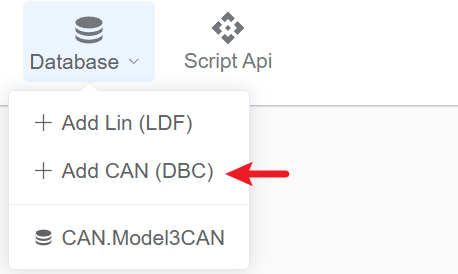
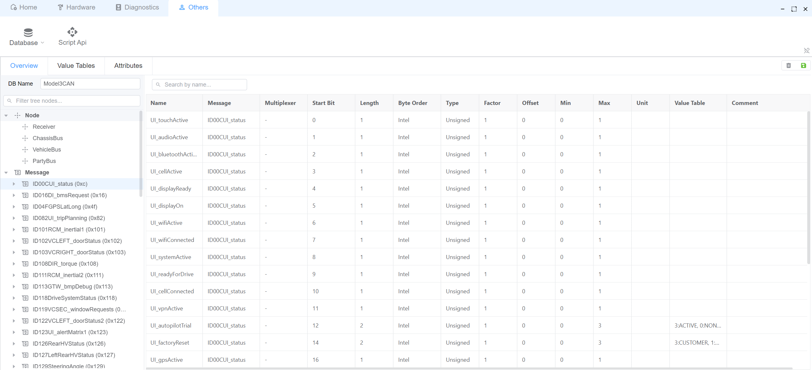
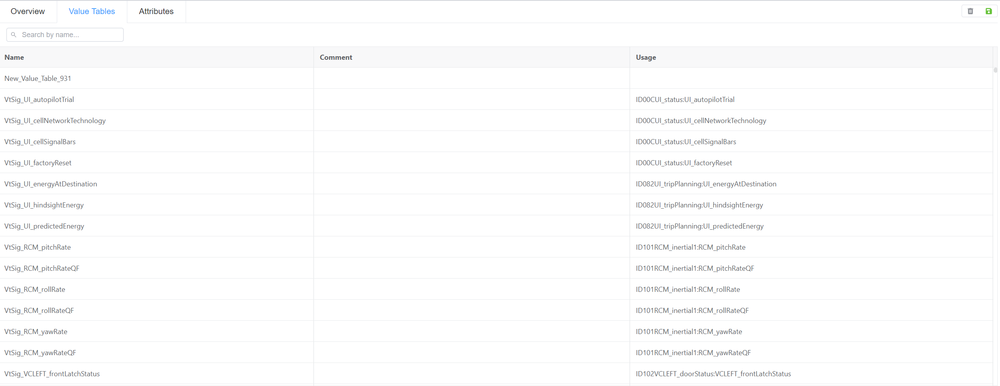
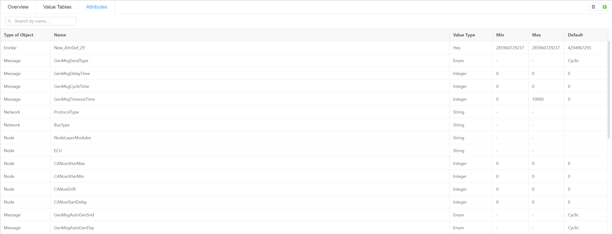

# CAN DBC

EcuBus-Pro 支持解析大部分CAN DBC文件。 如果你遇到无法正确解析的 DBC 文件，请在我们的 [Github Issues](https://github.com/ecubus/EcuBus-Pro/issues) 页面报告这个问题。

应用程序提供了一个高效的信息和信号搜索接口。

> [!注意]
> 目前仅支持查看 DBC 文件，不支持编辑。 请确保您的 DBC 文件在使用前格式正确。

## 选择一个 DBC 文件

## 概览

DBC 查看器提供有关以下方面的全面信息：

- 网络节点
- 留言
- 信号

## Value Tables

值表定义了原始值和相应含义之间的映射。

## Attributes

查看和检查所有 DBC 属性。

