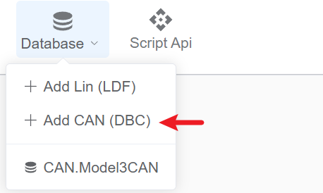
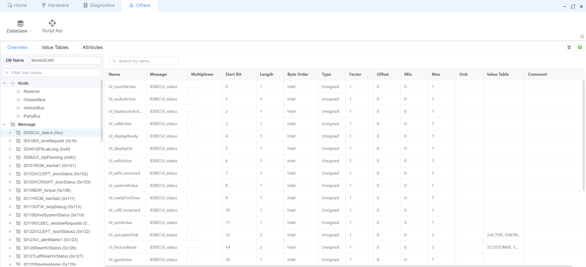
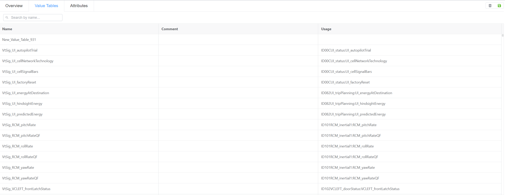
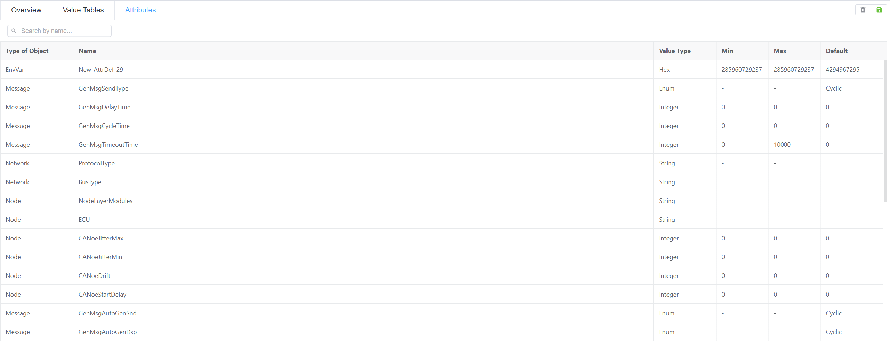
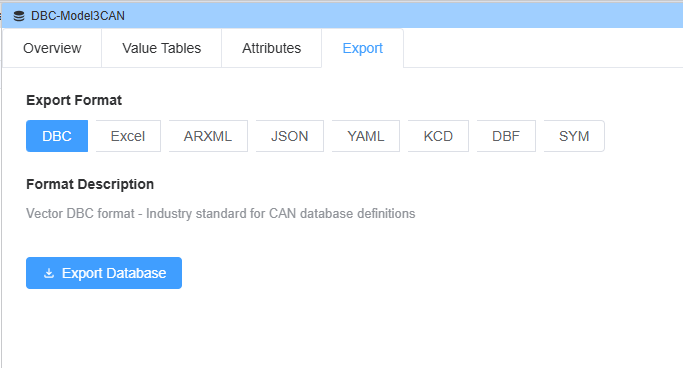

# CAN DBC 与 ARXML

EcuBus-Pro 使用 [python-canmatrix](https://github.com/canmatrix/canmatrix) 来解析和转换 CAN 数据库文件。 如果您遇到任何导入或解析问题，请在我们的 [Github Issues](https://github.com/ecubus/EcuBus-Pro/issues) 页面上报告，或者如果问题似乎出在解析器本身，请直接在 [canmatrix Issues](https://github.com/canmatrix/canmatrix/issues) 上报告。

**导入：** 支持 DBC 和 ARXML 格式。  
**导出：** 数据库可以导出为 DBC、ARXML、Excel、JSON、YAML、KCD、DBF 和 SYM 格式。

该应用程序为报文和信号提供了高效的搜索界面。

## 导入数据库文件

## 概述

数据库查看器提供以下方面的全面信息：

- 网络节点
- 报文
- 信号

## 值表

值表定义了原始值与其对应含义之间的映射关系。

## 属性

查看和检查所有数据库属性。

## 导出

将加载的数据库导出为其他格式：DBC、ARXML、Excel (XLSX)、JSON、YAML、KCD、DBF 或 SYM。 选择所需的格式并保存文件。

