# LIN LDF

LDF 解析器支持以下 LIN 规范版本：

* 2.2
* 2.1
* 2.0

## 选择 LDF 文件

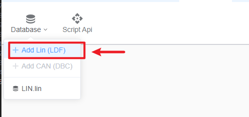

## 保存数据库

创建新数据库时，需要指定唯一名称并保存。
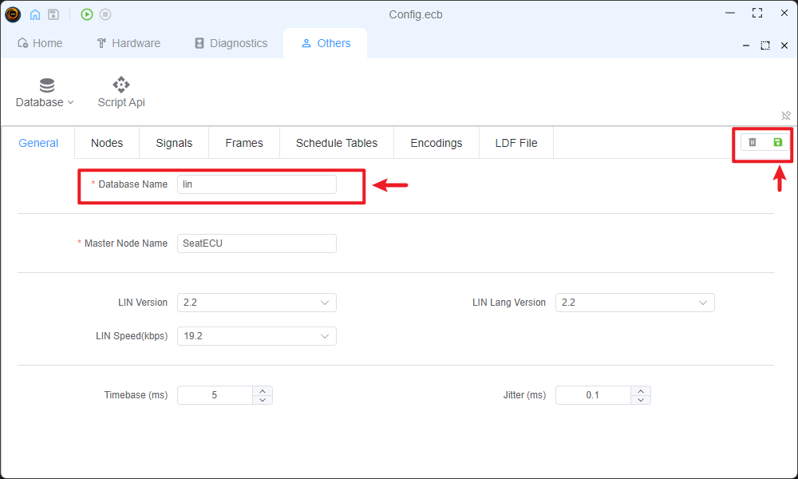

## LDF 编辑器

可通过不同标签页编辑 LDF 数据库。各部分均实现严格的错误检查以确保数据完整性。

### 常规（General）

该标签页显示数据库的基础信息与错误提示。保存或使用数据库前必须解决所有错误。
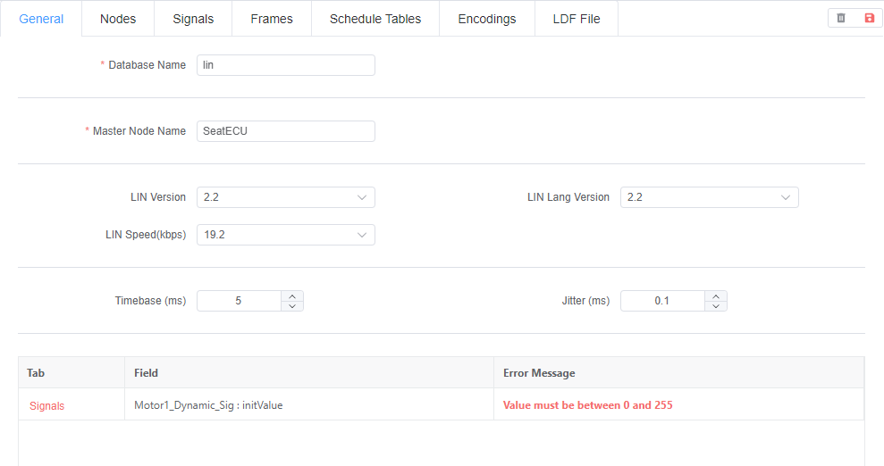

### 节点（Nodes）

在此配置从节点属性，并对节点配置进行严格校验。
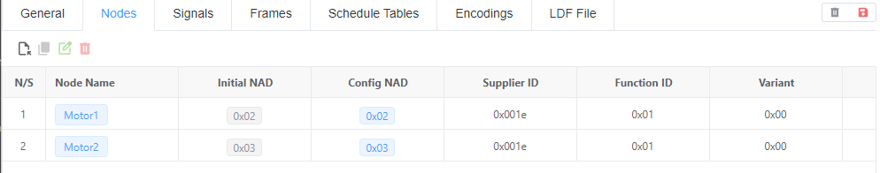
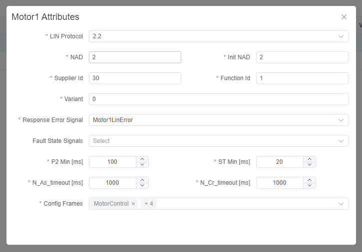

### 信号（Signals）

在此管理信号信息。存在问题的信号会被高亮显示，所有配置都会被严格校验。
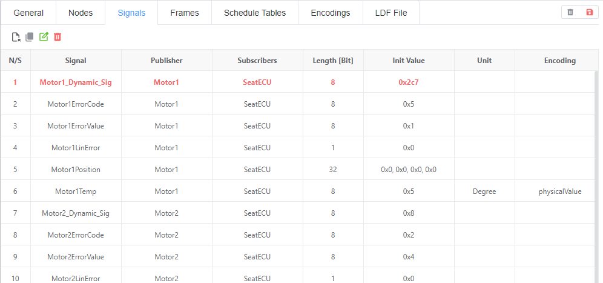
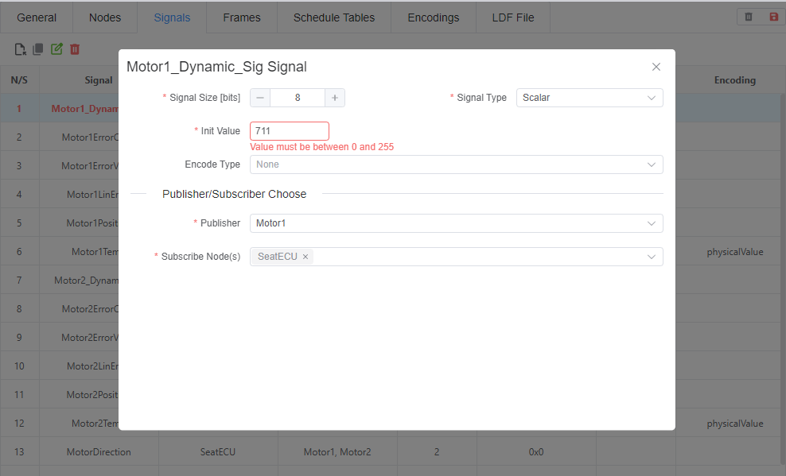

### 帧（Frames）

此处仅展示 Unconditional 帧，其他帧类型可在调度表中配置。存在问题的帧会被高亮显示，系统会对帧进行严格一致性检查。
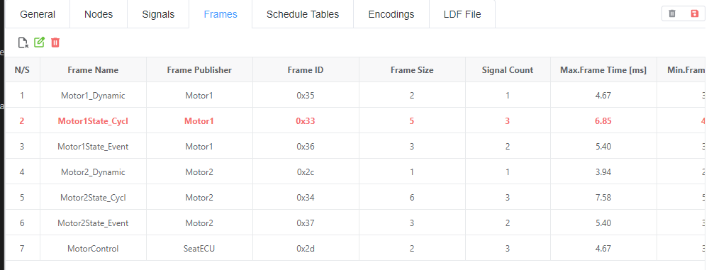
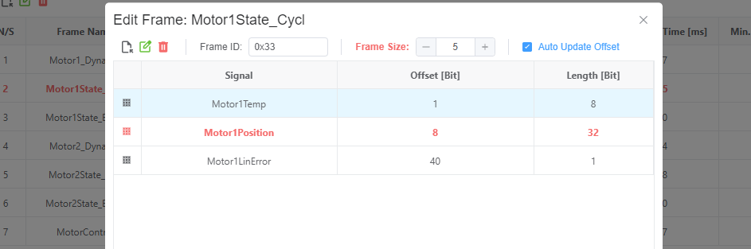

### 调度（Schedule）

在此配置调度表并向其中添加帧。所有调度配置都会经过严格校验。
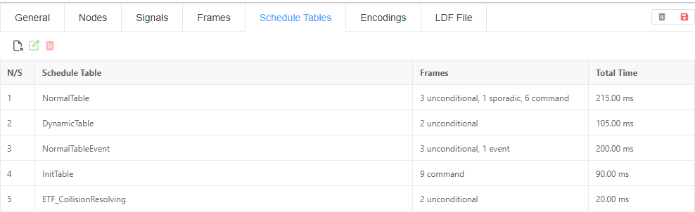
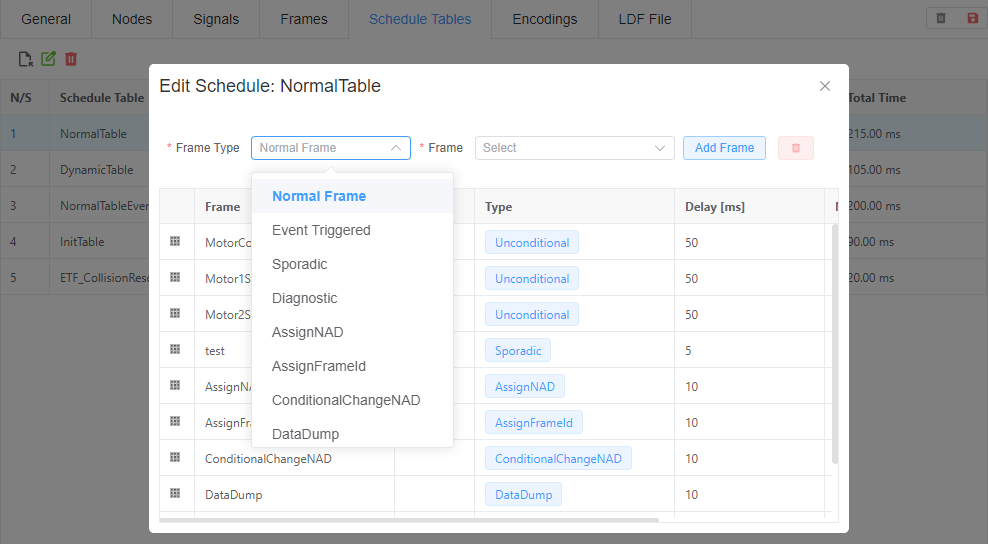

### 编码（Encode）

在此定义编码信息。配置完成后，可在 Signals 标签页编辑信号的编码定义。所有编码定义都会进行严格校验。
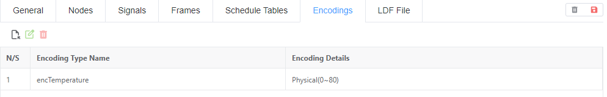
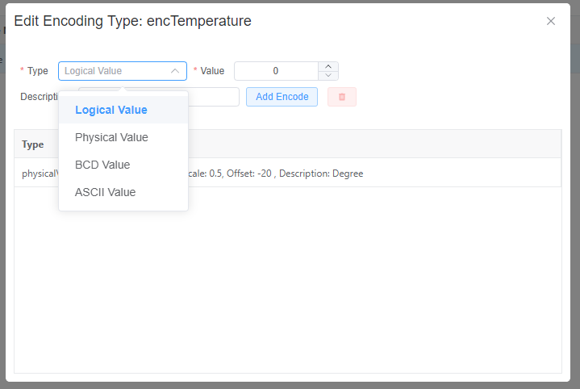

### LDF

查看实时 LDF 文件内容；当所有错误被解决后，可从此处复制 LDF 内容。
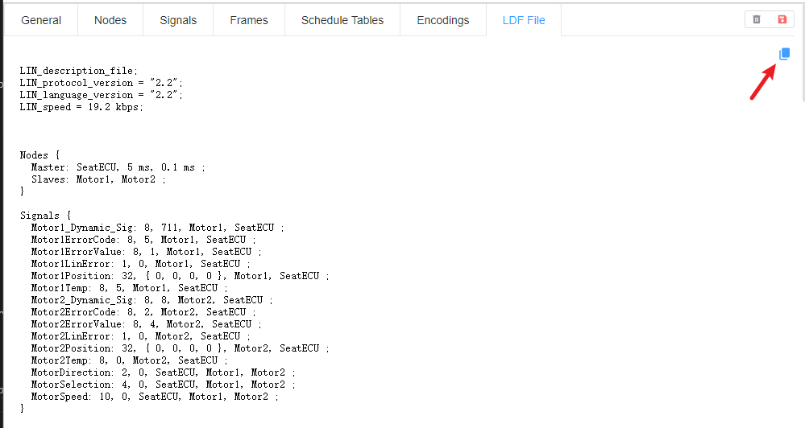
