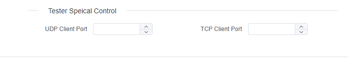

# DOIP

> 待办事项

DOIP 测试仪支持 DoIP v2 和 DoIP v3。

有关 DoIP v3 的更多详细信息：[DoIP v3](doipv3.md)

OEM 特定字段留空时发送标准路由激活请求。网关要求 OEM 特定数据时填写 4 字节。

## 测试仪特殊控制

### TCP/UDP源端口控制

默认情况下，客户端将使用随机可用端口进行TCP/UDP通信。但是，如果需要，您可以将其配置为使用特定的固定端口。

