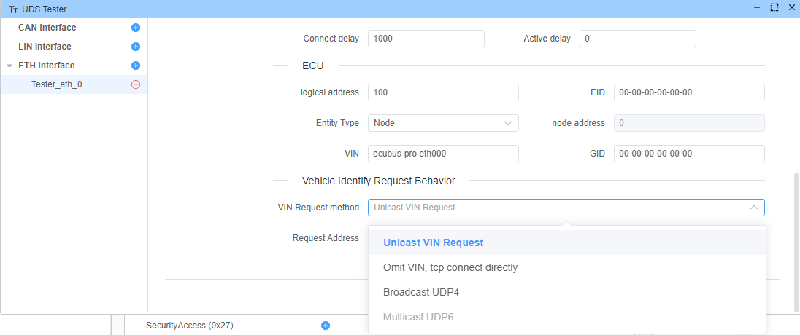
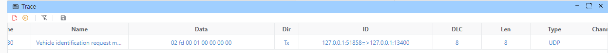
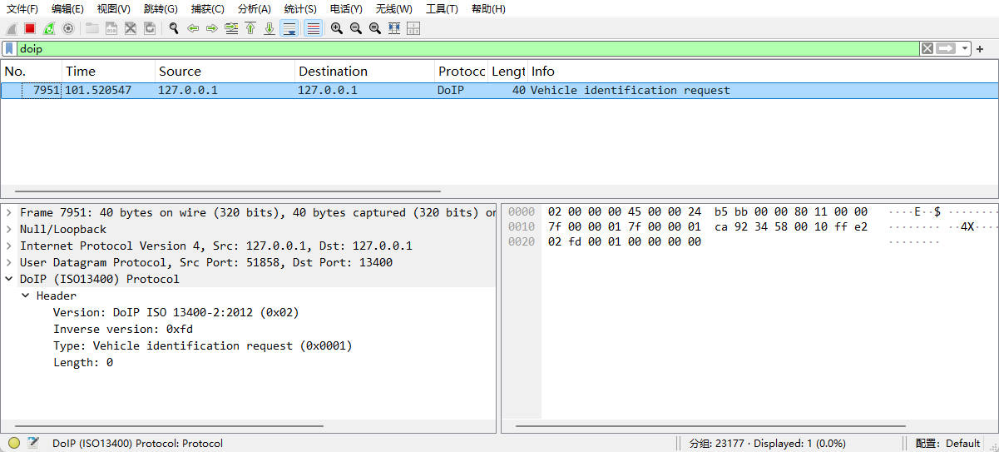
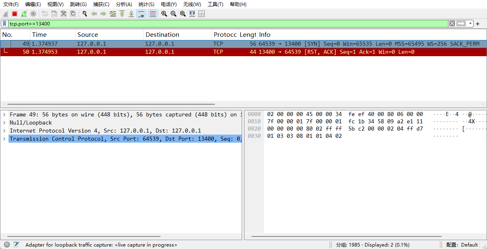
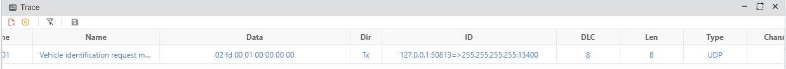
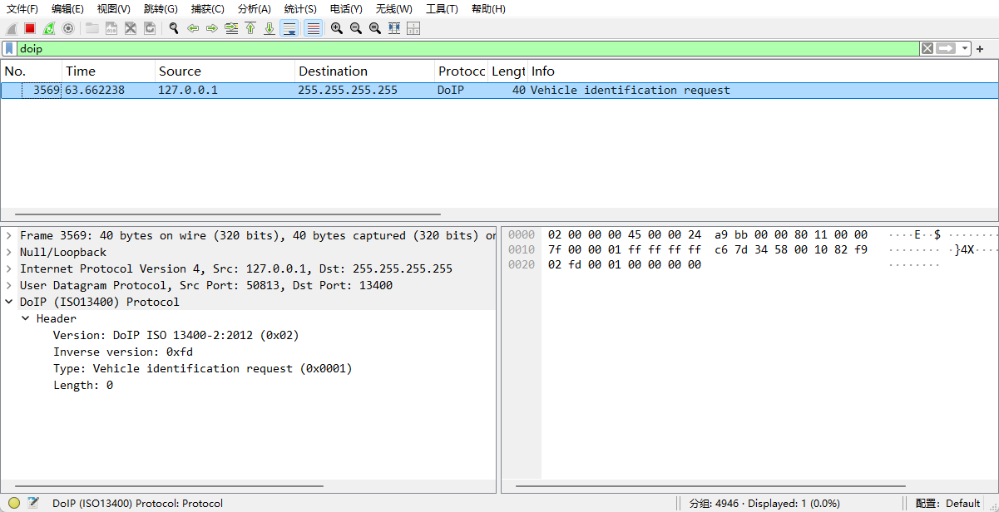

# 车辆识别请求行为

我们支持 4 VIN 请求方法：

1. Unicast VIN 请求
2. 省略VIN，直接连接
3. 广播 VIN 请求 (UDP4)
4. 多播VIN 请求 (UDP6)

## Unicast VIN 请求

> [!注意]
> 此方法只是设置请求地址。

## 省略VIN，直接连接

没有UDP请求，直接连接到 tcp 服务器，请参阅[[#82](https://github.com/ecubus/EcuBus-Pro/issues/82)]

> [!注意]
> 此方法只是设置请求地址。

## 广播 VIN 请求 (UDP4)

## 多播VIN 请求 (UDP6)

尚不支持。
