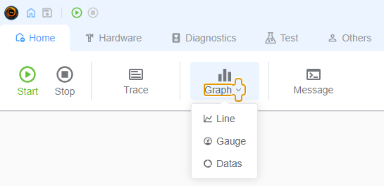
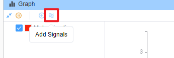
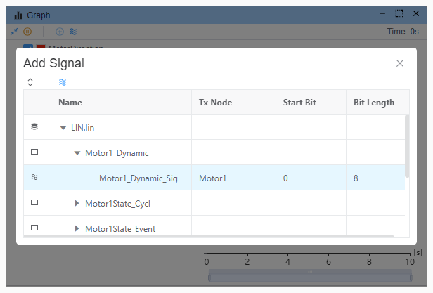
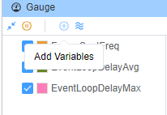
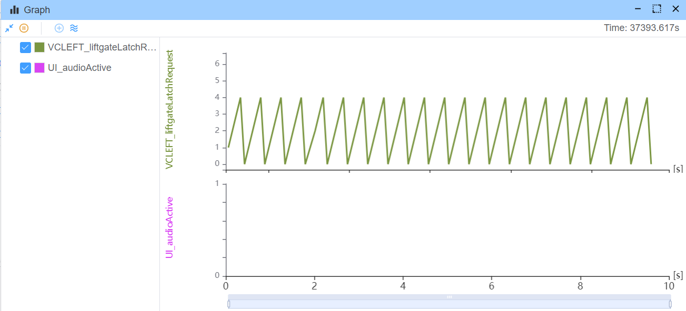
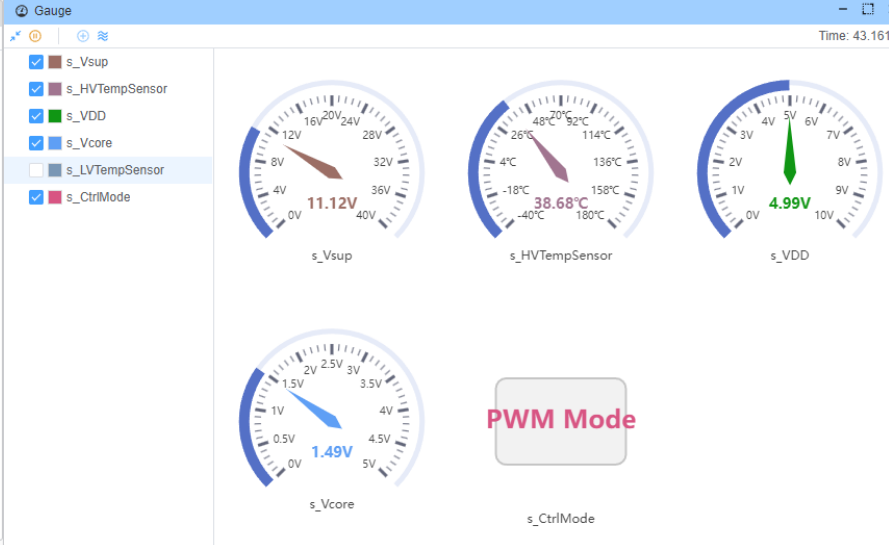
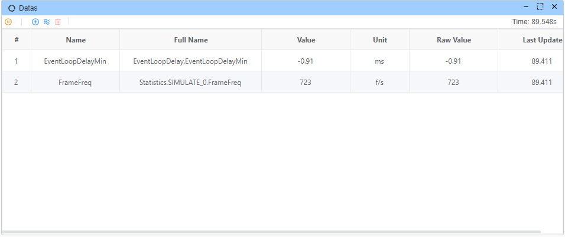
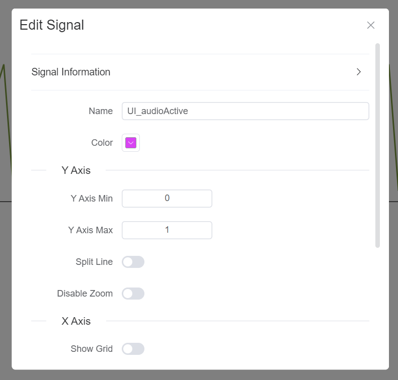
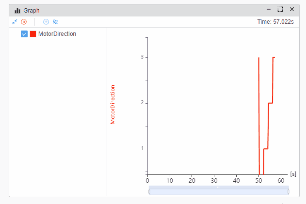

# 图

图形信号功能允许您以图形格式可视化信号之间的数据流。 这一特性对于理解信号之间的关系和调试复杂的信号相互作用特别有用。

- **行**
- **Gauge**
- **数据**

## 添加信号

从数据库添加信号，这取决于 [database](./../database.md)。

## 添加变量

来自[`变量窗口`](./../var/var.md)的所有有效变量。

## 一个图形中的多信号

## 编辑信号属性

## 拖动/缩放线图

你通过拖动鼠标滚轮来缩放图形。

