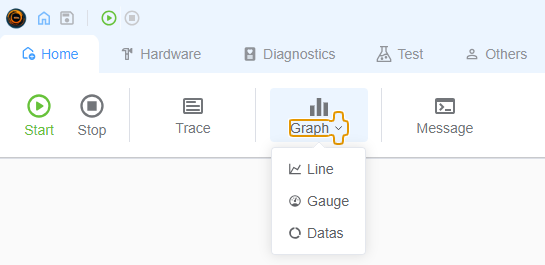
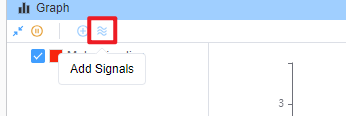
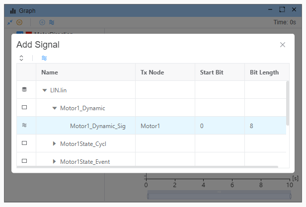
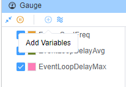
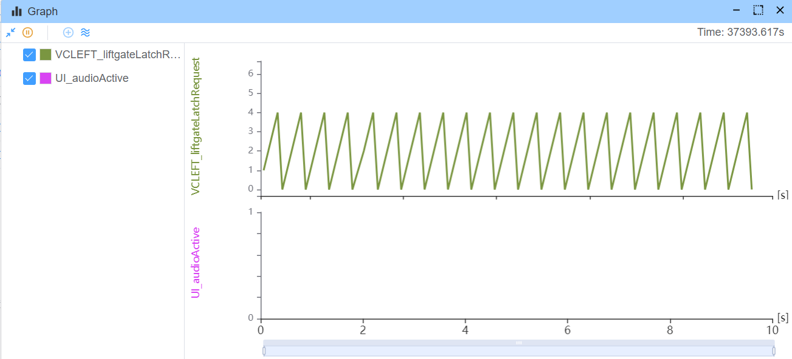
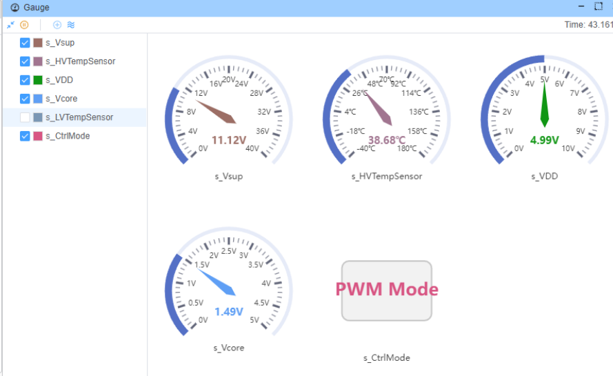
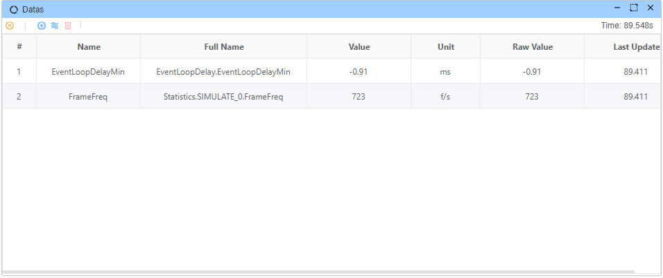
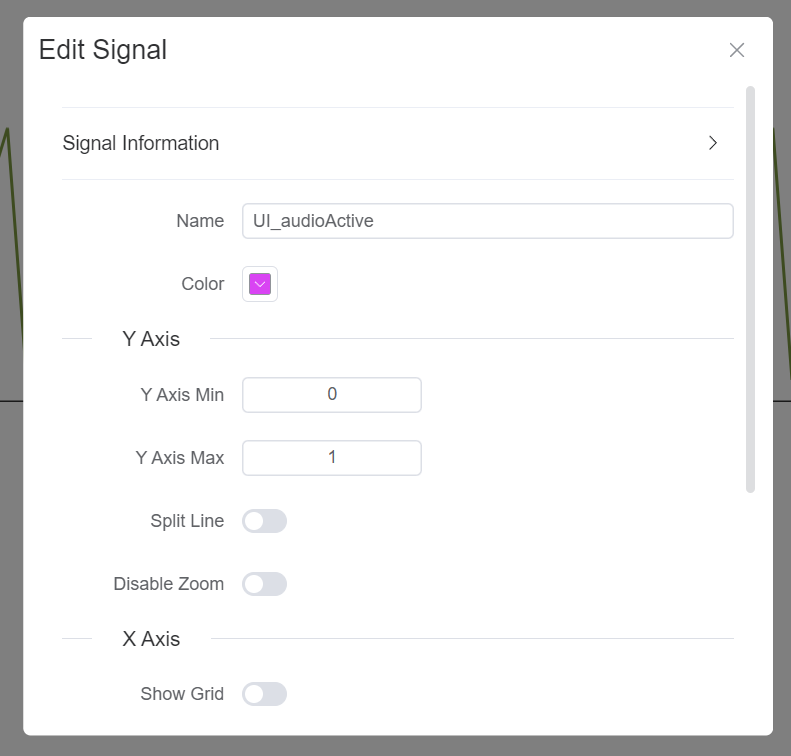
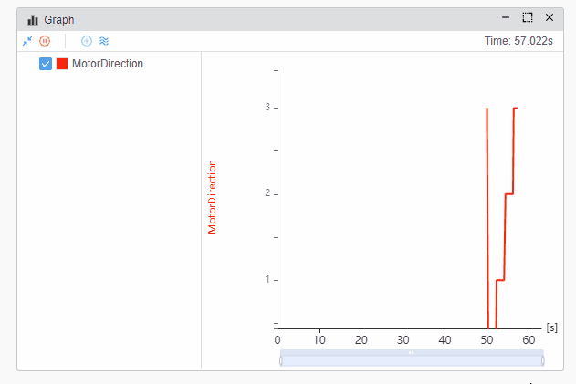

# 图表

图表信号功能允许您以图形格式可视化信号之间的数据流。 此功能对于理解信号之间的关系以及调试复杂的信号交互特别有用。

- **折线**
- **仪表**
- **数据**

## 添加信号

从数据库添加信号，这取决于[数据库](./../database.md)。

## 添加变量

来自[`变量窗口`](./../var/var.md)的所有有效变量。

## 多信号同图显示

从树中添加多个信号或变量，然后为要绘制的每个项目启用复选框。 所有启用的轨迹都绘制在同一时间轴上，并共享 X（时间）轴。 每条轨迹保留自己的颜色，并显示在图表图例中，以便您区分重叠的序列。

使用树复选框可向时间轴添加或移除变量，而无需为每个信号创建单独的图形窗口。 只启用一个项目时，图形的行为与之前相同（一个序列，使用该信号的 Y 轴设置）。

## 编辑信号属性

## 拖拽/缩放折线图

您可以通过拖动鼠标滚轮来放大/缩小图表。

