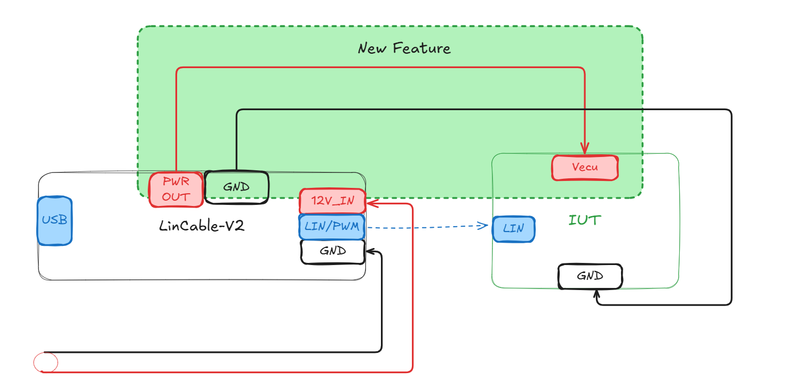

<script setup>
import LinCableProductPage from '../../../component/LinCableProductPage.vue'
</script>

# EcuBus LinCable – 用于汽车开发的 USB 转 LIN 适配器

<LinCableProductPage />

EcuBus LinCable 适配器可通过 USB Type-C 将 LIN 网络无缝连接到计算机。 支持单个 LIN 通道。

**电路板尺寸：** 59mm（高度）× 19mm（长度）

## 示意图



## LIN 协议支持

LinCable 完全支持 LIN 2.0、2.1、2.2A 和 SAE J2602 标准，提供与各种汽车 LIN 设备和网络的兼容性。 支持的波特率包括 19200、10400、9600 和 2400 bps，使 LinCable 适用于传统和现代 LIN 应用。

### 自定义波特率配置

LinCable 支持超出标准速率范围的自定义波特率配置，允许您设置大约 107 bps 至 2,750,000 bps 之间的任何波特率。 这是通过一个两级预分频器系统实现的：

- **主预分频**：可从 /2 配置至 /256（8 个选项：0-7）
- **次预分频**：可从 1 配置至 32

波特率使用以下公式计算：

```
baudRate = 5,500,000 / (2^(prescale + 1) × bitMap)
```

这种灵活性使 LinCable 能够与非标准 LIN 实现以及需要标准速率未涵盖的特定波特率的自定义协议配合工作。

### 运行时波特率控制

LinCable 通过 `linBaudRateCtrl()` API 函数提供运行时波特率控制，允许您在操作期间动态更改波特率而无需重新初始化设备。 该函数会自动计算最优的预分频和 bitMap 组合，以实现尽可能接近您目标值的波特率，并返回实际达到的波特率。

**主要特性：**

- 自动优化：找到最佳的预分频/bitMap 组合以最小化误差
- 实时调整：在测试期间动态更改波特率
- 精确控制：返回实际达到的波特率以供验证
- 宽范围：支持从约 107 bps 到 2.75 Mbps 的波特率

此功能特别适用于：

- 测试具有非标准波特率的设备
- 动态适应不同的 LIN 网络配置
- 协议开发与验证

## PWM 输出能力

LinCable 包含高级 [PWM](../pwm/pwm.md) 输出功能，使其成为汽车开发和测试的多功能工具。 PWM 输出功能能够为各种汽车应用提供精确的数字信号控制。

### PWM 输出规格

- **频率范围**：1 Hz 至 20KHz，高精度
- **占空比控制**：0% 至 100%，分辨率 0.1%
- **输出电压**：高电平等于 VBAT 输入电压，低电平等于 0V
- **通道数量**：单个 PWM 输出通道
- **频率精度**：典型值 ±0.1%

## 电源控制

LinCable 为被测件（IUT）提供集成的电源控制功能，可在测试期间实现自动化的电源循环与电源管理。 此特性消除了对外部电源的需求，并简化了测试设置。

### 电源控制规格

- **最大电流**：2A
- **最大电压**：18V
- **控制方法**：通过 API 进行软件控制
- **电源状态**：开/关控制

### 运行时电源控制 API

`linPowerCtrl()` 函数允许您在运行时动态控制被测件的电源。 这对于以下方面至关重要：

- **电源循环测试**：自动对设备进行电源循环以测试其恢复行为
- **上电时序控制**：为复杂的测试场景控制上电时序
- **能源管理**：在不需要时关闭电源以节省能源
- **自动化测试**：将电源控制集成到测试序列中

**API 用法：**

```typescript
// Turn on power
await linPowerCtrl(true);

// Turn off power
await linPowerCtrl(false);

// Control power on specific device (when multiple devices connected)
await linPowerCtrl(true, 'Device1');
```

**使用案例：**

- 测试设备在上电和下电序列期间的行为
- 验证断电后的恢复程序
- 实现带有电源管理的自动化测试序列
- 在空闲期间降低功耗
- 为鲁棒性测试模拟电源中断

## 故障注入与一致性测试

LinCable 内置高级故障注入功能，允许工程师模拟各种错误条件并执行全面的一致性测试。 这对于在开发和质量保证期间验证 LIN 节点和网络的鲁棒性和可靠性至关重要。

> 遵循 ISO/DIS 17987-6

---

### Break 字段/分隔符长度控制

- **Break 长度**：可调整的 break 字段长度从 13 到 26 位（默认：13 位）
- **Break 分隔符长度**：可配置的分隔符长度从 0 到 14.6 位（默认：1 位）

### 字节间间隔控制

- **报头字节间间隔**：控制同步字节和标识符字段之间的间隔（0-14 位，默认：0）
- **数据字节间间隔**：单独控制每个数据字节之间的间隔（每字节 0-4 位）

### 同步/PID 字段自定义

- **同步值覆盖**：自定义同步字节值或完全禁用同步传输（默认：0x55，false 表示主机不发送同步值）
- **PID 覆盖**：自定义受保护标识符（PID）值或禁用 PID 传输（默认：getPID(frameId)，false 表示主机不发送 pid）

### 位级故障注入

- **精确位操作**：从 break 字段开始的任何特定位位置注入故障
- **位值控制**：强制特定位为高（1）或低（0）状态

### 校验和覆盖

- **校验和覆盖**：用自定义值覆盖校验和

---

> 有关更多详细信息，请参阅 [LIN 一致性测试示例](https://app.whyengineer.com/examples/lin_conformance_test/readme.html)。

## 跨平台与软件集成

LinCable 完全兼容 Windows、macOS 和 Linux 操作系统（USB-ACM 驱动程序）。 它与 **EcuBus-Pro** 软件套件无缝集成，并支持第三方汽车开发工具。 提供全面的 SDK 和 API 用于自定义应用程序开发。

## 用于二次开发的开放通信协议

LinCable 提供开放的通信协议，使用户能够根据特定需求进行二次开发和定制。 该协议文档完善，包含全面的 API，允许开发人员将 LinCable 集成到自己的应用程序中，或为专门的汽车测试场景创建自定义解决方案。 这种开放式架构确保了需要超越标准功能的定制功能的高级用户的灵活性和可扩展性。

## DFU 固件更新支持

LinCable 支持设备固件更新（DFU）功能，允许用户轻松将设备固件更新到最新版本或安装自定义固件。 此功能确保 LinCable 可以保持最新状态，获得最新的改进、错误修复和新功能，而无需更换硬件。 DFU 过程简单直接，可以通过 EcuBus-Pro 软件或专用 DFU 工具执行，提供可靠且安全的固件更新方法。

## FW Upgrade Guide

要升级 LinCable 固件，请按照以下步骤操作：

1. **安装插件**：首先，从[插件市场](../plugin/plugin.md)安装 `LinCable Upgrade Tool` 插件。

2. **遵循插件 README**：安装完成后，请参考插件的 README 文档获取详细的升级说明，并按照其中提供的步骤进行操作。

## 固件下载

| 版本                                    | 下载链接                                                                                     |
| ------------------------------------- | ---------------------------------------------------------------------------------------- |
| 1.2.0 | [Download Link](https://ecubus.oss-cn-chengdu.aliyuncs.com/lincable/lincalbe_1_2_0.sdfu) |
| 1.3.0 | [Download Link](https://ecubus.oss-cn-chengdu.aliyuncs.com/lincable/lincalbe_1_3_0.sdfu) |

## 固件发布说明

### 1.3.0

1. 新增动态更改波特率功能

### 1.2.0

首次发布