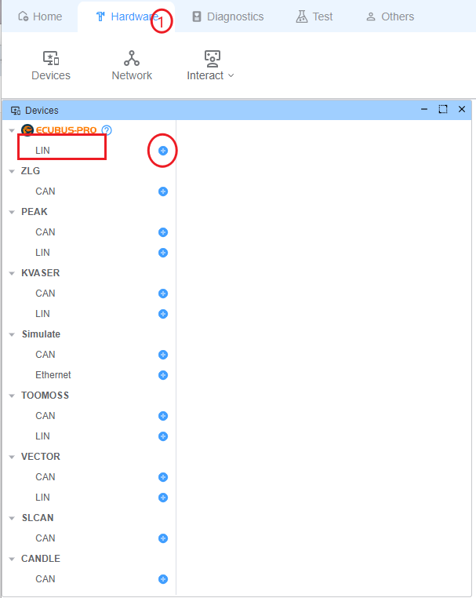
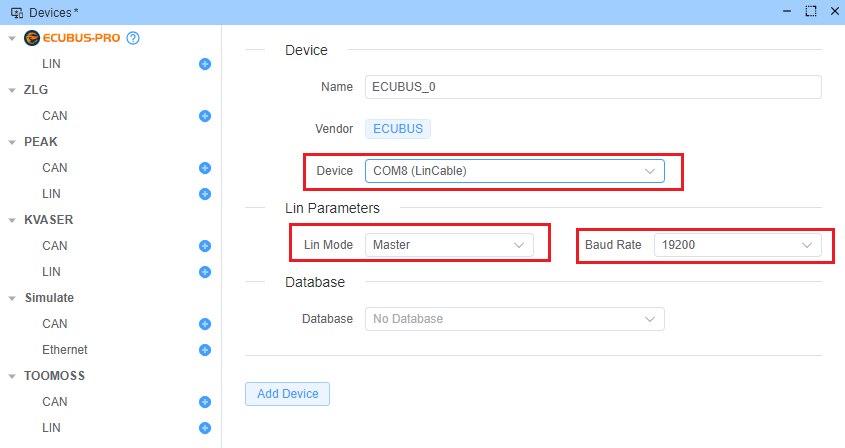
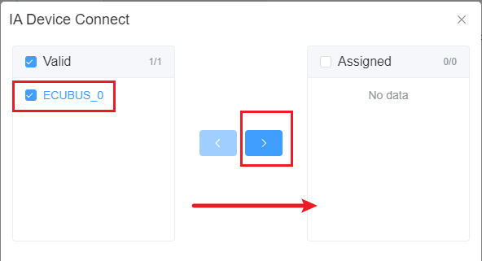
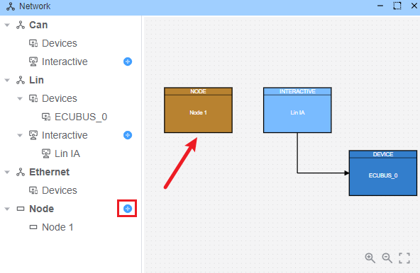
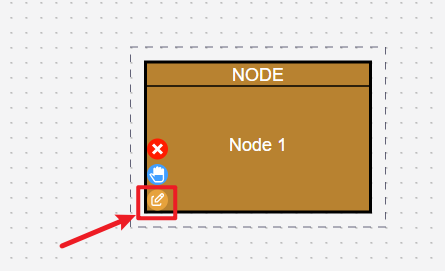
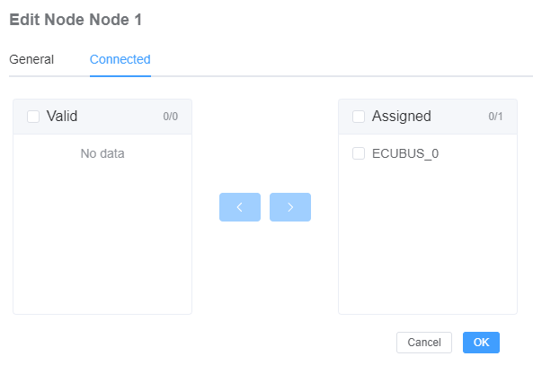
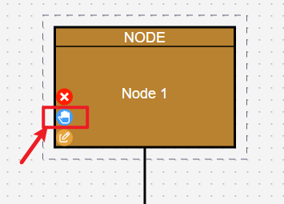

# LIN

LIN是一种经济高效且确定性的通信协议，专为连接电子控制单元（ECU）与智能传感器、执行器和控制器而设计。 EcuBus-Pro的LIN模块提供全面的功能，用于按照LIN 2.x规范开发、分析和测试LIN网络。

## 添加设备

通过顶部菜单栏选择`Hardware`，然后点击支持LIN的设备右侧的`+`按钮添加设备。

支持的硬件：

| 制造商               | 协议  | 功能                       |
| ----------------- | --- | ------------------------ |
| `EcuBus LinCable` | LIN | 支持错误注入，可执行一致性测试，并支持PWM输出 |
| PEAK              | LIN |                          |
| KVASER            | LIN |                          |
| Toomoss           | LIN | 支持12V电压输出/输入，5V电压输出      |
| VECTOR            | LIN |                          |

## 配置设备

点击添加设备后，您需要输入设备设置：

1. 自定义设备名称
2. 设备通道
3. 工作模式，主节点或从节点
4. 波特率
5. 绑定的数据库（可选）

> [!IMPORTANT]
> 下面描述的一些功能可能需要导入LIN描述文件（LDF）。 有关LDF的更多信息，请参阅[数据库文档](./../ldf)。

## 调度表管理

> [!IMPORTANT]
> 当LIN作为主节点工作时可用。
> 相应的设备需要加载相应的数据库。

调度表管理允许从LDF数据库定期执行特定的调度表。

### 添加LIN交互

- 打开网络界面
- 点击网络左侧`Lin`网络下`Interaction`选项卡下的`+`按钮添加交互
  

### 打开LIN交互

- 打开交互配置
  
- 配置连接到交互的LIN设备
  
- 选择您想要连接的LIN设备
  
- 查看和管理现有的调度表。 您可以通过关闭Active来临时跳过调度表中的一帧。
  

## 节点模拟与信号编辑

> [!IMPORTANT]
> 相应的设备需要加载相应的数据库。

配置和模拟LIN节点以测试网络行为，并动态更新相应节点的信号值。

### 节点配置步骤

1. **添加节点**
   - 打开网络界面
   - 点击网络左侧`Node`选项卡下的`+`按钮添加节点
     

2. **配置节点**
   - 打开节点配置
     
   - 设置节点连接的设备
     
   - 选择节点模拟的网络节点（**需要选择相应的LIN设备，且相应设备已绑定数据库**）
     

3. **信号值编辑器**
   - 节点配置完成后，您可以编辑已配置节点的信号值
     
   - 修改信号值（**只能修改由已配置节点发布的信号。 例如，在下图中，只能修改作为发布者的`Motor2`的信号值**）
     

4. **节点模拟**
   节点配置网络节点后，将自动模拟节点发送信号。
   例如，当设备Lin工作在主节点模式且Node1配置为`Motor2`从节点网络节点时，当收到对`Motor2`的请求时，Node1将自动响应此帧并给出响应。

