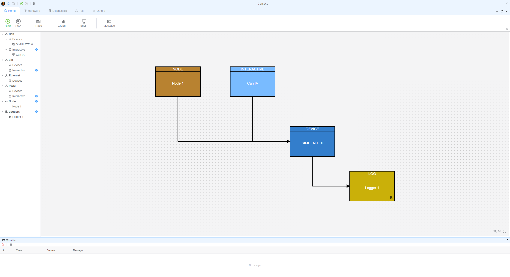
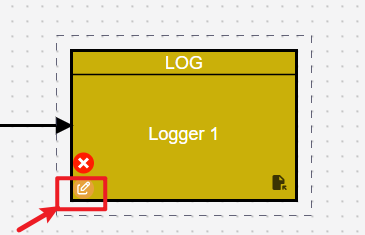
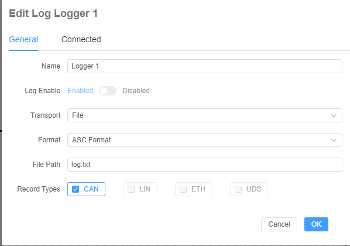
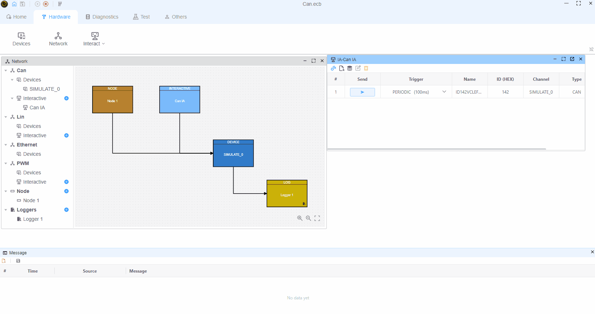

# 记录器

通过配置记录器，您可以将所有相关的跟踪数据导出到其他地方，从而解决用户界面中跟踪窗口存储容量有限的问题。

## 如何添加记录器

通过 `Hardware -> Network` 打开网络配置，然后在 `Loggers` 下添加记录器。

## 配置记录器

将鼠标悬停在目标记录器上，然后点击 `✏️` 按钮进行编辑。

- 传输方式
  - 文件：将帧写入文件；选择目标路径
  - 套接字：将帧写入套接字（暂不支持）
- 格式
  - ASC：Vector ASC 格式，`ASC 以流模式写入`
  - CSV：逗号分隔文本格式（暂不支持）
  - BLF：Vector BLF 格式（暂不支持）
- 记录类型：选择要记录的帧类型

  - CAN：记录 CAN 帧
  - LIN：记录 LIN 帧
  - ETH：记录以太网帧
  - UDS：记录 PW

## 演示：写入文件

