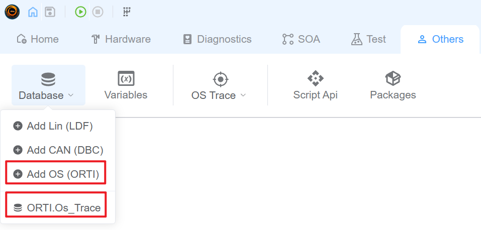
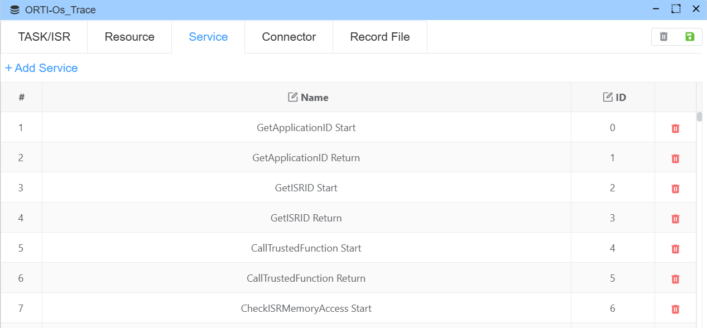
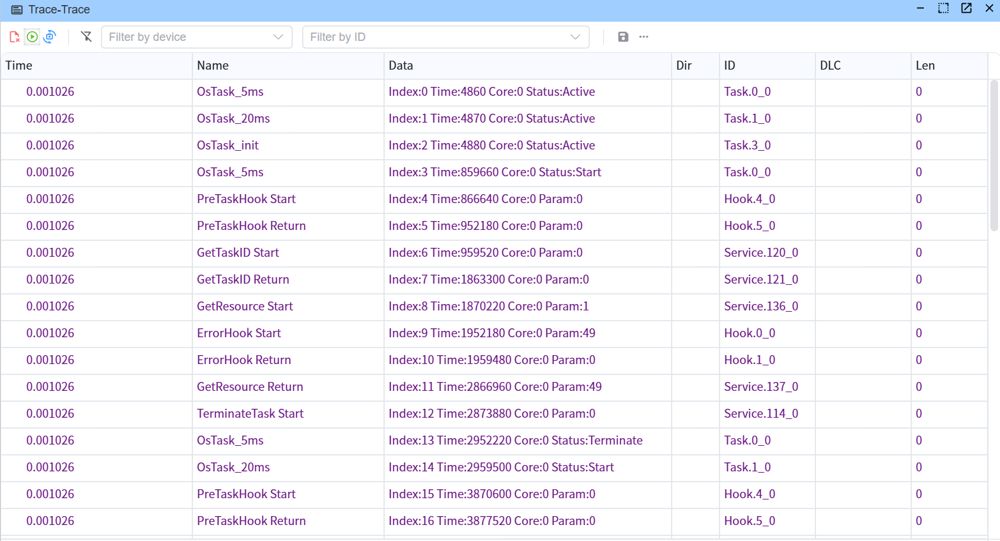
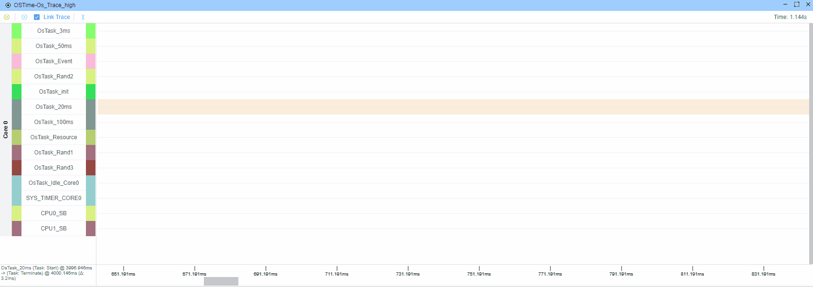
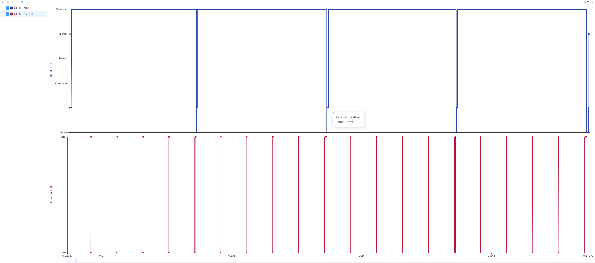

# OSEK OS 追踪

OSEK OS 追踪是一项强大的功能，允许您通过外部接口实时获取 OSEK OS 的运行状态，并将其转换为可视化的图形界面。

> [!注意]
> 此功能需要 OS 提供相应的 ORTI 文件，在相应的 HOOK 中插入相关代码以记录相关信息，然后通过数据接口将数据传输到 EcuBus-Pro。

## 导入 ORTI 文件

通过点击 `Others->Database->Add OS(ORTI)` 导入 ORTI 文件。 您也可以查看已导入的 ORTI 文件。


## 配置 ORTI

> [!注意]
> 导入 ORTI 文件后，仍允许用户手动修改配置信息。

成功导入 ORTI 文件后，您可以看到从 ORTI 文件中解析出的配置信息。

### 任务/中断服务程序

1. 设置名称
2. 设置实际的 CPU 运行频率（取决于您的时间戳格式）。 如果您的时间戳已经是微秒单位，CPU 频率可以设为 1)
3. 设置对象颜色
4. 设置周期性任务的理论激活间隔（激活间隔，以微秒为单位，仅适用于任务）

> [!注意]
> 激活间隔（微秒）只能为任务类型配置。 中断服务程序不支持此配置项。


### 资源


### 服务



### 钩子


### 连接器配置

连接器决定了您获取追踪数据的位置。 目前支持以下方法：

#### 串口（SerialPort）

通过串口实时接收 OS 追踪数据。

**配置项：**

- **设备**：选择串口设备（例如：COM1、/dev/ttyUSB0 等）
- **波特率**：波特率（例如：115200、921600 等）
- **数据位**：数据位（5、6、7、8）
- **停止位**：停止位（1、1.5、2）
- **校验位**：校验位（无、偶校验、奇校验、标记校验、空格校验）

**数据格式：** 16 字节二进制数据（小端序）

| 字段      | 长度   | 描述             |
| ------- | ---- | -------------- |
| 帧头      | 4 字节 | 帧头（05D5C5B5A）  |
| 时间戳     | 4 字节 | 时间戳（最低有效字节）    |
| 类型 ID   | 2 字节 | 对象 ID（最低有效字节）  |
| 类型状态    | 2 字节 | 状态/参数（最低有效字节）  |
| 索引      | 1 字节 | 事件索引（0-255 循环） |
| 类型      | 1 字节 | 事件类型           |
| 核心 ID   | 1 字节 | 核心 ID          |
| CRC8/保留 | 1 字节 | CRC8 校验和或保留字节  |

> [!注意]
>
> - 总帧长度固定为 16 字节
> - CRC8 校验和是从数据部分的 11 个字节计算得出的（不包括帧头和 CRC 字节本身，包括：索引、时间戳、类型、类型 ID、类型状态、核心 ID）
> - 当启用 CRC 校验时，最后一个字节用作 CRC8 校验和
> - 当禁用 CRC 校验时，最后一个字节用作保留字节（Reserved），系统通过检查类型字段（有效值：0-5）来验证帧的有效性


#### 二进制文件（BinaryFile）

从二进制文件读取 OS 追踪数据。 数据格式与串口相同（16 字节二进制数据）。

**配置项：**

- **文件**：选择二进制文件路径（支持相对路径）

**数据格式：** 与串口相同，16 字节二进制数据

#### CSV 文件（CSVFile）

从 CSV 文件读取 OS 追踪数据。

**配置项：**

- **文件**：选择 CSV 文件路径（支持相对路径）

**数据格式：** CSV 格式，每行一个事件

> [!注意]
> CSV 文件格式为：时间戳,类型,ID,状态。 不允许有表头，时间戳单位为 tick。

```csv

1000,1,0,0
1500,1,0,1
2000,2,1,0
```

**字段描述：**

- **时间戳**：时间戳（tick）
- **类型**：事件类型
- **ID**：对象 ID
- **状态**：状态值

#### CAN/以太网

> [!注意]
> CAN 和以太网接口尚未实现。 请持续关注。

### 记录文件

记录文件决定了TRACE数据写入本地文件的位置。 写入的数据格式为CSV格式。

> [!NOTE]
> 每行一个事件，格式：时间戳,类型,ID,状态。 时间戳单位为tick。


### 保存

配置ORTI相关信息后，点击右上角的保存按钮以保存ORTI配置信息。

## 查看OS Trace数据和自动生成的系统变量

可以通过`Trace`窗口查看OS发送的数据。



配置ORTI后，ORTI数据将自动生成为内置系统变量，可通过`Others->Variables->System Variables`查看。


## 查看OS统计信息

可通过`Others->Os Info->[相应ORTI文件名] Statistics`查看OS统计信息。


可以使用光标检查图表中的时间戳，或查看两个光标之间的差值。

## 查看OS时间线

可通过`Others->Os Info->[相应ORTI文件名] Timeline`查看OS时间线。

时间线使用`pixi.js`绘制，由GPU加速。

> [!NOTE]
> 目前，时间线中只能查看任务和ISR。


### 实时Trace

应用程序运行时支持实时trace。



### 离线分析

可以打开先前保存的CSV记录文件，在离线模式下查看OS时间线。


> [!NOTE]
> 如果启用了`Link Trace`并且trace窗口已打开，离线事件也会附加到trace窗口中。

### 链接Trace

链接Trace可以将时间线中的事件与trace窗口中的事件关联起来，使用户更容易查看事件之间的关系。


## 自定义查看特定变量信息

用户可以选择**LINE、Gauge、Data**等组件，根据需要显示这些变量。

例如：如果用户想要查看5msTask和SystemTick ISR的实时运行状态，点击`Home->Graph->Line`，然后点击顶部的`Add Variables`。


选择`5msTask->Status`和`SystemTick ISR->Status`，然后点击`Add`即可查看5msTask和SystemTick ISR的实时运行状态。


结果预览：

