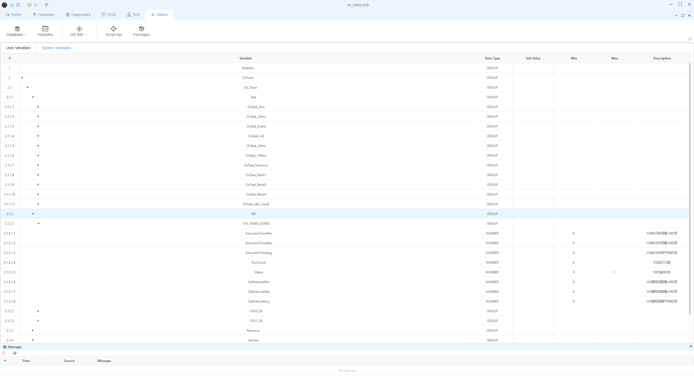

# OSEK OS 轨迹

OSEK OS 轨迹是一个强大的功能，您可以通过外部接口实时检索OSEK OS 的运行状态，并将其转换为可视的图形接口。

> [!注意]
> 此功能需要操作系统提供相应的 ORTI 文件, 在相应的 HOOK 中插入相关代码来记录相关信息，然后通过数据接口将数据传送给EcuBus-Pro。

## 导入 ORTI 文件

点击 "Others->Database->添加 OS(ORTI)" 导入 ORTI 文件。 您也可以查看已导入的 ORTI 文件。


## 配置 ORTI

> [!注意]
> 导入ORTI文件后，用户仍然可以手动修改配置信息。

在成功导入 ORTI 文件后，您可以看到从 ORTI 文件解析的配置信息。

### TASK/ISR

1. 设置名称
2. 设置实际CPU操作频率(取决于您的时间戳格式)。 如果您的时间戳已经在微秒中，CPU频率可以是 1)
3. 设置对象颜色
4. 设置周期任务的理论激活间隔(活动间隔，微秒，仅适用于任务)

> [!注意]
> 活动间隔 (我们) 只能为任务类型配置。 ISR 不支持此配置项。


### 资源


### 服务


### 钩子


### 连接器配置

连接器决定您在哪里获取TRACE数据。 当前支持以下方法：

#### 串行端口 (SerialPort)

通过串口实时接收操作系统跟踪数据。

**配置项目：**

- **设备**：选择串行端口设备(如：COM1, /dev/ttyUSB0等)
- **波特率**：波特率 (例如115200, 921600等)
- **Data Bits**: Data bits (5, 6, 7, 8)
- **停止 Bits**：停止 bits (1, 1.5, 2)
- **parity**: 对等点(无, Even, Odd, Mark, Space)

**Data Format:** 16字节二进制数据(little-endian)

| 字段      | 长度   | 描述                                  |
| ------- | ---- | ----------------------------------- |
| 帧标题     | 4 字节 | 帧头(05D5C5B5A)    |
| 时间戳     | 4 字节 | 时间戳 (LSB)        |
| 类型 id   | 2 字节 | 对象 ID (LSB)      |
| 类型状态    | 2 字节 | 状态/参数 (LSB)      |
| 索引      | 1 字节 | 事件索引 (0-255个周期性) |
| 类型      | 1 字节 | 事件类型                                |
| coreID  | 1 字节 | 核心ID                                |
| CRC8/保留 | 1 字节 | CRC8 校验和或预订字节                       |

> [!注意]
>
> - 总帧长度固定为16字节
> - CRC8校验和是从数据部分的11个字节(不包括帧头和 CRC 字节本身)计算出来的。 包括：索引、时间戳、类型、类型、类型、类型状况、核心ID)
> - 启用CRC 校验后，最后一个字节将用作CRC8校验和
> - 当CRC 验证被禁用时，最后一个字节被用作保留字节(保留)， 和系统通过检查类型字段验证帧的有效性(有效值：0-5)


#### 二进制文件(二进制文件)

从二进制文件读取操作系统跟踪数据。 数据格式与串口相同(16字节二进制数据)。

**配置项目：**

- **文件** ：选择二进制文件路径 (支持相对路径)

**Data Format:** 与串行端口相同，16字节二进制数据

#### CSV 文件 (CSVFile)

从 CSV 文件读取操作系统跟踪数据。

**配置项目：**

- **文件** ：选择 CSV 文件路径 (支持相对路径)

**Data Format:** CSV 格式，每行一个事件

> [!注意]
> CSV 文件格式为：时间戳,类型,id,status。 头不被允许，时间戳单位是勾。

```csv

1000,1,0,0
1500,1,0,1
2000,2,0
```

**字段描述:**

- **时间戳**：时间戳(刻度)
- **类型**：事件类型
- **id**: Object ID
- **状态**: 状态值

#### 加/ETH

> [!注意]
> CAN 和 ETH 接口尚未实现。 请保持敬爱。

### 录制文件

记录文件决定将TRACE数据写入本地文件。 写入的数据格式是 CSV 格式。

> [!注意]
> 每行一个事件, 格式: 时间戳,类型,id,状态. 时间戳单位为勾。


### 保存

配置ORTI相关信息后，点击右上角的保存按钮保存ORTI配置信息。

## 查看操作系统跟踪数据和自动生成的系统变量

操作系统发送的数据可以通过 `Trace` 窗口查看。


设置 ORTI 后，ORTI 数据将自动生成为内置系统变量，这些变量可以通过 `Others->Variables` 查看。



## 查看操作系统统计

操作系统统计数据可以通过 "Other s->Os Info->[[对应ORTI 文件名称] Statistics"查看。


您可以使用光标查看图形中的时间戳，或者查看两个光标之间的差异。

## 查看操作系统时间表

操作系统时间线可以通过“Others->Os Info->[对应ORTI文件名称]Timeline”查看。

定时器由 GPU 加速使用 '像素.js' 绘制。

> [!注意]
> 目前只有任务和ISR可以按时查看。


### 实时跟踪

应用程序运行时支持实时跟踪。


### 离线分析

您可以打开之前保存的 CSV 记录文件来在离线模式下查看操作系统的时间线。


> [!注意]
> 如果启用了“链接追踪”并打开了跟踪窗口，离线事件也将被附加到跟踪窗口。

### 链接轨迹

链接跟踪可以将时间轴中的事件链接到跟踪窗口中的事件， 让用户更容易查看事件之间的关系。


## 自定义特定变量信息视图

用户可以选择像**LINE、Gauge、Data**这样的组件来根据他们的需要显示这些变量。

例如：如果用户想查看5msTask 和 SystemTick ISR的实时运行状态，点击`Home->Graph->Line`，然后点击顶部的“添加变量”。


选择 `5msTask->Status` 和 `SystemTick ISR->Status` ，然后单击`Add`查看5msTask和SystemTick ISR的实时运行状态。


结果预览:

