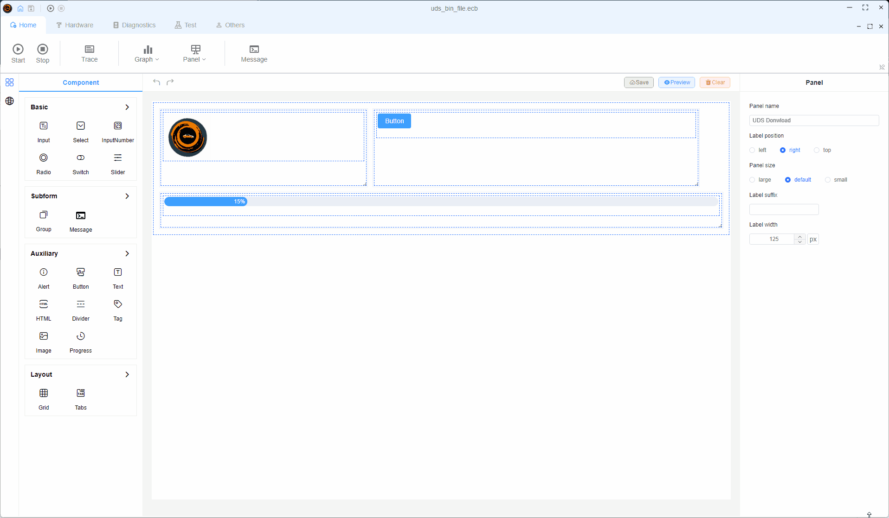
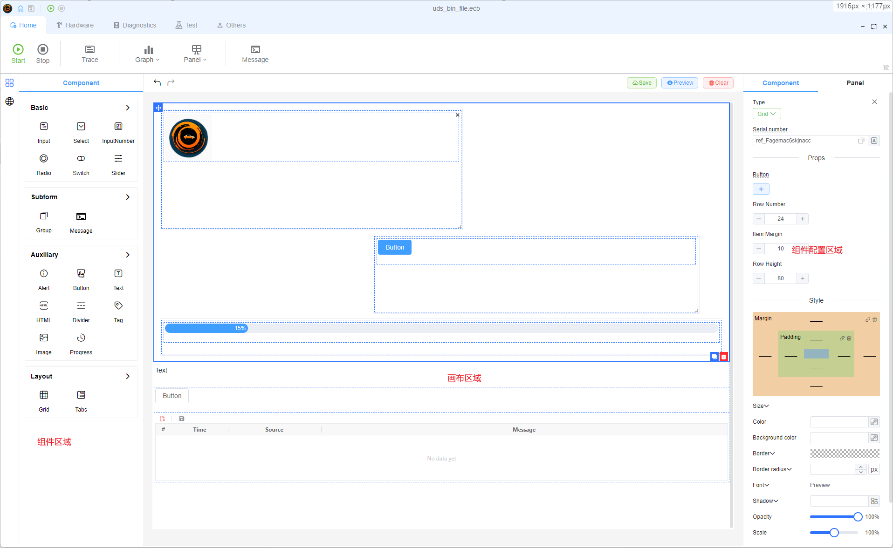
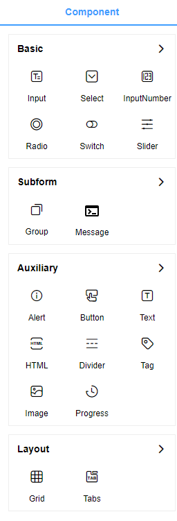
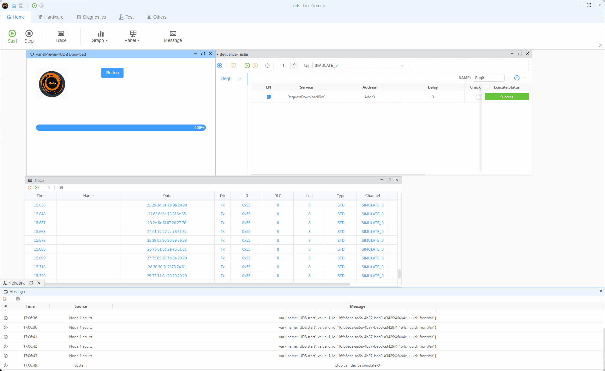

# 面板

## 什么是面板？

面板是一个灵活的拖放接口，提供了一个空白的插件，您可以在这里自由安排和连接功能组件。 像使用 LEGO 块建造一样，你可以在面板中集合各种功能来创建自定义界面：

## 面板能力

专家小组的特点为迅速建立各种示范或测试平台提供了特殊的灵活性：

- 为用户创建带图形接口的转换工具
- 为生产线工人建立简单、按键接口的测试管道。
- 将组件连接到 DBC/LDF 文件信号，从而使UI 更改能够触发相应的信号变化，参见 [Database](./../database)
- 将组件绑定到用户定义或系统变量以显示或修改他们的值，请参阅 [Variable](./../var/var)
- 还有更多的东西要被发现！

## 面板功能

### 编辑功能

编辑界面由三个主要领域组成：

1. **组件区域**：包含范围广泛的现用组件
2. **Panel Area**：用于放置和安排组件
3. **组件属性编辑器**：用于设置组件属性，如信号绑定，变量绑定等。

### 支持的组件

412. 目前，康瓦斯省支持四大类组成部分：

- **交互组件**：按钮、输入和其他用户交互元素
- **子表单组件**：特殊功能组件
- **显示组件**: 视觉呈现元素
- **布局组件**：用于组织和结构您的接口

在今后的更新中将添加更多的组件类型，例如用于模拟汽车仪表板面的仪表盘仪器。

### 显示功能

在配置您的组件后，用户可以在显示模式中查看和交互：

## 面板示例

[Led Control Panel 示例](../../../examples/panel/readme.md)
