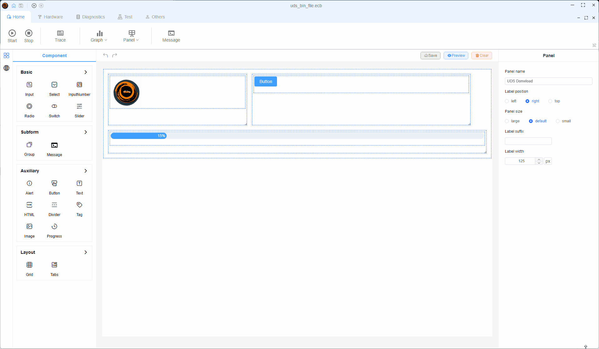
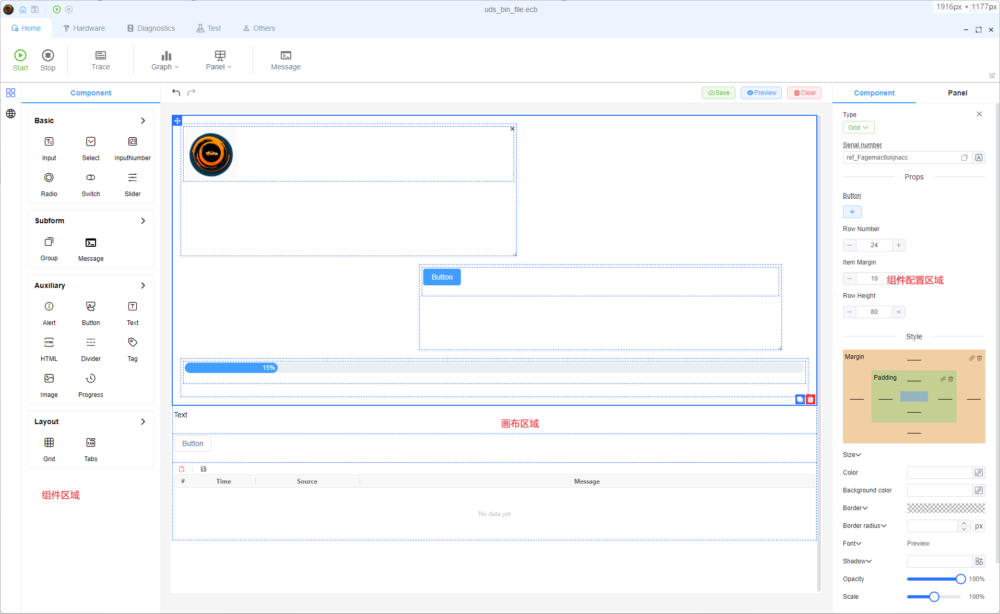
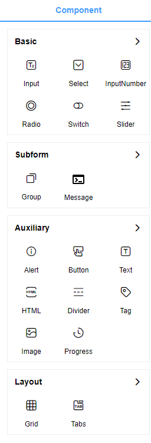
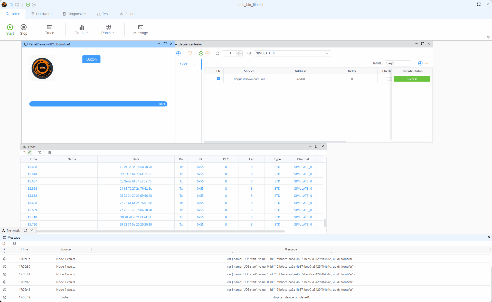

# 面板

独立 HTML 示例位于 `resources/examples/panel_html`。下文截图为旧版面板界面。

## 记住上次的值

用户自定义变量的“记住上次的值”默认开启，未设置该选项的旧工程变量也按开启处理。已保存工程运行后，下次启动测量会优先恢复记忆值；只修改初始值不会覆盖已有记忆值。

需要每次从初始值开始时，在用户变量编辑窗口关闭“记住上次的值”。需要清除已有值时，先停止测量，再进入变量页的“记忆文件”，选择工程并删除记录。下次启动使用初始值，仍开启记忆的变量会重新保存。正在使用或尚未写完的记录不能删除。

记忆值按工程路径保存在本机，不写入 `.ecb` 或 `.ecpanel`。未保存工程、内置系统变量以及 CAN/LIN 信号值不持久化。移动或重命名工程后会使用新的记忆记录，旧记录可在“记忆文件”中手动清理。

Panel 的“打开文件”按钮仅支持目录及 PDF、TXT、Markdown、CSV、PNG、JPEG、GIF、BMP、WebP 文件，不允许直接打开程序、脚本或快捷方式。

变量记忆文件仅用于桌面 GUI 测量。CLI 不读取这些文件，按工程文件中的变量定义启动（通常使用初始值），不会恢复 GUI 上次运行的记忆值。

## HTML 信号读取

`getSignal()` 返回当前测量中最近解析的发送或接收报文样本，不依赖 HTML 订阅；没有样本时回退到工程数据库中的已有值，可能为空。`setSignal()` 更新发送数据库，成功返回不代表报文已发送或 ECU 已处理，因此紧接着调用 `getSignal()` 不保证读到刚写入的值。缓存从测量开始持续记录，以保留首次读取或打开独立窗口之前出现过的单次报文。

## 什么是面板？

面板是一个灵活的拖放界面，提供了一个空白画布，您可以在其中自由排列和连接功能组件。 就像用乐高积木搭建一样，您可以在面板内组装各种功能来创建自定义界面：

## 面板功能

面板功能为快速构建各种演示或测试平台提供了卓越的灵活性：

- 为具有图形界面的用户创建转换工具
- 为生产线工人构建具有简单、基于点击界面的测试流水线
- 将组件连接到 DBC/LDF 文件信号，使 UI 更改能够触发相应的信号更改，请参阅 [数据库](./../database)
- 将组件绑定到用户定义或系统变量以显示或修改其值，请参阅 [变量](./../var/var)
- 还有更多功能等待您发现！

## 面板特性

### 编辑功能

编辑界面包含三个主要区域：

1. **组件区域**：包含各种现成可用的组件
2. **面板区域**：用于放置和排列组件
3. **组件属性编辑器**：用于设置组件属性，如信号绑定、变量绑定等

### 支持的组件

画布目前支持四大类组件：

- **交互式组件**：按钮、输入框和其他用户交互元素
- **子表单组件**：特殊功能组件
- **显示组件**：视觉表示元素
- **布局组件**：用于组织和构建界面结构

更多组件类型将在未来的更新中添加，例如用于模拟汽车仪表板的仪表盘。

### 显示功能

配置组件后，用户可以在显示模式下查看和与它们交互：

## 面板示例

[LED 控制面板示例](../../../examples/panel/readme.md)
