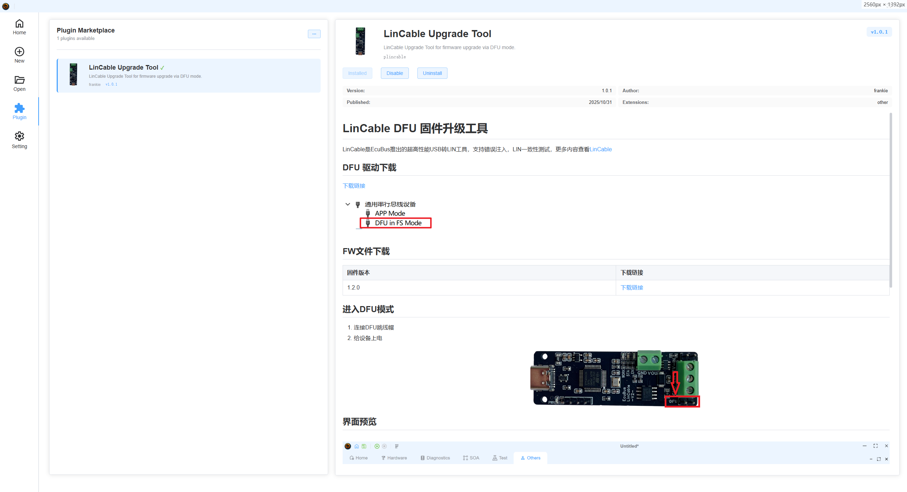
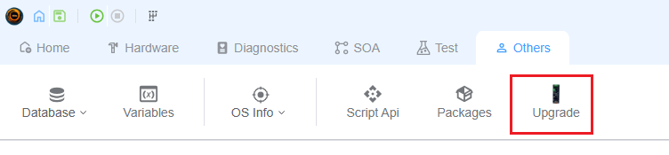

# 插件

## 概述

插件系统是一个强大的可扩展功能，允许您通过自定义功能增强 EcuBus-Pro。 插件使开发人员能够创建和共享额外的功能、工具和集成，以扩展应用程序的核心功能。 通过插件市场，您可以根据特定需求发现、安装和管理插件，以定制您的 EcuBus-Pro 体验。 插件使开发人员能够创建和共享额外的功能、工具和集成，以扩展应用程序的核心功能。 通过插件市场，您可以根据特定需求发现、安装和管理插件，以定制您的 EcuBus-Pro 体验。

## 主要功能

### 插件市场

插件市场提供了一个集中位置来发现和安装插件：

### 扩展点

插件可以通过两种主要方式扩展 EcuBus-Pro：

#### 自定义标签页

插件可以在应用程序界面中创建全新的标签页：

- 添加专业工具和界面
- 为特定用例创建自定义工作流
- 实现特定领域的功能
- 集成外部服务或工具

#### 标签页扩展

插件可以通过附加功能扩展现有标签页：

- 向现有标签页（测试、CAN、LIN、硬件等）添加按钮和控件
- 将新功能无缝集成到当前工作流中
- 在不修改核心代码的情况下增强现有功能
- 为特定标签页提供专业工具
  

### 开发支持

开发插件非常方便。 开发插件非常方便。 详情请参阅[插件开发指南](../../dev/plugin.md)。
