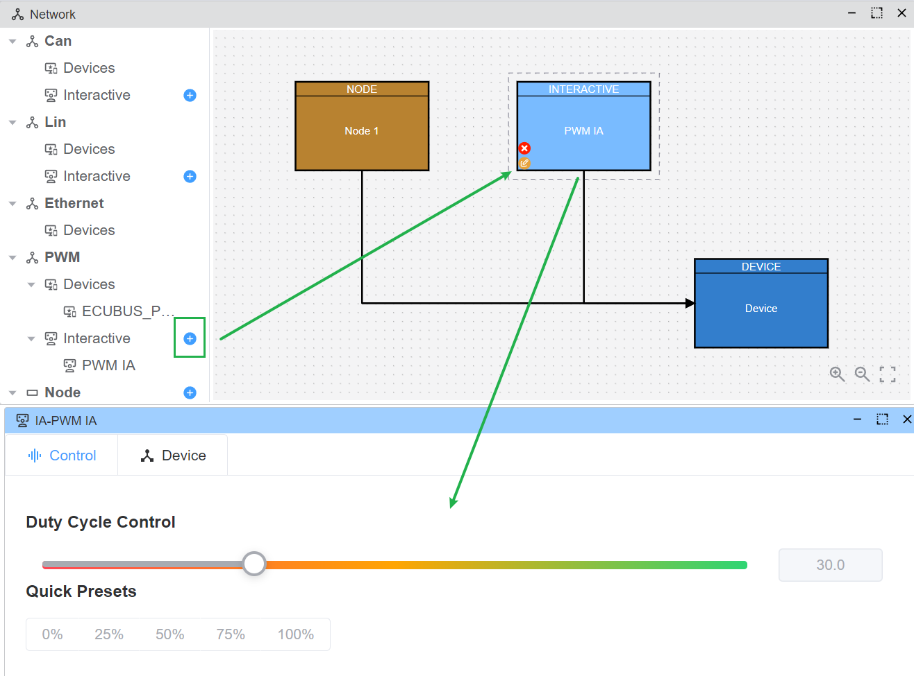

# PWM

PWM 设备支持输出 PWM 信号，并提供 ICU（输入捕获单元）功能。

支持的硬件：

| 厂商 | 协议 |
|--------|-------------------|
| ECUBUS | PWM，ICU（开发中） |

## PWM 交互

通过 `Network` 窗口打开 PWM IA。支持的能力：

- 设置 PWM 占空比（支持多设备）
- 快速预设：
    - 0%
    - 25%
    - 50%
    - 75%
    - 100%

