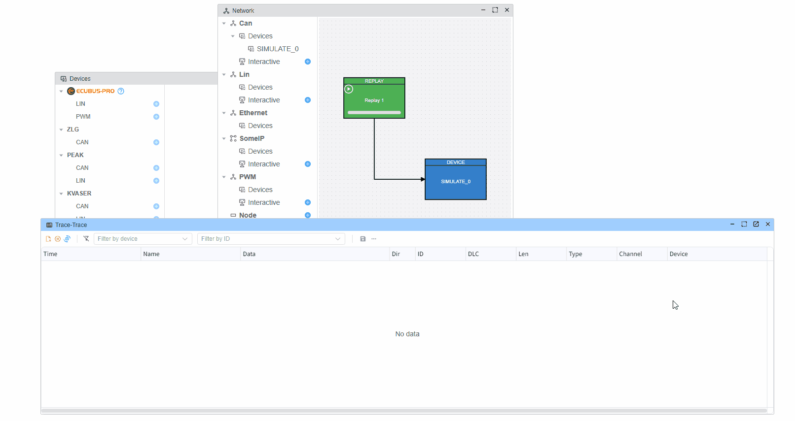
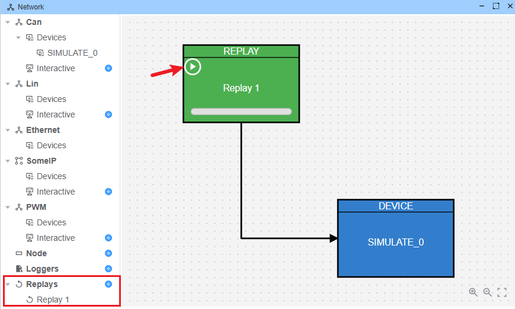
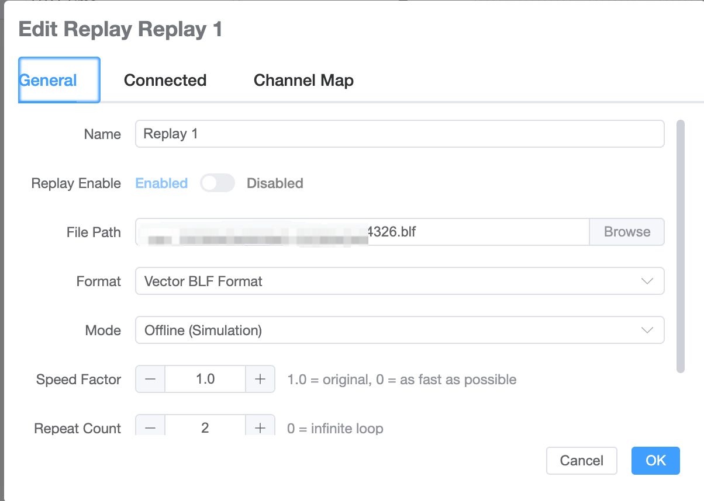
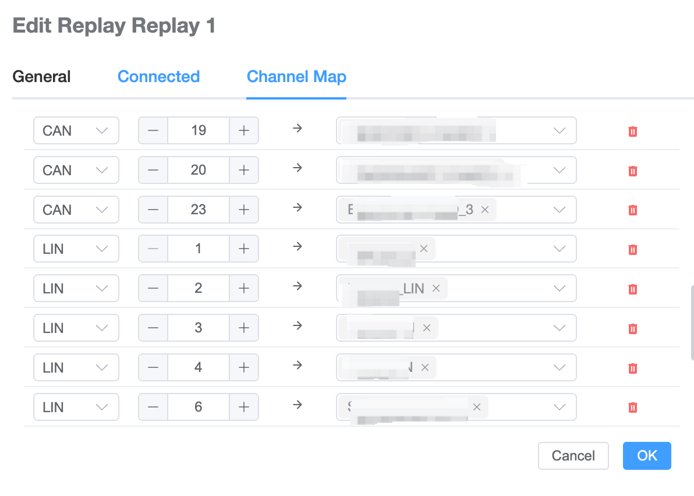

# 回放

## 概述

**回放**功能允许您加载先前记录的 CAN/LIN 通信数据，并像实时发生一样进行播放。  
这在以下场景中很有用：

- **调试**难以实时复现的复杂问题。
- **分析**诊断会话和网络行为。
- **演示**和培训，无需真实的车辆或台架。

## 在线回放与离线回放

- **离线回放**：您从磁盘加载先前记录的日志文件（ASC / BLF），并在工具内进行播放。不需要真实的 CAN/LIN 硬件或实时车辆连接。报文被注入到应用程序的内部总线中，用于分析和可视化。
- **在线回放（实时流）**：日志文件中的报文通过**真实的** CAN/LIN 硬件接口实时发送，允许您在实际总线网络上模拟录制的流量。

## 支持的文件格式

- **`.asc`**：Vector ASCII 日志文件（CAN/LIN）。
- **`.blf`**：Vector 二进制日志格式文件（CAN/LIN）。

如果您尝试打开任何其他格式，应用程序将拒绝该文件或可能不显示任何回放数据。

## 打开回放

1. 打开**网络**视图。
2. 添加**回放**节点。
3. 从您的文件系统中选择一个日志文件。

## 回放配置

**回放配置**面板允许您微调回放行为：

- **文件选择**：选择要回放的 ASC 或 BLF 文件。
- **速度因子（`speedFactor`）**：控制帧相对于原始时间戳的播放速度。
  - `1.0`：正常速度（默认）。
  - `> 1.0`：快于实时（例如 `2.0` = 2 倍）。
  - `< 1.0`：慢于实时（例如 `0.5` = 半速）。
  - `0`：尽可能快地播放，忽略实时延迟。
- **重复次数（`repeatCount`）**：日志回放的次数。
  - `1`：播放一次（默认）。
  - `N > 1`：将整个文件播放 N 次。
  - `0`：连续循环播放，直到您手动停止回放。

### 通道映射

在回放的上下文中，**映射**指的是**日志通道**与 **EcuBus 设备**之间的映射关系。

- 每个**日志通道**（例如 CAN 通道 `1`、`2`、… 或 LIN 通道 `7`、`8`、…）在日志文件中都可以映射到一个或多个 EcuBus-Pro 设备。
- **总线类型**列指示每个通道是 CAN 还是 LIN，设备下拉框会相应过滤。
- 在回放期间，来自给定日志通道的帧将被注入到对应的映射设备中。

典型用例包括：

- 将不同的 ASC 通道映射到您项目中的不同 CAN 接口。
- 将多通道日志回放到一部分设备中，以进行聚焦分析或测试。

