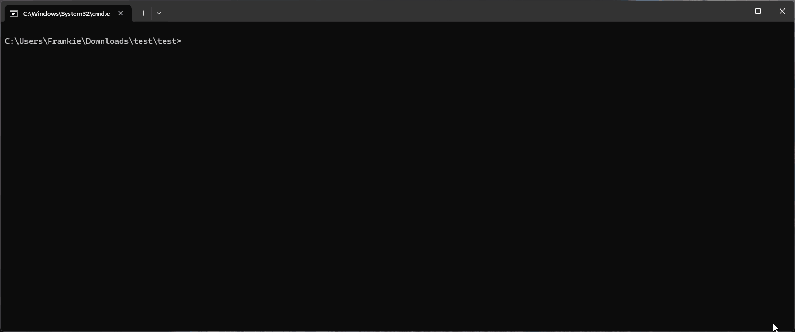

# 使用外部软件包

由于EcuadBus-Pro 脚本基于 Node.js，您可以在脚本中使用任意Node.js 包。 有两种方法可以安装软件包：

## 方法1：使用软件包管理器接口

当首次使用项目时，您需要先初始化 package.json 文件才能安装软件包。

EcuadBus-Pro 提供一个图形软件包管理界面，以方便安装、管理和卸载软件包。

1. 对于新项目，您将看到一条消息“未找到package.json”和“初始化package.json”按钮。 点击此按钮创建一个新的 package.json 文件。

2. 在主界面的左侧导航栏中点击“包”选项
   

3. 在软件包管理器界面：
   - 输入您想要安装的软件包名称
   - 选择安装类型 (依赖关系或开发依赖关系)
   - 点击“安装”按钮

4. 您可以在底部的“安装包”部分查看和管理已安装的软件包

## 方法2：利用EcuBus-Pro CLI

您也可以在 EcuadBus-Pro CLI 中使用 `pnpm` 命令安装软件包。 详见[EcuBus-Pro CLI](cli.md)。

### 通过 CLI 安装

在您的项目根目录中安装 "serialport" 包。

```bash
ecb_cli pnpm install serialport
```



## 用法示例

这是如何在脚本中使用 "serialport" 包的一个例子。
欲了解更多关于 `serialport` 包的信息，请参阅[serialport] (https://serialport.io/)。

### 代码示例

```typescript
import { SerialPort } from 'serialport'
//使用路径和波特率打开端口
const port = new SerialPort({
  path: 'COM9',
  baudRate: 57600,
  autoOpen: true
})
//获取端口列表
SerialPort.list()
  .then((ports) => {
    console.log(ports)
  })
  .catch((err) => {
    console.error(err)
  })
```

### 运行结果


