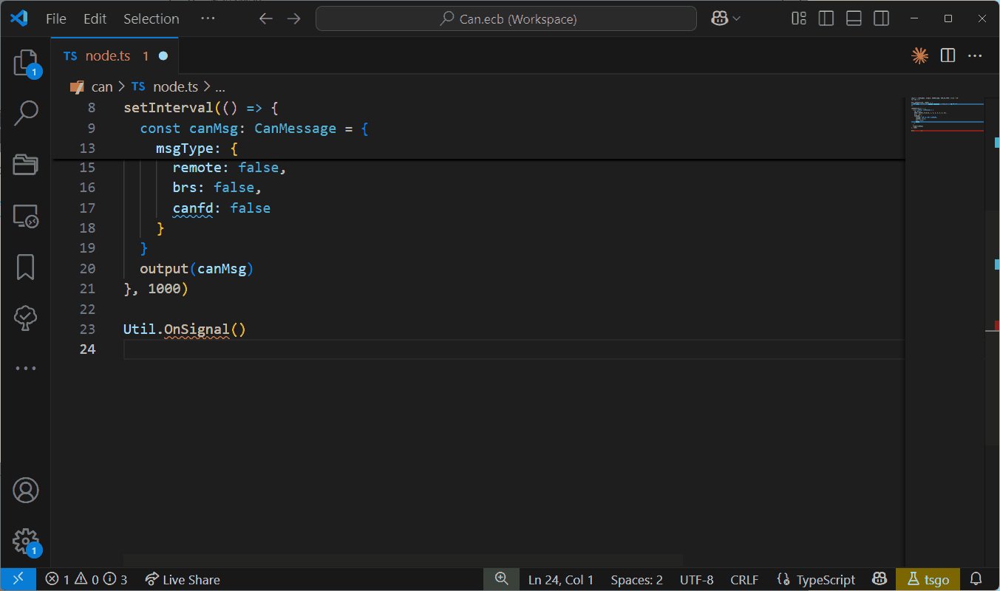

# CAPL 到 EcuBus-Pro 脚本 (TypeScript)

在汽车测试与诊断领域，`CAPL (CANoe 编程语言)` 长期以来一直是开发测试自动化脚本的重要工具。 它在 `Vector CANoe` 生态系统中拥有强大的功能和成熟的用户基础。
然而，随着测试场景多样化、跨平台需求增加以及对更高灵活性和可维护性的要求增长，是否存在替代解决方案？

EcuBus-Pro 的答案是使用 `TypeScript` 编写脚本。 EcuBus-Pro 脚本使用 `TypeScript` 作为开发语言，并采用现代软件工程实践。 与 CAPL 相比，`TypeScript` 提供更丰富的生态系统、更强的可扩展性以及与 DevOps 工作流程的原生兼容性。

## EcuBus-Pro 脚本智能感知

> 由于 EcuBus-Pro 脚本使用 TypeScript 作为开发语言，您将获得由 TypeScript 类型系统提供的基于类型的智能感知。

## CAPL 与 EcuBus-Pro 脚本语法对比

> [!INFO]
> 持续更新中。 有关更多脚本 API，请参阅 [API](https://app.whyengineer.com/scriptApi/index.html)

| 功能         | CAPL 示例                                       | EcuBus-Pro 脚本示例 (TypeScript)           |
| ---------- | --------------------------------------------- | --------------------------------------------------------- |
| **类型检查**   | 弱类型，无编译时检查                                    | 强类型，IDE 提示 + 编译时检查                                        |
| **库与扩展**   | 内置于 Vector 环境中                                | 拥有丰富第三方库的 NPM 生态系统                                        |
| **变量声明**   | `int counter = 0;`                            | `let counter: number = 0;`                                |
| **打印日志**   | `write("Hello CAPL");`                        | `console.log("Hello EcuBus-Pro");`                        |
| **消息接收事件** | `on message CAN1.MyMsg{  write("Received");}` | `Util.OnCan(0x1, (msg) => {  console.log("Received");});` |
| **事件回调**   | `on key 'a' { ... }`                          | `Util.OnKey('a', () => { ... });`                         |
| **变量监视**   | `on envVar EnvChecksumError { ... }`          | `Util.OnVar('EnvChecksumError', () => { ... });`          |

## 示例

> 示例正在不断完善中；欢迎贡献。

1. [监视信号变化并打印时间间隔](./capl2ts1.md)
2. [监视变量变化，发送 LIN 信号，并手动设置错误校验和](./capl2ts2.md)
