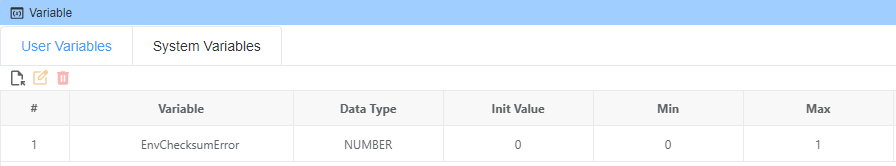
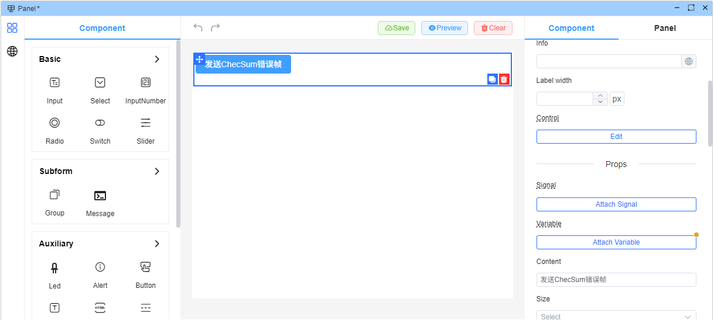
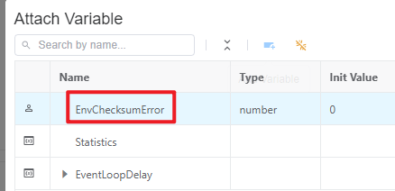
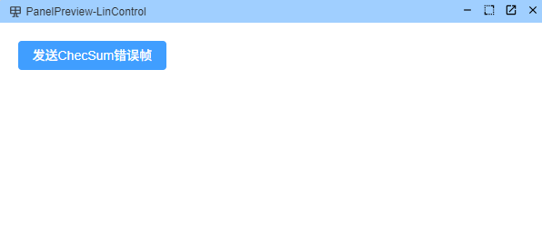
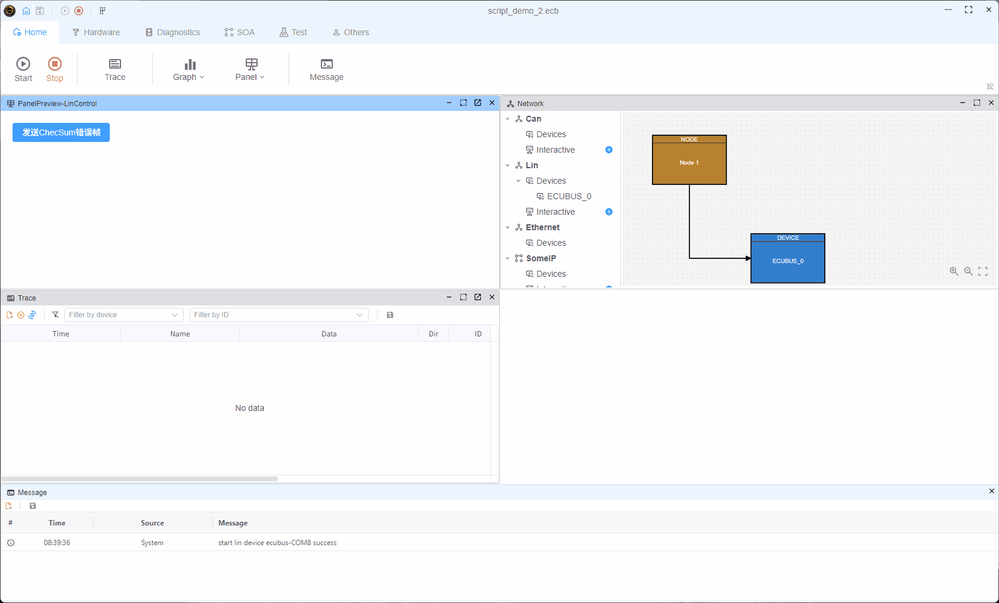

# 监控变量变化，发送LIN信号，并手动设置错误的校验和

> 感谢Alex提供示例

## CAPL分析

提供的CAPL示例如下：

```ts
on envVar EnvChecksumError  
{
  if (1 == getValue(EnvChecksumError))  // Checksum err
  {
     write("Checksum err");
    linSetManualChecksum(frmAC_1, linGetChecksum(frmAC_1) - 1);
    //linSetManualChecksum(frmReq, linGetChecksum(frmReq) - 1);
    
    //output(frmReq);
    output(frmAC_1);
  }
}
```

### CAPL代码详解

此CAPL脚本的核心逻辑是：

1. **环境变量监听**：`on envVar EnvChecksumError` 监听 `EnvChecksumError` 环境变量的变化
2. **条件检查**：当变量值为1时，触发错误注入逻辑
3. **错误注入**：
   - `linGetChecksum(frmAC_1)` 获取正确的校验和值
   - `linSetManualChecksum(frmAC_1, checksum - 1)` 手动设置错误的校验和（减1）
   - `output(frmAC_1)` 发送带有错误校验和的LIN报文

> [!注意]
>
> - **技术说明**：LIN总线校验和机制对于确保数据完整性至关重要。 通过故意设置错误的校验和，可以测试接收节点的错误处理能力。
> - **测试设备**：我们选择[LinCable](https://app.whyengineer.com/zh/docs/um/hardware/lincable.html)作为测试设备，因为它可以灵活注入各种LIN错误。

## EcuBus-Pro中的变量配置

### 步骤1：创建环境变量

要实现变量监控，首先在EcuBus-Pro中创建相应的环境变量。 环境变量是脚本与用户界面之间的重要桥梁。

> **路径**：其他 → 变量 → 添加变量


#### 关键变量设置

- **名称**：`EnvChecksumError`（必须与CAPL脚本中的变量名匹配）
- **类型**：整数
- **初始值**：0（正常状态）
- **范围**：0–1（0 = 正常，1 = 触发错误）

### 步骤2：验证变量

创建后，您可以在变量列表中查看和管理该变量：



在变量列表中，您可以：

- 查看变量的当前值
- 修改变量配置
- 删除不必要的变量
- 导出/导入变量配置

## UI控制面板配置

### 步骤3：创建控制面板

为了在测试过程中动态控制变量值，创建一个用户界面面板。 通过图形界面，测试人员可以实时切换变量状态，无需修改代码。

> **路径**：主页 → 面板 → 添加面板



#### 面板设计建议

- 使用**开关**或**切换**控件来表示0/1状态
- 设置描述性的按钮文本，如"发送校验和错误帧"
- 清晰布局控件，确保操作直观

### 步骤4：绑定变量

创建面板控件后，将其绑定到环境变量，建立控件与变量之间的双向数据关联。



#### 绑定设置

- **目标变量**：选择之前创建的 `EnvChecksumError` 变量
- **控件类型**：布尔开关
- **映射**：关 = 0（正常），开 = 1（触发错误）

### 步骤5：预览UI

配置完成后，您可以预览最终的用户界面：



#### UI亮点

- 实时显示当前变量状态
- 支持一键切换操作
- 提供直观的视觉反馈

## EcuBus-Pro TypeScript实现

### 步骤6：编写TypeScript脚本

现在我们将CAPL逻辑转换为EcuBus-Pro TypeScript脚本。 与CAPL相比，TypeScript提供了更好的类型安全性和开发体验。

```typescript
Util.OnVar("EnvChecksumError", ({ value }) => {
    if (value == 1) {
        console.log("Checksum err");
        const msg: LinMsg =
        {
            frameId: 0x3c,
            direction: LinDirection.SEND,
            data: Buffer.from([0x60, 0x01, 0xb5, 0xff, 0xff, 0xff, 0xff, 0xff]),
            checksumType: LinChecksumType.CLASSIC,
            lincable:{
                checkSum:3,// wrong checksum
            }
        }
        output(msg);
    }
});
```

### 详细脚本解析

#### 1. 变量监控机制

```typescript
Util.OnVar("EnvChecksumError", ({ value }) => {
    // Callback, triggered when the variable value changes
});
```

- `Util.OnVar()` 是EcuBus-Pro提供的变量监控API
- 支持解构赋值以直接获取 `value` 参数
- 当变量值发生变化时自动触发回调

#### 2. LIN报文构造

```typescript
const msg: LinMsg = {
    frameId: 0x3c,              // LIN frame ID (hex)
    direction: LinDirection.SEND, // Send direction
    data: Buffer.from([...]),    // Data byte array
    checksumType: LinChecksumType.CLASSIC, // Checksum type
    lincable: {
        checkSum: 3             // Manually set incorrect checksum
    }
}
```

#### 3. 关键参数说明

| 参数             | 描述      | 示例                             |
| -------------- | ------- | ------------------------------ |
| `frameId`      | LIN帧标识符 | `0x3c` (60) |
| `direction`    | 报文方向    | `LinDirection.SEND`            |
| `data`         | 数据载荷    | 8字节数据数组                        |
| `checksumType` | 校验和类型   | `CLASSIC` 或 `ENHANCED`         |
| `checkSum`     | 手动校验和   | `3`（故意错误）                      |

#### 4. 错误注入原理

正常情况下，LIN 报文的校验和应根据数据内容自动计算。 在测试场景中，我们通过 `lincable.checkSum` 手动指定一个错误值（例如 3），以模拟传输错误并测试接收节点的错误处理能力。

## 测试运行与验证

### 步骤 7：运行测试

完成所有配置后，运行测试。 使用界面上的切换按钮控制变量值，并观察 LIN 报文的发送。


