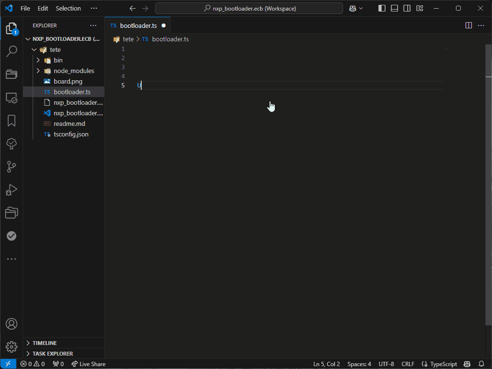
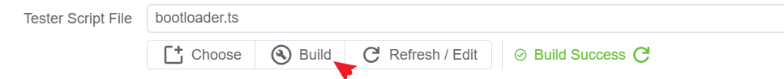
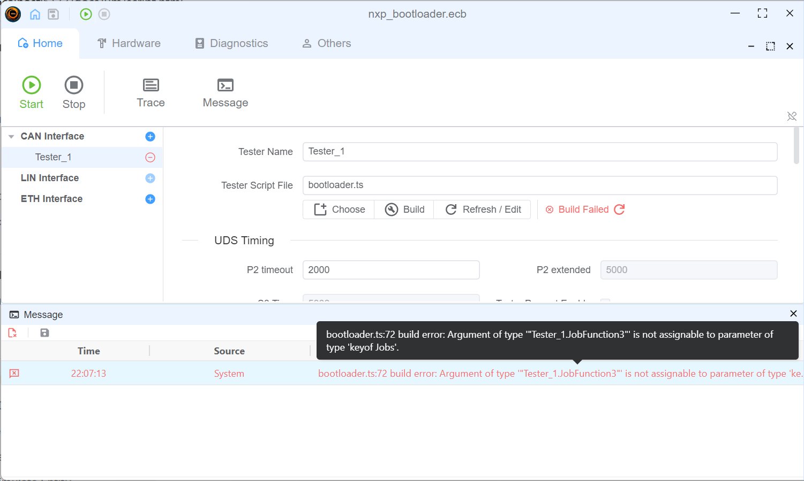
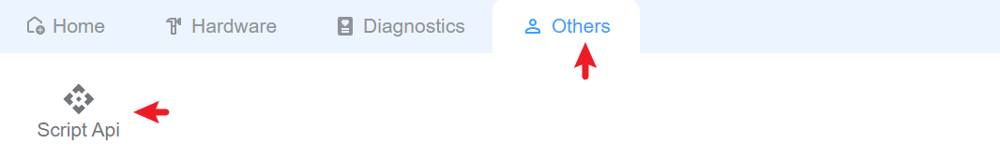

# 脚本

基于 Node.js 环境中的 TypeScript/JavaScript 的脚本。 我们使用 `ts` 进行语法检查，并使用 esbuild来生成脚本，构建脚本在 `.ScriptBuild` 文件夹中。

## 编辑器

建议使用 Vscode 来编辑脚本，您可以安装 `TypeScript` 扩展来获取语法检查和智能化。


> [!TIP]
> 我们还计划提供 vscode 扩展，让您直接在 vscode 中构建脚本。

## 构建脚本


如果脚本中存在任何错误，您可以获取`Message`窗口中的构建错误信息。


## Script API

您可以打开 `API` 窗口来获取 API 信息。


或检查此在线文档 [API](https://app.whyengineer.com/scriptApi/index.html)

## 脚本使用

### Node.js 能力

#### Init

Init 函数是脚本的条目，将在脚本加载时调用。

```typescript
Util.Init(() => {
  console.log('Init')
})
```

#### 定时器

计时器是 node.js 内置功能，您可以使用它来做一些定期工作。 更多关于计时器的详细信息，请参阅 [Timer](https://nodejs.org/api/timers.html)

```typescript
// periodical output can message
let timer = setInterval(() => {
  outputCan(canMsg)
}, 1000)

// stop the timer
clearInterval(timer)

//refresh the timer
timer.refresh()
```

#### OnKey

聆听密钥事件，您可以在按键时使用它来做一些工作。

```typescript
// listen to the key event
Util.OnKey('s', () => {
  outputCan(canMsg)
})
```

#### OnCan

聆听可以发送的消息，您可以在收到消息时使用它来完成一些工作。

```typescript
// listen to the can message
Util.OnCan(0x1, (msg) => {
  console.log(msg)
})
// listen all can message
Util.OnCan(true, (msg) => {
  console.log(msg)
})
```

#### On

监听诊断消息。
`<0>.<1>.recv`用于监听收到的 uds消息。 <tester name>。<service item name>被用来监听uds消息发送。

```typescript
// listen to the uds message
Util.On('Can.DiagRequest.recv', (msg) => {
  //receive diag response
})
Util.On('Can.DiagRequest.send', (msg) => {
  //receive diag request
})
```

## 示例

:::details 在脚本初始化时发送10条CAN消息，然后在30秒延迟后再发送一条消息{open}

```typescript
async function sendCanMessage(msgId: number, targetId: number, dataPattern: string) {
    console.log(`sendCanMessage called with msgId: ${msgId}, targetId: ${targetId}`);

    const dataBytes = Buffer.from(dataPattern.repeat(8), 'hex');
    console.log("Total Length:", dataBytes.length);

    const fdMsg: CanMessage = {
        id: targetId,
        dir: 'OUT',
        data: dataBytes,
        msgType: {
            idType: CAN_ID_TYPE.STANDARD,
            brs: true,
            canfd: true,
            remote: false,
        }
    };

    try {
        await output(fdMsg);
    } catch (error) {
        console.error(`CAN FD 发送失败 (ID: ${msgId}):`, error);
    }

}

Util.Init(async () => {
    console.log("Init");
    // 循环 10 次，定义不同的消息 ID 和数据内容
    for (let i = 0; i < 10; i++) {
        const msgId = 0x510 + i;
        const targetId = 0x520 + i;
        const dataPattern = i % 2 === 0 ? '1234567890ABCDEF' : 'FFAABBCCDDEE5599';
        await sendCanMessage(msgId, targetId, dataPattern);
    }

    setTimeout(() => {
        console.log("Timeout triggered, preparing to send CAN message...");
        const msgId = 0x510 + 10;
        const targetId = 0x520 + 10;
        const dataPattern = 'DEADBEEFCAFEBABE';
    
        sendCanMessage(msgId, targetId, dataPattern);
    }, 30000); // 延时 30 秒
})
```

:::
