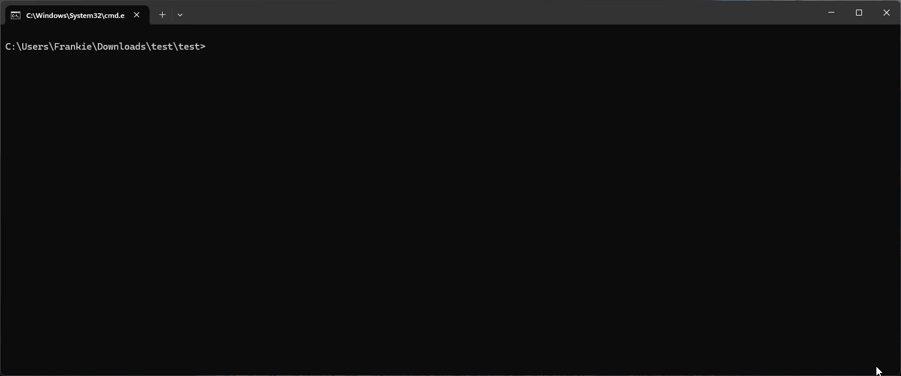
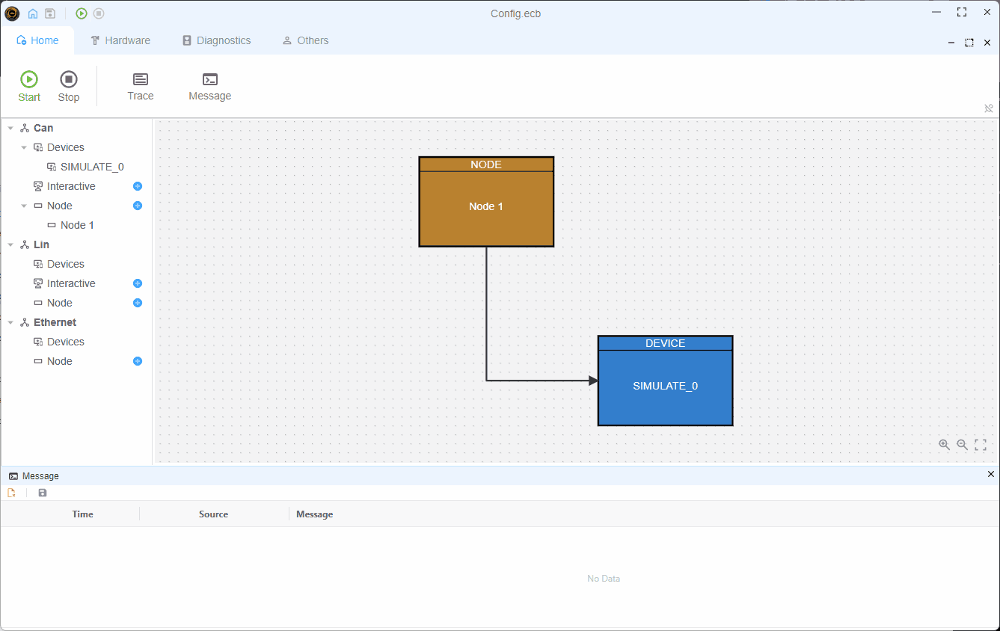

# 在软件内使用外部包

由于 EcuBus-Pro 脚本基于 Node.js，所以可以在脚本中使用任何 Node.js 包，在未来的版本中，软件会兼容其他语言的包，当前版本推荐使用 Node.js 包。安装外部 Node.js 包有两种方法：

## 方法一：使用包管理器界面

首次使用项目时，需要先初始化 package.json 文件，然后再安装包。

EcuBus-Pro 提供了图形化的包管理界面，便于安装、管理和卸载包。

1. 对于新项目，会看到提示  “未找到 package.json” （"No package.json found"）以及一个 “初始化 package.json” （"Initialize package.json"）按钮。点击该按钮以创建新的 package.json 文件。

2. 在主界面左侧导航栏中，点击“Packages（包）”选项。


3. 在包管理器界面中：
   
   - 输入您想要安装的包的名称
   - 选择安装类型（Dependencies （依赖项） 或 Dev Dependencies （开发依赖项））
   - 点击“Install（安装）”按钮
   
   - Enter the name of the package you want to install
   - Select the installation type (Dependencies or Dev Dependencies)
   - Click the "Install" button
4- 可以在底部的“Installed Packages（已安装的包）”区域查看和管理已安装的包。

## 方法2：使用 EcuBus-Pro 命令行工具（CLI）

您也可以在 EcuBus-Pro 命令行工具（CLI）中使用 `pnpm` 命令来安装包。更多详细信息请参见 [EcuBus-Pro CLI](cli.md) 。

### 通过 CLI 安装

在您的项目根目录下安装 `serialport` 包。

```bash
ecb_cli pnpm install serialport
```



## 使用示例

以下是在脚本中使用 `serialport` 包的示例。  
有关 `serialport` 包的更多详细信息，请参阅 [serialport 官网](https://serialport.io/)。

### 代码示例

```typescript
import { SerialPort } from 'serialport'
//open port with path and baudrate
const port = new SerialPort({
  path: 'COM9',
  baudRate: 57600,
  autoOpen: true
})
//get port list
SerialPort.list()
  .then((ports) => {
    console.log(ports)
  })
  .catch((err) => {
    console.error(err)
  })
```

### 程序执行结果


