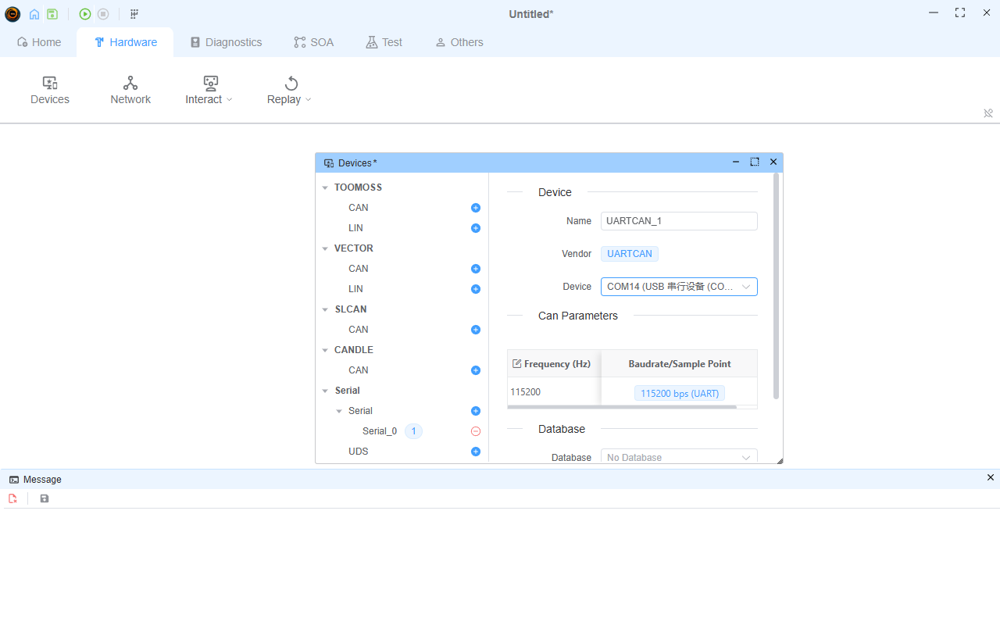
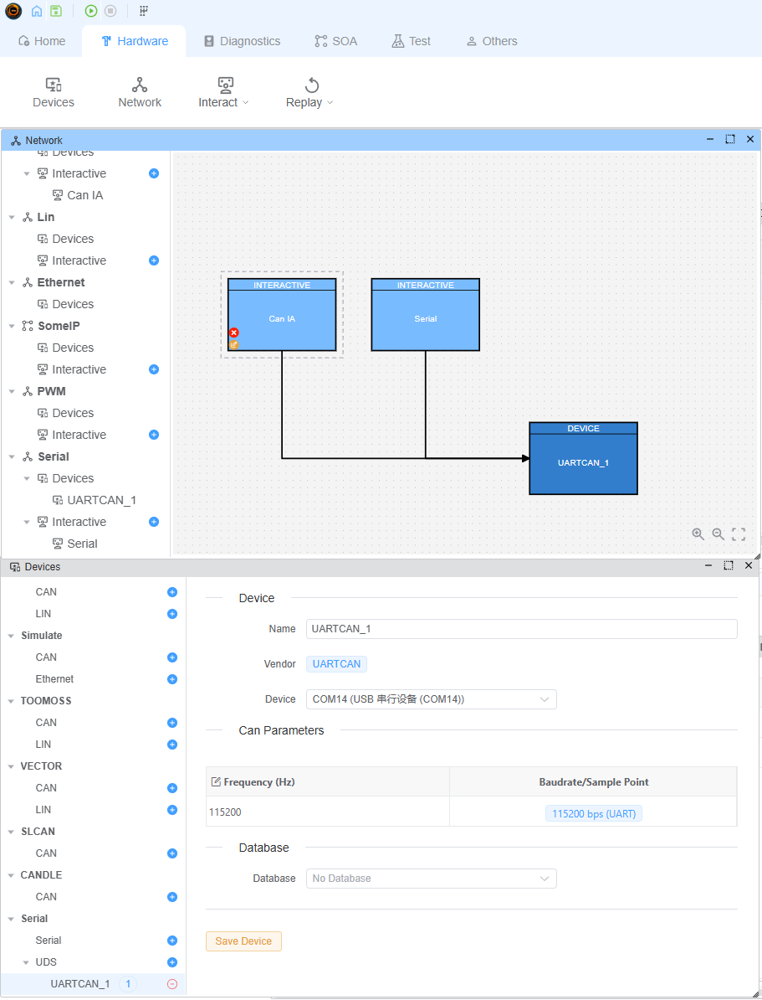
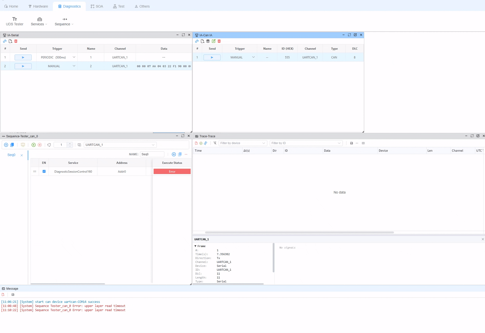

# UDS on Serial（UART-CAN）

EcuBus-Pro 可以在一个普通串口上运行**完整的 UDS / ISO 15765-2（CAN-TP）协议栈**。**UDS** 设备（内部为 `uartcan` 厂商）把串口呈现为一条虚拟 CAN 总线：每个 CAN 帧通过 UART 以固定 13 字节记录传输。真实 CAN 设备能做的这里都能做——UDS Tester、诊断序列、带流控的多帧传输、Tester Present、CAN 交互面板以及 Trace 窗口。

当你的 MCU 没有 CAN 收发器（或手头没有 CAN 调试器）时，这非常有用：只需在 MCU 侧实现一个很小的 UART 桥接，即可复用整套诊断工具链。

## 线上帧格式

每个 CAN 帧是一条固定 **13 字节**的记录，与常见 MCU 侧 UART↔CAN 桥接使用的 SocketCAN `can_frame` 布局兼容：

| 字节 | 内容 |
|------|------|
| 0–3  | CAN ID，大端 `uint32`。bit31（`0x80000000`）= 扩展帧（29 位）标志，bit30（`0x40000000`）= 远程帧标志 |
| 4    | DLC（0–8） |
| 5–12 | 数据，补零到 8 字节 |

示例——ID `0x7AA`，数据 `03 22 F1 90`：

```
00 00 07 AA 04 03 22 F1 90 00 00 00 00
```

接收端通过校验每条候选记录的 DLC 和 ID 保留位在字节流损坏时重新同步，并在线路空闲超过 100 ms 后丢弃残缺的半条记录。

## 添加 UDS 设备

1. 打开 **设备（Devices）** 窗口（Hardware → Devices）。
2. 在 **Serial** 分组下选择 **UDS**，点击 **+** 按钮。
3. 选择串口 **Device**（COM 口），设置 **Frequency**——这是 **UART 波特率**（默认 `115200`），不是 CAN 位速率。
4. 点击 **Add Device**。



> [!IMPORTANT]
> 一个串口同一时刻只能被**一个**程序（一个设备）打开。请关闭占用端口的串口助手类工具，也不要把普通 Serial 设备和 UDS 设备配置在同一个 COM 口上——否则工程启动会报 `Access denied`。

## 交互发送

在 **Network** 窗口中，你可以增加Serial的IA来发送串口数据,如果想使用`UDS On Serial`的功能，添加一个CAN的IA即可：



- **串口 IA**（Serial 分支 → Interactive）：字节**原样发送**。要构成合法帧需输入完整的 13 字节记录，如 `00 00 07 AA 04 03 22 F1 90 00 00 00 00`。
- **CAN IA**（Can 分支 → Interactive）：UDS 设备本质是 CAN 设备，带 ID / DLC / Data 字段的 CAN 面板同样可用——帧会自动打包成 13 字节记录。

## 运行 UDS 诊断

创建一个 **CAN Tester**（Diagnostics → Tester），配置地址对（如 TxId `0x7AA` / RxId `0x7AB`）。工程启动后，诊断服务和序列就像在真实 CAN 上一样通过串口运行——包括多帧传输（FF/CF/FC 流控）、功能寻址和 Tester Present。

## 数据发送示例

- **Serial IA** : 通过Serial IA发送原始值.
- **CAN IA** : 通过CAN IA发送诊断消息.
- **Sequecne** : 同样的，你可以增加一个UDS Tester,然后通过Sequence发送.



## MCU 侧桥接

MCU 侧只需一个很小的桥接：

1. 收集 UART 字节直到集满一条 13 字节记录（空闲超时后复位计数器，如 100 ms）。
2. 解析 ID / DLC / 数据，把帧像来自 CAN 控制器一样喂给你的 ISO-TP / UDS 协议栈。
3. 发送方向：把每个待发 CAN 帧打包成同样的 13 字节记录（数据补零到 8 字节）写入 UART。

任何符合 ISO 15765-2 的 ISO-TP 实现都可以，例如 [isotp-c](https://github.com/openxc/isotp-c)。
