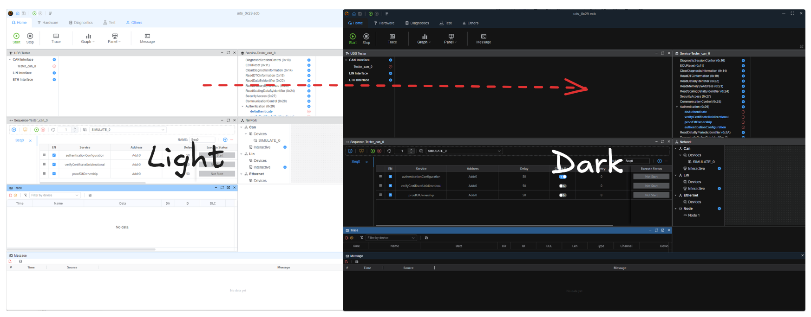

# 常规

## 主题

用于在浅色和深色主题之间切换。

---

## 界面缩放

用于调整界面缩放比例。 默认值为100%，最小值为50%，最大值为200%。

## JSON-RPC

EcuBus 图形界面运行时，其他程序可以通过 JSON-RPC（默认 `127.0.0.1:17320`）访问已打开的 CAN 设备。外部程序写入的帧在跟踪窗口中显示为 **Rx**。EcuBus 发出的帧作为 RX 交给 RPC 客户端。

修改主机或端口后点击 **应用 RPC**。协议说明见 [CLI JSON-RPC](../cli/rpc.md)。
