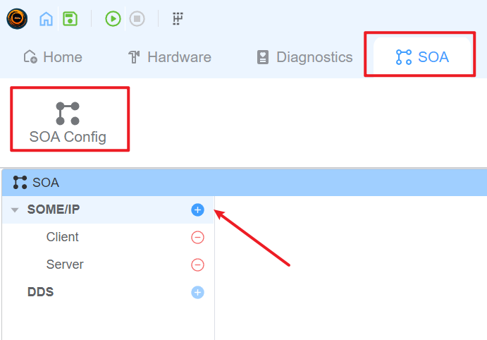
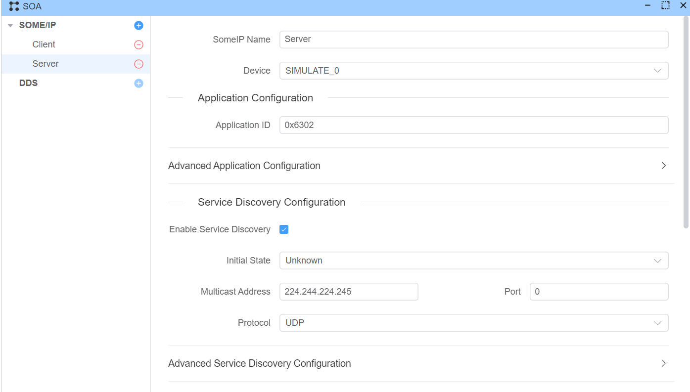
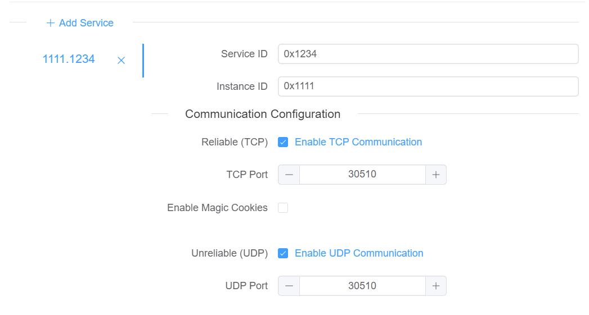
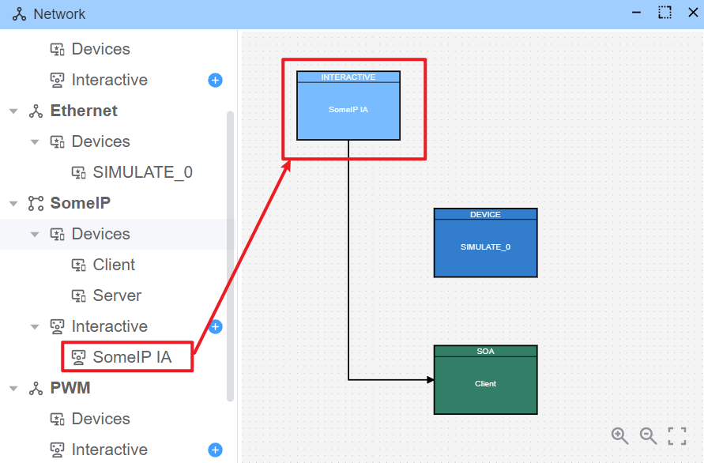
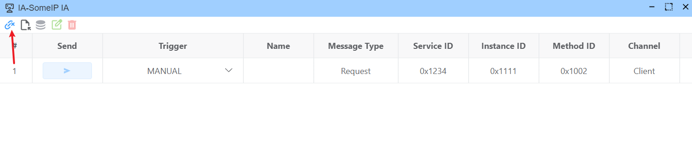
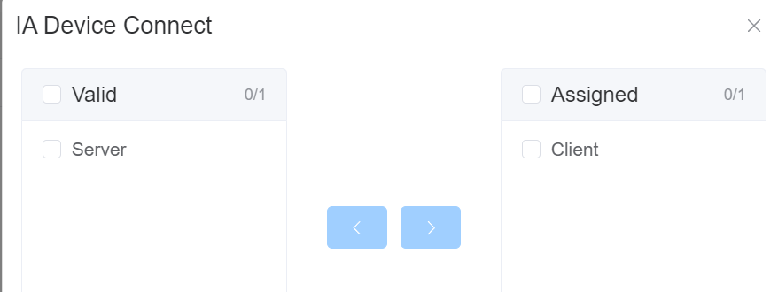
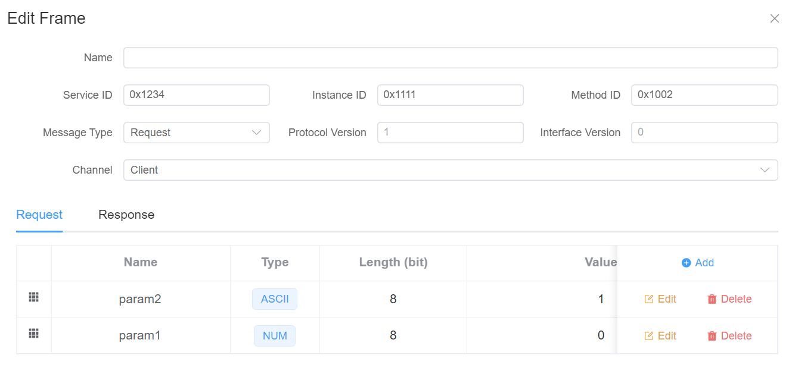

# SOME/IP

EcuBus-Pro支持SOME/IP协议，可以用于开发和测试SOME/IP协议的设备。

## 配置

> EcuBus-Pro的SOME/IP功能基于[vSomeIP](https://github.com/GENIVI/vsomeip)实现， 关于不知道如何理解的配置可以参考[vSomeIP配置文档](https://github.com/COVESA/vsomeip/blob/master/documentation/vsomeipConfiguration.md)。

### 添加SOME/IP配置

通过点击 SOA->SOA Cofnig->添加SOME/IP配置，可以添加SOME/IP配置。



### 配置SOME/IP配置

通过点击SOME/IP配置，可以配置SOME/IP配置。



#### 设备配置

每个SOME/IP配置必须添加一个以太网设备

#### 应用配置

每个SOME/IP配置对应一个应用，且需要配置应用ID，应用ID是应用的唯一标识，应用ID从1-65535

#### 服务发现配置

控制是否启用服务发现，如果启用服务发现，则需要配置服务发现相关的配置

> [!TIP]
> 如果启用服务发现，可能需要配置电脑组播相关的配置

#### 服务配置



> [!WARNING]
> 目前还只支持简单的服务，后续会支持事件和事件组

每个服务需要配置：

1. 服务ID，服务ID是服务的唯一标识，服务ID从1-65535
2. 服务实例ID，服务实例ID是服务的实例的唯一标识，服务实例ID从1-65535
3. 是否开启TCP可靠传输和对应的端口号
4. 是否开启UDP不可靠传输和对应的端口号

## SOME/IP交互器

通过点击SOME/IP交互器可以快速发起SOME/IP请求，并查看SOME/IP请求的响应。



### 交互器配置

鼠标悬停在交互器的方块上可以点击编辑按钮对交互器进行配置。

#### 连接配置




#### 编辑请求

> [!TIP]
> 从数据库中选择请求暂时不支持



## SOME/IP脚本

### [Util.OnSomeipMessage](https://app.whyengineer.com/scriptApi/classes/UtilClass.html#onsomeipmessage) 监听SOME/IP消息

监听SOME/IP消息，当收到SOME/IP消息时，会调用回调函数。

```typescript
// 监听所有SOME/IP消息
Util.OnSomeipMessage(true, (msg) => {
  console.log('Received SOMEIP message:', msg);
});

// 监听特定服务/实例/方法的SOME/IP消息
Util.OnSomeipMessage('0034.5678.90ab', (msg) => {
  console.log('Received specific SOMEIP message:', msg);
});

// 监听特定服务/通配符的SOME/IP消息
Util.OnSomeipMessage('0034.*.*', (msg) => {
  console.log('Received specific SOMEIP message:', msg);
});
```

### [output](https://app.whyengineer.com/scriptApi/functions/output.html) 输出SOME/IP消息

输出SOME/IP消息，可以输出SOME/IP请求和SOME/IP响应。

```typescript
import { SomeipMessageRequest, SomeipMessageResponse, output } from 'ECB'

Util.OnSomeipMessage('1234.*.*', async (msg) => {
  if (msg instanceof SomeipMessageRequest) {
    const response = SomeipMessageResponse.fromSomeipRequest(msg)
    await output(response)
  }
})
```
