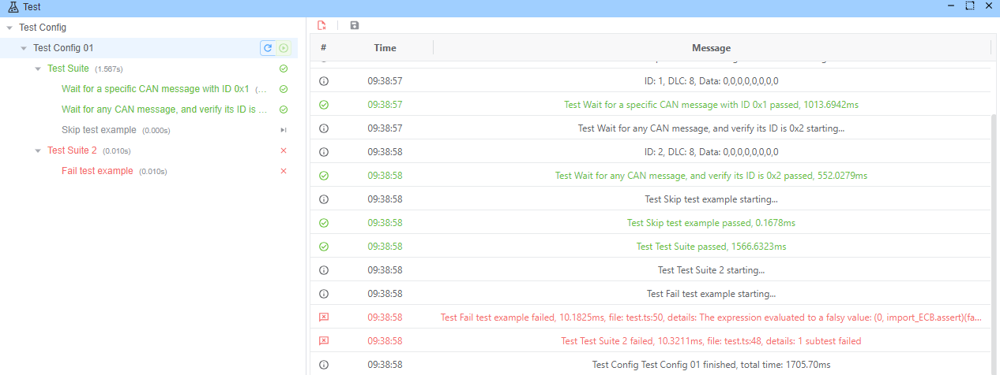
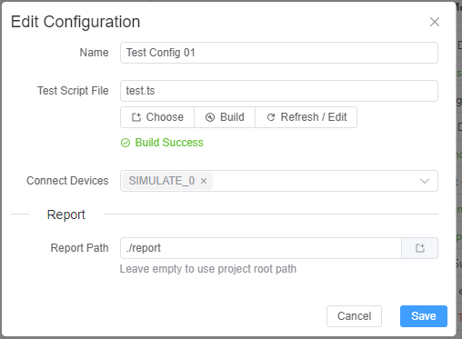
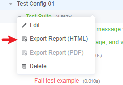
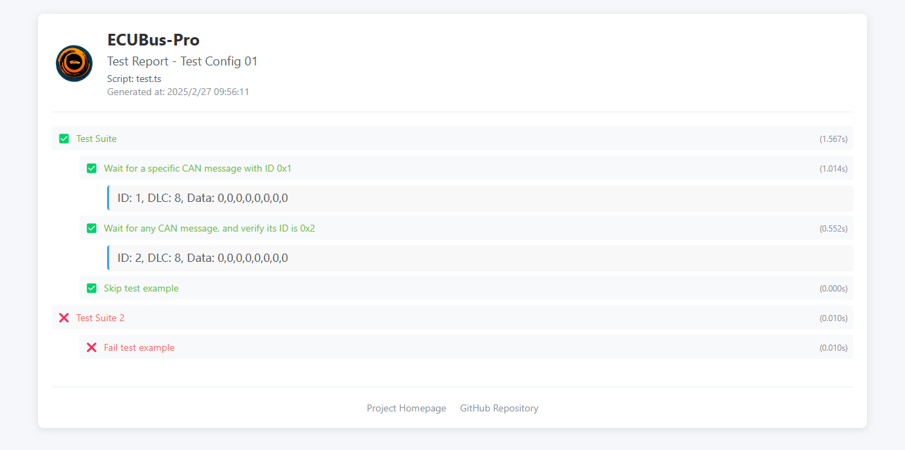

# Ecuadus Bus-Pro 测试结构

## 概览

Ecuadus Bus-Pro为自动ECU的发展和验证提供了一个强有力和灵活的测试框架。 测试架构允许开发者创建、执行和监视汽车通信自动化测试，确保汽车系统的可靠和一贯行为。


## 关键功能

### 配置

使用方便的接口监视测试执行情况，显示实时结果



### 基于类型脚本的测试框架

使用熟悉的 TypeScript 语法和内置测试工具编写测试。 见 [Srcipt](./../script.md)。

重用了 Node.js [测试运行器](https://nodejs.org/docs/latest/api/test.html)

#### 示例

```typescript
 describe('测试套件', () => {


  test('等待 ID 为 0x1 的特定 CAN 消息', async () => {
    await TestWaitForMessage(0x1, 3000)
    assert(true)
  })

  // 等待任何 CAN 消息并验证其 ID 为 0x2 的测试用例
  test('等待任何 CAN 消息，并验证其 ID 为 0x2', async () => {
    const msg = await TestWaitForMessage(true, 3000)
    assert(msg.id == 0x2)
  })

  // 被跳过的测试用例，否则会立即通过
  test.skip('跳过测试示例', async () => {
    assert(true)
  })
})

// 第二个测试套件
describe('测试套件 2', () => {
  // 立即通过的简单测试用例
  test('失败测试示例', () => {
    assert(false)
  })
})
```

### 详细测试报告

生成带有时间和传输/失败信息的全面测试报告




