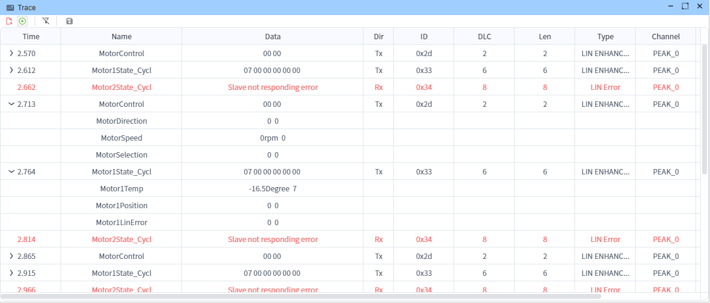
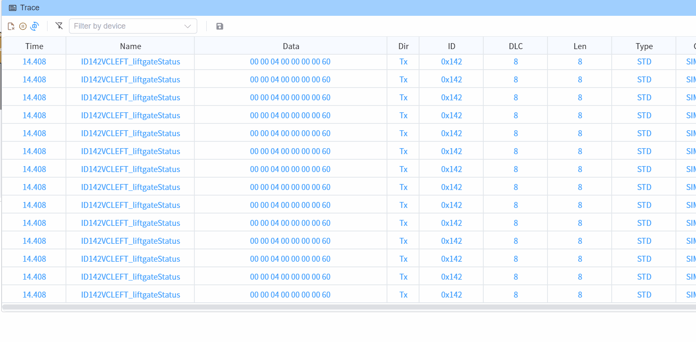
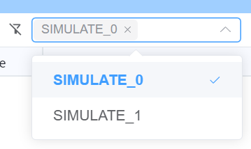
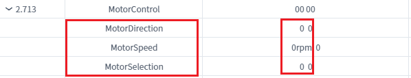
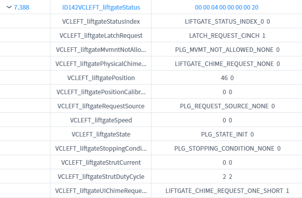

# Trace

Trace 窗口提供查看与导出数据的界面。用户可以通过工具栏按钮保存数据，用于后续分析或归档。

>[!INFO]
> Trace 的最大存储容量为 50,000 条。超过该上限后，将自动覆盖最早的数据。

## 覆盖模式（Overwrite Mode）

使用下方按钮在覆盖模式与滚动模式之间切换。

在覆盖模式下，当达到最大存储容量，会覆盖最早的数据。

## 过滤器（Filter）

### 按设备过滤

Trace 窗口支持按设备、信号名称与信号值进行过滤。
> [!NOTE]
> 选择全部设备与不选择任何设备，效果相同。

## 按报文类型过滤

* CAN - 接收 CAN 相关数据
* LIN - 接收 LIN 相关数据
* UDS - 接收 UDS 相关数据
* ETH - 接收以太网相关数据

## 支持的导出格式

* Excel - 以 Microsoft Excel 格式导出
* ASC（ASCII）- 以 ASCII 格式导出，兼容多种 CAN 分析工具
* [功能需求](./../../dev/feature.md)

## 列信息（Column Information）

Trace 窗口通常包含以下列：

* **Timestamp**：事件发生的精确时间
* **Name**：触发事件的帧/信号名称
* **Signal Value**：信号的当前值
* **DIR（Direction）**：方向（Tx 为发送，Rx 为接收）
* **ID**：信号标识符
* **DLC（Data Length Code）**：数据长度码
* **LEN（Length）**：实际数据长度
* **Type**：信号类型（如布尔、整数、浮点）
* **Channel**：通信通道编号
* **Device**：设备名称

当相应的硬件通道绑定到[数据库](../database.md)后，这些列信息有助于快速理解与分析系统运行状态。

>[!INFO]
> 仅在 Trace 窗口暂停时，才能查看帧内的信号值。

## LIN 信号显示

## CAN 信号显示

