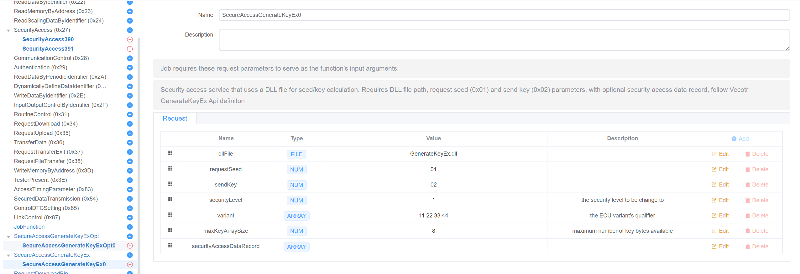
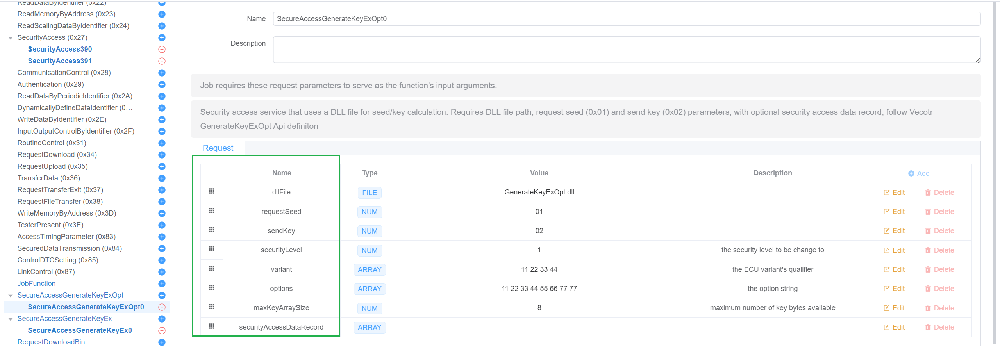
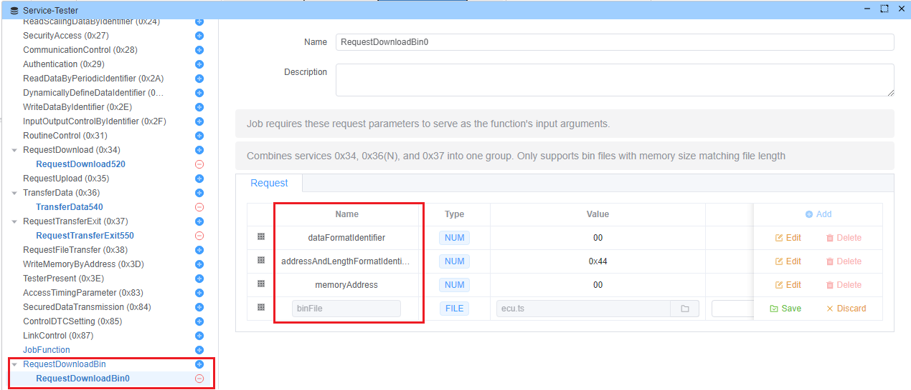

# 在脚本中生成

内置脚本系统为共同的UDS操作提供预先配置的诊断服务。 此文档涵盖可用的内置脚本及其功能。

## 支持内置脚本

### [SecureAccessGenerateKeyEx](https://github.com/ecubus/EcuBus-Pro/tree/master/resources/buildInScript/SecureAccessGenerateKeyEx)

此脚本用于生成安全访问过程的密钥。 请参阅 [GenerateKeyEx](https://cdn.vector.com/cms/content/know-how/_application-notes/AN-IDG-1-017_SecurityAccess.pdf)。

```c
VKeyGenResultEx GenerateKeyEx (
  const unigned char* ipSeedAray,  
  未签名的 iSeedAraySize, 
  conster 未签名的 iSecurityLevel,  
  const char* ipVariant, 
  unigned char* KeyAray,  
  未签名的 iMaxKeyAraySize, 
  未签名的 int& oActualKeyArraySize 
;
```



#### 参数 - SecureAccessGenerateKeyEx

- **dllFile**

  - DLL 文件路径，DLL 必须是64位 DLL 文件并包含GenerateKeyEx 函数。

```c
VKeyGenResultEx GenerateKeyEx (
  const unigned char* ipSeedAray,  
  未签名的 iSeedAraySize, 
  conster 未签名的 iSecurityLevel,  
  const char* ipVariant, 
  unigned char* KeyAray,  
  未签名的 iMaxKeyAraySize, 
  未签名的 int& oActualKeyArraySize 
;
```

- **请求种子**
  - 请求种子职能分别1,3,3,5,7,9,11,13,15
  - 默认值： 0x01

- **sendKey**
  - 派遣关键分职能，2 4,6,8,810,12,14,16
  - 默认值： 0x02

- **安全级别**
  - 安全等级更改为

- **变量**
  - 安全存取处理的变体(诊断接收器ECU的名称)

- **maxKeyArraySize**
  - 最大键数组大小

- **securityAccessDataRecord**
  - 请求种子图请求中的安全访问数据记录，数据将在请求种子函数中发送到ECU。

### [SecureAccessGenerateKeyExOpt](https://github.com/ecubus/EcuBus-Pro/tree/master/resources/buildInScript/SecureAccessGenerateKeyExOpt)

此脚本用于生成安全访问过程的密钥。 请参阅 [GenerateKeyExOpt](https://cdn.vector.com/cms/content/know-how/_application-notes/AN-IDG-1-017_SecurityAccess.pdf)。



#### 参数 - SecureAccessGenerateKeyExOpt

- **dllFile**
  - DLL 文件路径，DLL 必须是64位 DLL 文件并包含GenerateKeyExOpt 函数。

```c
VKeyGenResultExOpt GenerateKeyExOpt ( 
  const unigned char* ipSeedArray,  
  unsigned int iSeedArraySize, 
  委托未签名的 iSecurityLevel,  
  const char* ipVariant,  
  const char* ipOptions, 
  unigned char* KeyiARay,  
  未签名的 iMaxKeyAraySize,  
  未签名的 int& oActualKeyAraySize 
;
```

- **请求种子**
  - 请求种子职能分别1,3,3,5,7,9,11,13,15
  - 默认值： 0x01

- **sendKey**
  - 派遣关键分职能，2 4,6,8,810,12,14,16
  - 默认值： 0x02

- **安全级别**
  - 安全等级更改为

- **变量**
  - 安全存取处理的变体(诊断接收器ECU的名称)

- **选项**
  - 安全准入程序的各种选择

- **maxKeyArraySize**
  - 最大键数组大小

- **securityAccessDataRecord**
  - 请求种子图请求中的安全访问数据记录，数据将在请求种子函数中发送到ECU。

### [RequestDownloadBin](https://github.com/ecubus/EcuBus-Pro/tree/master/resources/buildInScript/RequestDownloadBin)

一个处理完整的二进制下载过程的合并服务，通过管弦乐队服务 0x34 (RequestDownload), 0x36 (TransferData), 和 0x37 (TransferExit).



#### 描述

此脚本通过以下方式自动下载二进制文件到 ECU 的过程：

1. 正在启动下载请求
2. 正在将数据传输到合适的数据块中
3. 完成转让过程

#### 参数 - 请求DownloadBin

- **dataFormatIdentifier** (8-bit)
  - 要传输的数据的格式标识符
  - 默认值： 0x00

- **addressAndLengthFormatIdentifier** (8-bit)
  - 指定内存地址和长度的格式
  - 默认值： 0x44 (地址4字节，长度4字节)

- **memoryAddress** (依赖地址AndLengthFormatIdentifier)
  - 下载目标内存地址
  - 默认值： 0x000000

- **binFile**
  - 要下载的二进制文件将自动更改内存大小

## 创建自定义脚本

可以创建自定义脚本来扩展诊断系统的功能。 您可以创建和保存您自己的脚本，并在未来使用它。

这是如何创建您自己的脚本：

### 脚本结构

1. **目录设置**
   - 在 `${App Install Path}/resources/app.asar.unpacked/resources/buildInScript/` 下创建一个新目录
   - 根据你的脚本函数命名它(如：`MyCustomScript`)

2. **必填文件**
   - `plugin.json`: 配置文件
   - `index.js`: 实现文件

### plugin.json 配置

```json
{
  "service": {
    "name": "MyCustomScript",
    "fixedParam": true,
    "buildInScript": "index.js",
    "hasSubFunction": false,
    "desc": "Description of your script's functionality",
    "defaultParams": [
      {
        "param": {
          "id": "parameterName",
          "name": "parameterName",
          "bitLen": 8,
          "deletable": false,
          "editable": true,
          "type": "NUM",
          "phyValue": "00"
        }
      }
    ],
    "defaultRespParams": []
  }
}
```

### index.js 实现

```javascript
const ECB = require('../../lib/js');

Util.Init(() => {
  const testerName = Util.getTesterName();

  // Register main function
  Util.Register(`${testerName}.MyCustomScript`, async function(parameters) {
    // Create diagnostic requests
    const request = new ECB.DiagRequest(testerName, {
      id: "",
      name: "",
      serviceId: "0xXX",  // Your service ID
      params: [],
      respParams: []
    });

    // Implement your logic here
    
    return [request];
  });
});
```

### 最佳做法

1. **参数定义**
   - 在 plugin.json 中定义清晰的参数结构
   - 支持适当的数据类型(NUM, HEX, ASCII, BUFFER, FILE)
   - 设置适当的位长度和可编辑

2. **响应处理**
   - 定义预期响应参数
   - 执行响应验证
   - 处理不同的应对方案

### 示例：简单的计数脚本

```javascript
// index.js
const ECB = require('../../lib/js');

Util.Init(() => {
  const testerName = Util.getTesterName();

  Util.Register(`${testerName}.CounterScript`, async function(startValue, increment) {
    const request = new ECB.DiagRequest(testerName, {
      id: "counter",
      name: "Counter Service",
      serviceId: "0x22",
      params: [],
      respParams: []
    });

    request.diagSetRaw(Buffer.from([startValue, increment]));
    return [request];
  });
});
```
