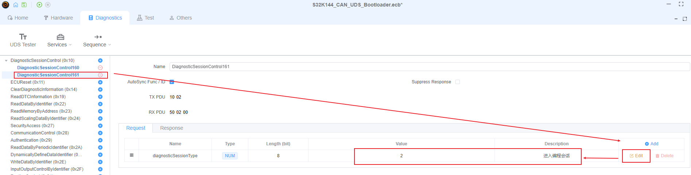

# UDS 引导程序（Bootloader）实现指南

## 概述

本文演示如何在 S32K144 微控制器上，结合 EcuBus-Pro，实现完整的 UDS（统一诊断服务）引导程序。示例覆盖固件升级的全流程：从初始配置到脚本实现。


## 工程配置
### 硬件与通信设置
+ 按如下方式配置 Hardware>Device 界面，选择 Leaf V3。其他 CAN 卡配置方式类似，只需确保波特率为 500K。
  
> [!NOTE]
> 支持的 CAN 设备列表：[CAN Devices](./../../can/can.md)


+ 可根据实际情况选择对应的采样点。


+ 设置寻址模式。S32K144 官方 CAN UDS Bootloader 示例采用 Normal 固定寻址，配置如下。


### 诊断服务配置
#### DiagnosticSessionControl（诊断会话控制，$10）
+ 进入扩展会话的配置：


+ 进入编程会话的配置：



#### ECUReset（ECU 复位，$11）
+ 硬件复位配置如下，此处使用硬件复位。


#### SecurityAccess（安全访问，$27）
+ 种子请求配置如下。需要进入 Response 界面，将 securitySeed 长度修改为 128bit，否则无法接收 MCU 返回的完整 seed 数据。


+ 密钥响应配置如下。数据段会在脚本中将大小修改为 128bit，并填入计算得到的 key。


#### CommunicationControl（通信控制，$28）
+ 关闭网络管理报文以及正常报文收发，配置如下。


#### WriteDataByIdentifier（按标识写数据，$2E）
+ 写入指定 DID。S32K144 官方 CAN UDS Bootloader 示例使用 0xF15A，配置如下。


#### RoutineControl（例程控制，$31）
+ routineID 为 0x0202 的例程用于通知 MCU 执行 CRC 校验，配置如下。


+ routineID 为 0xFF00 的例程用于通知 MCU 执行 Flash 擦除，配置如下。


+ routineID 为 0xFF01 的例程用于通知 MCU 执行固件校验，配置如下。


#### RequestDownload（请求下载，$34）
+ 请求下载配置如下。实际使用中，存储地址与存储空间将在脚本中赋值。


#### TransferData（传输数据，$36）
+ 传输数据配置如下。实际使用中，会在脚本中反复调用并赋值。


#### RequestTransferExit（请求结束传输，$37）
+ 结束传输配置如下。


#### JobFunction
> 什么是 Job？Job 是 EcuBus-Pro 中的一种抽象服务。使用 Job 时必须有相应的脚本，通过脚本来实现 Job 的返回。Job 的返回必须是一个数组，数组元素可以是 0-N 个普通 UDS 服务或 Job。Job 通常用于固件下载、上传，以及需要不确定数量 0x36 服务的场景，也可用于其它任意需要的场景。

添加空的 JobFunction0 与 JobFunction1，便于通过脚本组合下载相关服务。


### 序列（Sequence）配置
完整的 UDS 升级流程配置如下图所示：


主要分为三个阶段：

`预编程阶段（Pre-programming）:`

1. 通过 $10 服务进入扩展会话；
2. 通过 $28 服务关闭网络管理报文及正常报文收发；

`编程阶段（Programming）:`

1. 通过 $10 服务进入编程会话；
2. 通过 $27 服务请求 seed 并返回计算得到的 key，校验通过；
3. 通过 $2E 服务写入指定 DID（0xF15A）；
4. 通过 $34 服务发起 Flash 驱动下载请求；
5. 通过 $36 服务传输 Flash 驱动；
6. 通过 $37 服务结束传输；
7. 通过 $31 服务通知 MCU 执行 CRC 校验与 Flash 擦除；
8. 通过 $34 服务发起 APP 下载请求；
9. 通过 $36 服务传输 APP；
10. 通过 $37 服务结束传输；
11. 通过 $31 服务通知执行 CRC 校验与固件检查；

`后编程阶段（Post-programming）:`

1. 通过 $11 服务执行硬件复位

## 实现
### 开发环境准备
+ 在工程目录中创建新的 ts 文件；


+ 将升级所需文件放入工程目录；


+ 在 UDS Tester 中加载脚本文件，并在 VS Code 中打开进行编写；


### 脚本开发
#### 引入必要模块
```typescript
// Import necessary modules
import crypto from 'crypto'
import { CRC, DiagRequest, DiagResponse } from 'ECB'
import path from 'path'
import fs from 'fs/promises'
```

#### 准备所需的 CRC 算法与相关变量
```typescript
// Create CRC instance, configure parameters: type 'self', 16 bits, polynomial 0x3d65, initial value 0, XOR value 0xffff, input/output reflection
const crc = new CRC('self', 16, 0x3d65, 0, 0xffff, true, true)
// Initialize maximum chunk size, initial value undefined
let maxChunkSize: number | undefined = undefined
// Initialize file content buffer, initial value undefined
let content: undefined | Buffer = undefined
```

#### 固件文件配置
```typescript
// Define file list, containing start address and file path for each file
const fileList: {
  addr: number
  file: string
}[] = [
  {
    // Start address of the first file
    addr:0x1FFF8010,
    // Path of the first file, joined from project root directory, bin folder and filename
    file: path.join(process.env.PROJECT_ROOT, 'bin', 'flash_api.bin')
  },
  {
    // Start address of the second file
    addr:0x00014200,
    // Path of the second file, joined from project root directory, bin folder and filename
    file: path.join(process.env.PROJECT_ROOT, 'bin', 'S32k144_UDS_Bootloader_App_Test.bin')
  }
]
```

#### Security Access 实现
```typescript
/**
 * Listen to security access response event, encrypt received security seed and send response request
 * @param v - Security access response object
 */
Util.On('S32K144_CAN_UDS_Bootloader.SecurityAccess390.recv', async (v) => { 
  // Get security seed data from response
  const data = v.diagGetParameterRaw('securitySeed')
  // Create AES-128-CBC cipher with fixed key and zero initialization vector
  const cipher = crypto.createCipheriv(
    'aes-128-cbc',
    Buffer.from([0, 1, 2, 3, 4, 5, 6, 7, 8, 9, 10, 11, 12, 13, 14, 15]),
    Buffer.alloc(16, 0)
  )
  // Encrypt security seed data
  const encrypted = cipher.update(data)
  // Complete encryption operation
  cipher.final()
  // Create security access response request object
  const req = DiagRequest.from('S32K144_CAN_UDS_Bootloader.SecurityAccess391')
  // Set request parameter 'data' raw value to encrypted data
  req.diagSetParameterRaw('data', encrypted)
  // Initiate service change request
  await req.changeService()
})
```

#### JobFunction0 实现 - 下载请求与 CRC 校验
```typescript
/**
 * Register job function 0, handle file download requests and CRC verification requests
 */
Util.Register('S32K144_CAN_UDS_Bootloader.JobFunction0', async () => {
  // Take the first file item from the file list
  const item = fileList.shift()
  if (item) {
    // Create request download diagnostic request object
    const r34 = DiagRequest.from('S32K144_CAN_UDS_Bootloader.RequestDownload520')
    // Create 4-byte buffer to store memory address
    const memoryAddress = Buffer.alloc(4)
    // Write file start address to buffer in big-endian byte order
    memoryAddress.writeUInt32BE(item.addr)
    // Set request parameter 'memoryAddress' raw value to memory address buffer
    r34.diagSetParameterRaw('memoryAddress', memoryAddress)
    // Asynchronously read file content to buffer
    content = await fs.readFile(item.file)
    // Calculate CRC value of file content
    const crcResult = crc.compute(content)
    // Create routine control diagnostic request object for CRC verification
    const crcReq = DiagRequest.from('S32K144_CAN_UDS_Bootloader.RoutineControl490')
    // Create 4-byte buffer to store CRC result
    const crcBuffer = Buffer.alloc(4)
    // Write CRC result to the last 2 bytes of buffer in big-endian byte order
    crcBuffer.writeUInt16BE(crcResult, 2)
    // Set routine control option record parameter size to 4 bytes (32 bits)
    crcReq.diagSetParameterSize('routineControlOptionRecord', 4 * 8)
    // Set routine control option record parameter raw value to CRC result buffer
    crcReq.diagSetParameterRaw('routineControlOptionRecord', crcBuffer)
    // Initiate routine control service request
    await crcReq.changeService()

    // Set request download diagnostic request object 'memorySize' parameter to file content length
    r34.diagSetParameter('memorySize', content.length)
    // Listen to request download diagnostic request response event
    r34.On('recv', (resp) => {
      // Get maximum block length parameter from response and read its first byte as maximum chunk size
      maxChunkSize = resp.diagGetParameterRaw('maxNumberOfBlockLength').readUint8(0)
    })
    // Return array containing request download diagnostic request object
    return [r34]
  } else {
    // If file list is empty, return empty array
    return []
  }
})
```

#### JobFunction1 实现 - 分片传输与结束
```typescript
/**
 * Register job function 1, handle file chunk transfer requests and transfer exit requests
 */
Util.Register('S32K144_CAN_UDS_Bootloader.JobFunction1', () => {
  // Check if maximum chunk size is undefined or too small
  if (maxChunkSize == undefined || maxChunkSize <= 2) {
    // If condition not met, throw error
    throw new Error('maxNumberOfBlockLength is undefined or too small')
  }
  if (content) {
    // Subtract 2 from maximum chunk size
    maxChunkSize -= 2
    // Ensure maximum chunk size is multiple of 8
    if (maxChunkSize & 0x07) {
      maxChunkSize -= maxChunkSize & 0x07
    }
    // Calculate number of chunks needed for file content
    const numChunks = Math.ceil(content.length / maxChunkSize)
    // Initialize array to store transfer request objects
    const list = []
    // Loop to generate transfer request for each chunk
    for (let i = 0; i < numChunks; i++) {
      // Calculate start position of current chunk
      const start = i * maxChunkSize
      // Calculate end position of current chunk, not exceeding file content length
      const end = Math.min(start + maxChunkSize, content.length)
      // Extract current chunk from file content
      const chunk = content.subarray(start, end)

      // Create transfer data diagnostic request object
      const transferRequest = DiagRequest.from('S32K144_CAN_UDS_Bootloader.TransferData540')
      // Set transfer request parameter record size to current chunk byte count
      transferRequest.diagSetParameterSize('transferRequestParameterRecord', chunk.length * 8)
      // Set transfer request parameter record raw value to current chunk
      transferRequest.diagSetParameterRaw('transferRequestParameterRecord', chunk)

      // Calculate block sequence number (starting from 1)
      const blockSequenceCounter = Buffer.alloc(1)
      // Use cyclic count 1-255, write block sequence number to buffer
      blockSequenceCounter.writeUInt8((i + 1) & 0xff) 
      // Set block sequence counter parameter raw value to block sequence number buffer
      transferRequest.diagSetParameterRaw('blockSequenceCounter', blockSequenceCounter)

      // Add transfer request object to array
      list.push(transferRequest)
    }
    // Create request transfer exit diagnostic request object
    const r37 = DiagRequest.from('S32K144_CAN_UDS_Bootloader.RequestTransferExit550')
    // Set transfer request parameter record size to 0
    r37.diagSetParameterSize('transferRequestParameterRecord', 0)
    // Add request transfer exit diagnostic request object to array
    list.push(r37)
    // Clear file content buffer
    content = undefined
    // Reset maximum chunk size to undefined
    maxChunkSize = undefined
    // Return array containing all transfer requests and transfer exit request
    return list
  } else {
    // If file content buffer is empty, return empty array
    return []
  }
})
```

---

*本示例可作为在汽车应用中实现 UDS 引导程序的基础。请根据具体项目需求自定义配置与脚本。*


