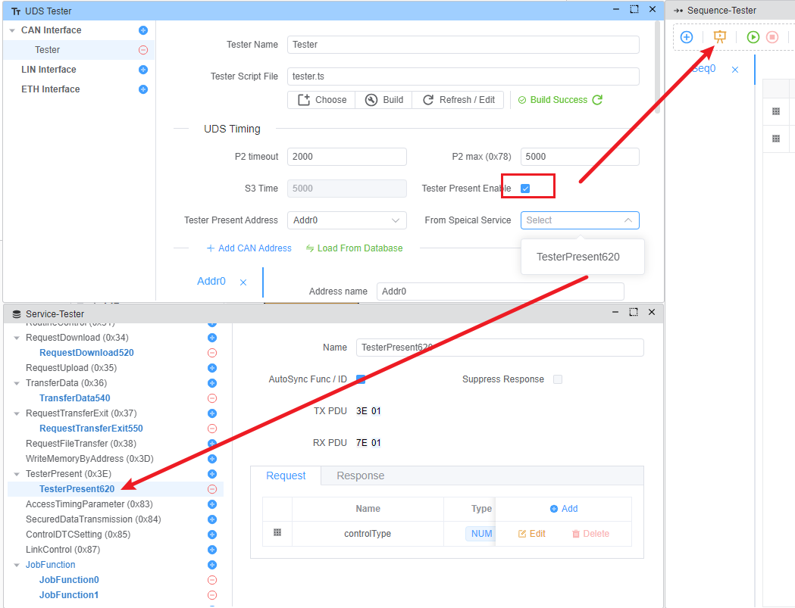

# 测试者存在

Tester Present(Service ID 0x3E) 是一种诊断服务，用来向ECU表明诊断客户(测试者)仍然存在，诊断会话应继续有效。

参加考试的主要目的是：

- 定期发送消息以保持非默认诊断会话激活
- 防止诊断会话超时(S3 超时)
- 保持测试员与 ECU 之间的通信

> [!注意]
> 测试存在仅支持CAN。

## 配置

在 Ecuadus Pro，Tester Present 可以在 `UDS Tester` 窗口中配置：

### S3 时间 [M]

S3时间意味着S3客户端超时，这是测试者显示消息之间的最大时间。

### 测试仪当前地址 [M]

测试者当前消息的地址，可以设置为实际地址或功能地址。

### 来自Speical Serivce [O]

Tester Present的默认消息是 `0x3E 0x00` ，如果你想要使用特殊服务，你可以从服务列表中选择一个。
