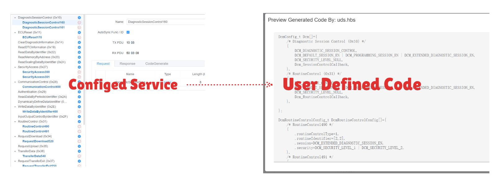
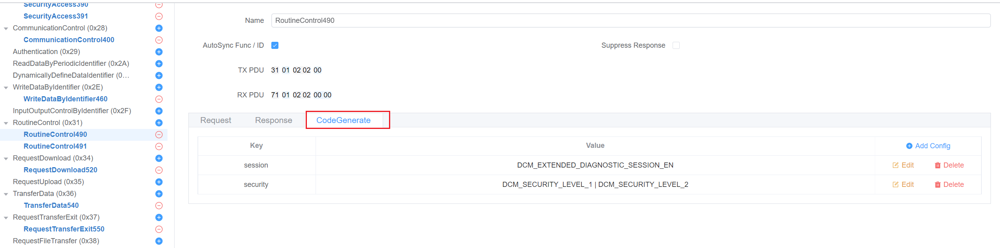

# UDS -> C 代码

<!-- markdownlint-disable MD033 -->

用户可以根据其配置的 UDS 服务生成 C 代码。 代码格式取决于用户定义的模板。


## UDS 代码生成

首先，用户需要在 UDS Tester 中启用 UDS 代码生成。


然后用户可以添加模板配置。 每个模板配置包含两个字段：

- **模板路径**：用户可以从本地文件系统中选择模板文件。
- **生成路径**：用户可以指定生成代码的保存路径。

支持多个模板配置。 用户可以根据需要添加或删除模板配置，每个模板都支持运行时预览功能。

## 特殊属性

启用 UDS 代码生成时，每个服务都支持添加用户定义的特殊属性以用于 `代码生成`。


属性以键值对格式定义。

**要求：**

- 键不能重复
- 值必须是字符串

## 模板

UDS 代码生成系统基于 [**Handlebars.js**](https://handlebarsjs.com) 模板引擎，并通过大量自定义辅助方法进行增强，以提供强大的代码生成能力。

### 模板系统概述

<span v-pre>
模板使用 Handlebars 语法，双花括号 `{{ }}` 用于表达式，`{{# }}{{/ }}` 用于块辅助方法。 系统提供对 UDS 服务数据、配置属性以及丰富的辅助函数集的访问。
</span>

### 可用数据上下文

生成代码时，模板可以访问：

- **tester:[TesterInfo](https://app.whyengineer.com/scriptApi/interfaces/TesterInfo.html)**：所有已配置的 UDS 服务及其属性
- **project:ProjectInfo**：项目信息，类型为：

```ts
export interface ProjectInfo {
  name: string
  path: string
}
```

### 自定义辅助方法

#### **数学运算**

- <span v-pre>`{{add a b}}`</span> - 加法
- <span v-pre>`{{subtract a b}}`</span> - 减法
- <span v-pre>`{{multiply a b}}`</span> - 乘法
- <span v-pre>`{{divide a b}}`</span> - 除法
- <span v-pre>`{{abs num}}`</span> - 绝对值
- <span v-pre>`{{ceil num}}`</span> - 向上取整
- <span v-pre>`{{floor num}}`</span> - 向下取整
- <span v-pre>`{{modulo a b}}`</span> - 取余
- <span v-pre>`{{avg array}}`</span> - 数组平均值
- <span v-pre>`{{sum array}}`</span> - 数组求和

#### **字符串操作**

- <span v-pre>`{{camelcase str}}`</span> - 转换为驼峰命名法
- <span v-pre>`{{capitalize str}}`</span> - 首字母大写
- <span v-pre>`{{uppercase str}}`</span> - 转换为大写
- <span v-pre>`{{lowercase str}}`</span> - 转换为小写
- <span v-pre>`{{dashcase str}}`</span> - 转换为短横线命名法
- <span v-pre>`{{snakecase str}}`</span> - 转换为蛇形命名法
- <span v-pre>`{{dotcase str}}`</span> - 转换为点分命名法
- <span v-pre>`{{append str suffix}}`</span> - 追加后缀
- <span v-pre>`{{prepend str prefix}}`</span> - 添加前缀
- <span v-pre>`{{trim str}}`</span> - 移除空白字符
- <span v-pre>`{{replace str old new}}`</span> - 替换文本

#### **数组操作**

- <span v-pre>`{{first array n}}`</span> - 获取前 n 项
- <span v-pre>`{{last array n}}`</span> - 获取后 n 项
- <span v-pre>`{{after array n}}`</span> - 获取索引 n 之后的项
- <span v-pre>`{{before array n}}`</span> - 获取索引 n 之前的项
- <span v-pre>`{{join array separator}}`</span> - 连接数组元素
- <span v-pre>`{{arrayify value}}`</span> - 转换为数组
- <span v-pre>`{{#forEach array}}...{{/forEach}}`</span> - 遍历数组
- <span v-pre>`{{#eachIndex array}}...{{/eachIndex}}`</span> - 带索引遍历

#### **比较与逻辑**

- <span v-pre>`{{eq a b}}`</span> - 等于
- <span v-pre>`{{ne a b}}`</span> - 不等于
- <span v-pre>`{{gt a b}}`</span> - 大于
- <span v-pre>`{{lt a b}}`</span> - 小于
- <span v-pre>`{{gte a b}}`</span> - 大于等于
- <span v-pre>`{{lte a b}}`</span> - 小于等于
- <span v-pre>`{{isString val}}`</span> - 检查是否为字符串
- <span v-pre>`{{isNumber val}}`</span> - 检查是否为数字
- <span v-pre>`{{isArray val}}`</span> - 检查是否为数组
- <span v-pre>`{{isDefined val}}`</span> - 检查是否已定义
- <span v-pre>`{{isUndefined val}}`</span> - 检查是否未定义

#### **实用函数**

- <span v-pre>`{{setVar name value}}`</span> - 设置变量
- <span v-pre>`{{jsonParse str}}`</span> - 解析 JSON 字符串
- <span v-pre>`{{jsonStringify obj}}`</span> - 转换为 JSON
- <span v-pre>`{{times n}}...{{/times}}`</span> - 重复 n 次
- <span v-pre>`{{range start end}}...{{/range}}`</span> - 从 start 到 end 循环
- <span v-pre>`{{logFile message}}`</span> - 调试输出
- <span v-pre>`{{error message}}`</span> - 抛出错误

### 模板示例

```handlebars
/* Generated UDS Code */
#include <stdint.h>

{{#forEach services}}
// Service: {{name}}
{{#if (isDefined description)}}
/* {{description}} */
{{/if}}

#define {{uppercase (snakecase name)}}_ID 0x{{serviceId}}

{{#if specialProperties}}
/* Special Properties */
{{#each specialProperties}}
#define {{uppercase (snakecase @key)}} "{{this}}"
{{/each}}
{{/if}}

{{/forEach}}
```

### 更复杂示例

请参阅 [uds_generate_code](https://app.whyengineer.com/examples/uds_generate_code/readme) 示例。

<!-- markdownlint-enable MD033 -->